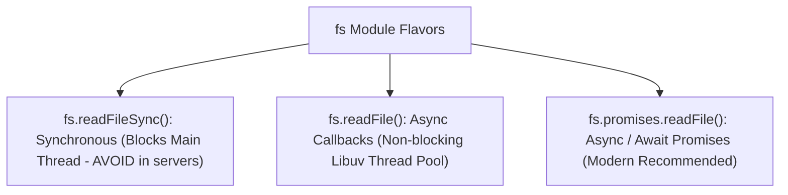

# File 07: File System (fs) — Sync, Callbacks, and Promises

## Overview
The **`fs`** module enables interacting with the file system. Node.js offers three flavors of file APIs: **Synchronous Blocking (`readFileSync`)**, **Asynchronous Callback-based (`readFile`)**, and **Asynchronous Promise-based (`fs.promises.readFile`)**.

---

## 1. File System API Flavors Comparison



---

## 2. Promise-Based File System Operations Implementation

```javascript
const fs = require("fs").promises;
const path = require("path");

async function fileOperations() {
    const filePath = path.join(__dirname, "sample.txt");

    try {
        // 1. Write File
        await fs.writeFile(filePath, "Hello Node.js File System!", "utf-8");
        console.log("File created successfully.");

        // 2. Append Content
        await fs.appendFile(filePath, "\nAppended line 2.", "utf-8");

        // 3. Read File
        const content = await fs.readFile(filePath, "utf-8");
        console.log("File Content:\n", content);

        // 4. Delete (Unlink) File
        await fs.unlink(filePath);
        console.log("File deleted successfully.");
    } catch (err) {
        console.error("FS Error:", err.message);
    }
}

fileOperations();
```

---

## Key Takeaways
1. **AVOID `fs.readFileSync()`** in web servers as it blocks the single main Event Loop thread.
2. Use **`require('fs').promises`** with `async/await` for clean non-blocking file operations.
3. Specify encoding (`'utf-8'`) to receive string content instead of raw binary `Buffer`.
