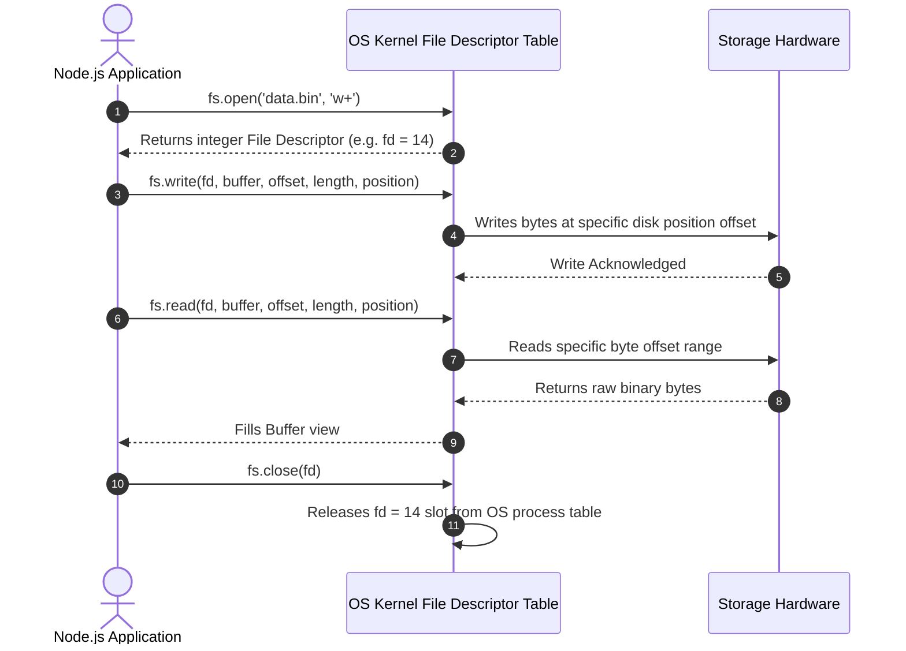
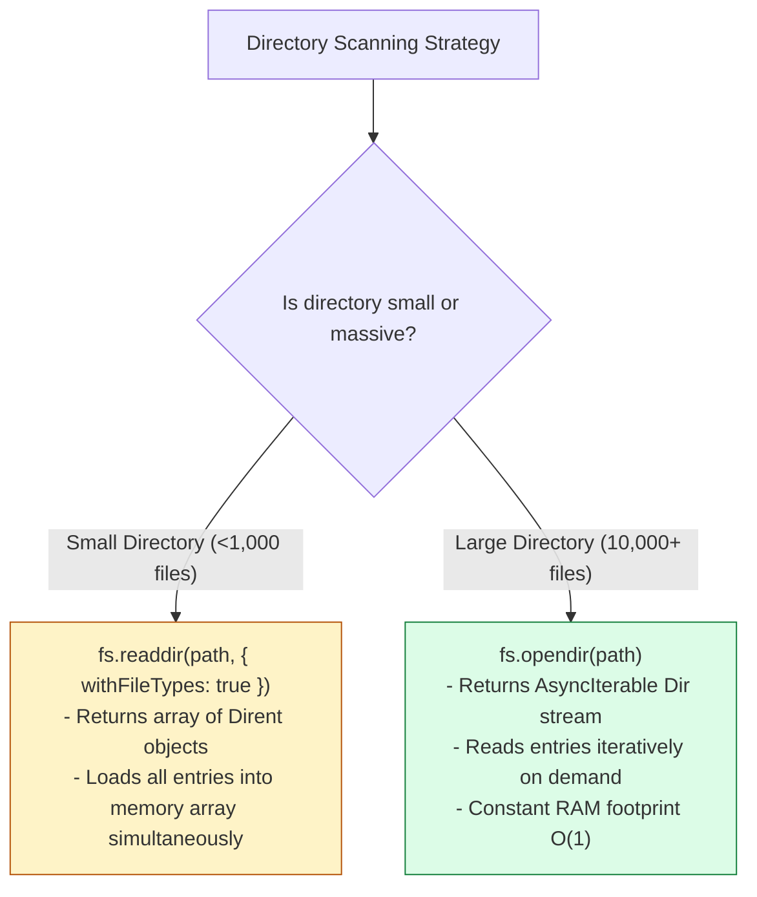

# Module 08: Advanced File System — File Descriptors, Directory Streaming, Atomic Flags, and Kernel File Watching

## Overview

Beyond simple whole-file reads and writes, production Node.js applications require low-level file manipulation primitives.

These include **File Descriptors (`fd`)** for partial random-access disk reads/writes, high-efficiency directory streaming (`fs.opendir`), atomic file creation flags (`'wx'`, `'a+'`), symbolic links (`fs.symlink`), POSIX permission adjustments (`fs.chmod`), and kernel-level file watchers (`fs.watch`).

Understanding **File Descriptor Lifecycles**, **Atomic Lockfile Flags**, **`fs.opendir` Async Iterators**, and **Kernel File Notification Engines (`inotify`, `kqueue`, `FSEvents`)** is essential.

---

## 1. File Descriptor (fd) Lifecycle & OS Kernel Integration

A **File Descriptor** is a non-negative integer assigned by the operating system kernel to track an open file handle inside the process file descriptor table.



---

## 2. Essential File Flags Reference Matrix

| Flag Code | Mode | Description | Behavior if File Exists | Behavior if Missing |
| :--- | :--- | :--- | :--- | :--- |
| **`'r'`** | Read | Opens file for reading | Position set to 0 | Throws `ENOENT` |
| **`'w'`** | Write | Opens file for writing | **Truncates (wipes) file to 0 bytes!** | Creates new file |
| **`'a'`** | Append | Opens file for appending | Appends data to end of file | Creates new file |
| **`'r+'`** | Read/Write | Opens file for reading and writing | Overwrites data at position 0 | Throws `ENOENT` |
| **`'wx'`** | Exclusive Write | Opens file exclusively for writing | **Fails with `EEXIST`** (Atomic file creation guard!) | Creates new file |
| **`'ax'`** | Exclusive Append| Opens file exclusively for appending | **Fails with `EEXIST`** (Atomic append guard!) | Creates new file |

> [!IMPORTANT]
> Always use **`'wx'`** or **`'ax'`** flags when implementing lockfiles, atomic file queues, or file-based database engines to prevent race conditions during concurrent file creation!

---

## 3. Directory Traversal: `fs.readdir` vs. `fs.opendir`

Loading millions of filenames into a single array using `fs.readdir` consumes massive V8 heap memory. Node.js `fs.opendir` streams `Dirent` entries lazily via an **Async Iterator**, keeping memory consumption flat ($O(1)$ RAM).



---

## 4. Real-Time File Watching Mechanics

| Watcher API | Underlying Engine | CPU Overhead | Duplicate Events? | Best Used For |
| :--- | :--- | :--- | :--- | :--- |
| **`fs.watch()`** | Kernel Notifications (`inotify` / `kqueue` / `FSEvents`) | **Extremely Low** | Yes (Platform dependent) | Real-time file change monitoring |
| **`fs.watchFile()`** | Periodic OS Polling (`stat` interval polling) | **High** | No | Legacy fallback for NFS / Network drives |
| **`chokidar` (NPM)** | Wraps native kernel watchers + stat fallback | **Extremely Low** | **No** (Normalized events) | **Production standard for all file watching** |

---

## 5. Code Showcase: Production Random-Access File Descriptor & Directory Streaming

```javascript
const fs = require("node:fs/promises");
const path = require("node:path");

async function executeAdvancedFileOperations() {
  const filePath = path.join(__dirname, "random_access.dat");

  let fileHandle = null;
  console.log("=== EXECUTING ADVANCED FILE DESCRIPTOR SUITE ===");

  try {
    // 1. Atomic File Creation via 'w+' flag (Returns FileHandle wrapper around fd)
    fileHandle = await fs.open(filePath, "w+");
    console.log(`  ✓ 1. File opened cleanly. OS File Descriptor (fd): ${fileHandle.fd}`);

    // 2. Writing Buffer at specific byte position
    const writeBuffer = Buffer.from("ENTERPRISE NODE.JS FILE SYSTEM ARCHITECTURE");
    await fileHandle.write(writeBuffer, 0, writeBuffer.length, 0);
    console.log("  ✓ 2. Written 43 bytes to disk at position 0.");

    // 3. Inspecting Metadata via File Handle stat
    const stats = await fileHandle.stat();
    console.log(`  ✓ 3. File Size: ${stats.size} Bytes | POSIX Mode: ${stats.mode.toString(8)}`);

    // 4. Random Access Partial Read (Read 7 bytes starting from offset 11)
    const readBuffer = Buffer.alloc(7);
    const { bytesRead } = await fileHandle.read(readBuffer, 0, 7, 11);
    console.log(`  ✓ 4. Partial Read (${bytesRead} bytes at offset 11): "${readBuffer.toString("utf-8")}"`); // "NODE.JS"

  } catch (err) {
    console.error("  !! Advanced FS Operation Failed:", err.message);
  } finally {
    // ALWAYS close file handles in a finally block to prevent descriptor leaks!
    if (fileHandle !== null) {
      await fileHandle.close();
      console.log("  ✓ 5. File Descriptor handle successfully closed.");
      await fs.unlink(filePath); // Cleanup
    }
  }
}

// 5. Memory-Efficient Directory Streaming Example using fs.opendir
async function streamDirectoryContents(dirPath) {
  try {
    const dir = await fs.opendir(dirPath);
    console.log(`\n=== STREAMING DIRECTORY CONTENTS: ${dirPath} ===`);
    
    for await (const dirent of dir) {
      const typeLabel = dirent.isDirectory() ? "[DIR ]" : "[FILE]";
      console.log(`  ${typeLabel} ${dirent.name}`);
    }
  } catch (err) {
    console.error("Directory Stream Error:", err.message);
  }
}

executeAdvancedFileOperations().then(() => streamDirectoryContents(__dirname));
```

---

## Key Production Takeaways

1. **Always Close File Descriptors in `finally` Blocks**: Unclosed file descriptors cause operating system resource leaks (`EMFILE: too many open files` failures).
2. **Use `fs.opendir` for Memory-Efficient Directory Scans**: Stream directory entries using async iterators (`for await (const dirent of dir)`) to maintain constant RAM usage when traversing large folders.
3. **Use Atomic Flags (`'wx'`) for Concurrency Safety**: When creating lockfiles or atomic file write operations, use exclusive flags (`'wx'`) to prevent race condition file corruption.
4. **Use `Dirent` Type Guards**: Leverage `dirent.isDirectory()` directly from `fs.opendir` or `fs.readdir({ withFileTypes: true })` without executing extra separate `fs.stat()` system calls.


