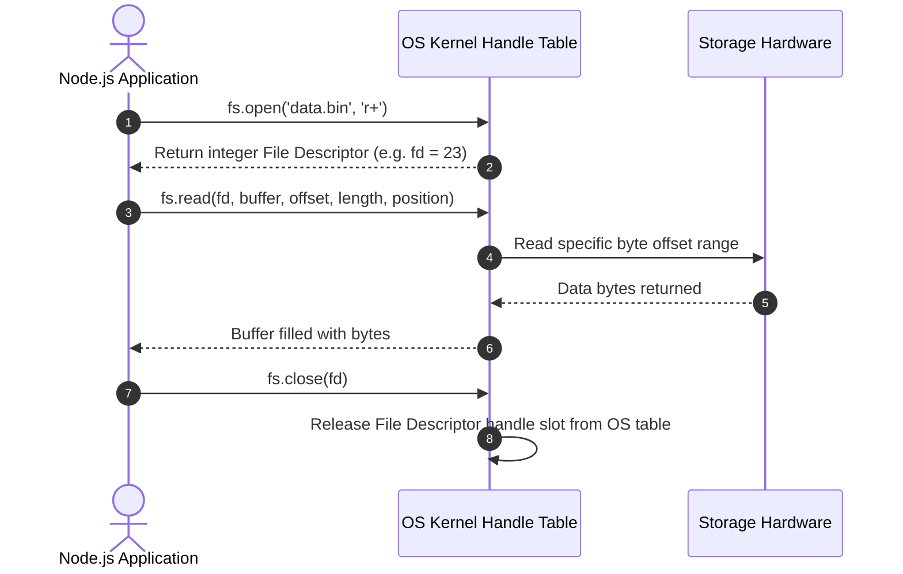
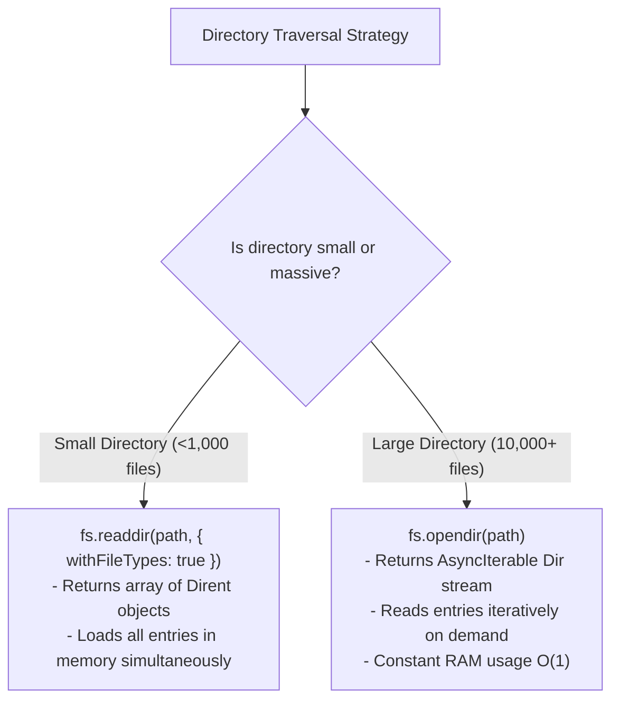

# Module 08: Advanced File System — File Descriptors, Directory Streaming, and File Watching

## Overview

Beyond basic whole-file reads and writes, production Node.js applications require low-level file manipulation primitives.

These include **File Descriptors (`fd`)** for partial random-access disk reads/writes, high-efficiency directory streaming (`fs.opendir`), file flags (`'r+'`, `'a+'`, `'wx'`), symbolic links (`fs.symlink`), POSIX permission adjustments (`fs.chmod`), and real-time kernel file event watchers (`fs.watch`).

---

## 1. File Descriptor (fd) Lifecycle & Flag Mechanics

A **File Descriptor** is an integer index assigned by the operating system kernel to track an open file handle inside the process file table.



### Essential File Flags Reference

| Flag Code | Mode | Description | Behavior if File Exists | Behavior if Missing |
| :--- | :--- | :--- | :--- | :--- |
| **`'r'`** | Read | Opens file for reading. | Reads from position 0. | Throws `ENOENT`. |
| **`'w'`** | Write | Opens file for writing. | **Truncates (wipes) file to 0 bytes!** | Creates new file. |
| **`'a'`** | Append | Opens file for writing. | Appends data to end of file. | Creates new file. |
| **`'r+'`** | Read/Write | Opens file for reading and writing. | Overwrites data starting at position 0. | Throws `ENOENT`. |
| **`'wx'`** | Exclusive Write | Opens file exclusively for writing. | **Fails with `EEXIST`** (Atomic file creation guard!). | Creates new file. |

> [!IMPORTANT]
> Always use **`'wx'`** or **`'ax'`** flags when implementing lockfiles or key-value file stores to guarantee atomic creation without race conditions!

---

## 2. Directory Traversal: `fs.readdir` vs. High-Performance `fs.opendir`

When scanning directories containing millions of files, loading all filenames into a single array via `fs.readdir` consumes significant heap memory. Node.js 12+ introduced **`fs.opendir`**, which streams `Dirent` directory entries lazily via an Async Iterator.



---

## 3. Real-Time File System Watching: `fs.watch` vs. `fs.watchFile`

| Feature | `fs.watch()` | `fs.watchFile()` | Recommended Library |
| :--- | :--- | :--- | :--- |
| **Underlying Mechanism** | Native OS Kernel Notifications (`inotify` / `kqueue` / FSEvents) | Periodic OS Polling (`stat` interval) | **`chokidar`** (Wraps native watchers cleanly) |
| **CPU Overhead** | Extremely low (Event-driven kernel callbacks) | High (Continuous CPU polling) | Extremely low |
| **Platform Behavior** | Emits raw OS events (can trigger duplicate events) | Consistent across platforms | Normalized clean API |
| **Network Drive (NFS/SMB)** | May fail to detect changes | Works across network mounts | Handles edge cases |

---

## 4. Advanced Production Code Example

```javascript
const fs = require("node:fs/promises");
const path = require("node:path");

async function advancedFileOperations() {
  const filePath = path.join(__dirname, "random_access_demo.dat");

  let fileHandle = null;
  try {
    // 1. Atomic File Creation via 'wx+' flag
    fileHandle = await fs.open(filePath, "w+");
    console.log(`1. File opened successfully. File Descriptor (fd): ${fileHandle.fd}`);

    // 2. Writing Buffer at specific byte offset
    const writeBuffer = Buffer.from("NODE.JS ADVANCED FILE SYSTEM ARCHITECTURE");
    await fileHandle.write(writeBuffer, 0, writeBuffer.length, 0);

    // 3. Inspecting Metadata via fstat
    const stats = await fileHandle.stat();
    console.log(`2. File Size: ${stats.size} Bytes | Mode Permissions: ${stats.mode.toString(8)}`);

    // 4. Low-Level Random Access Partial Read (Read 8 bytes starting at offset 8)
    const readBuffer = Buffer.alloc(8);
    const { bytesRead } = await fileHandle.read(readBuffer, 0, 8, 8);
    console.log(`3. Partial Read (${bytesRead} bytes): "${readBuffer.toString("utf-8")}"`);

  } catch (error) {
    console.error("Advanced FS Error:", error.message);
  } finally {
    // ALWAYS close file handles in a finally block to prevent descriptor leaks!
    if (fileHandle !== null) {
      await fileHandle.close();
      console.log("4. File Descriptor handle successfully closed.");
      await fs.unlink(filePath); // Cleanup
    }
  }
}

// 5. Memory-Efficient Directory Streaming Example using fs.opendir
async function streamDirectory(dirPath) {
  try {
    const dir = await fs.opendir(dirPath);
    console.log(`\n--- Streaming Directory Contents: ${dirPath} ---`);
    
    for await (const dirent of dir) {
      const type = dirent.isDirectory() ? "DIR " : "FILE";
      console.log(`  [${type}] ${dirent.name}`);
    }
  } catch (err) {
    console.error("Directory Stream Failed:", err.message);
  }
}

advancedFileOperations().then(() => streamDirectory(__dirname));
```

---

## Key Production Takeaways

1. **Always Close File Descriptors in `finally` Blocks**: Unclosed file descriptors lead to OS handle leaks (`EMFILE: too many open files` errors).
2. **Use `fs.opendir` for Large Directory Iteration**: Stream directory entries using async iterators (`for await (const dirent of dir)`) to prevent high memory spikes when reading large folder trees.
3. **Prefer `chokidar` for Production File Watching**: Raw `fs.watch()` suffers from platform inconsistencies and duplicate event emissions; use the popular `chokidar` npm package for robust watcher logic.
4. **Leverage `Dirent` Objects**: When listing directories, specify `{ withFileTypes: true }` or use `fs.opendir` to get `Dirent` objects. This allows checking `.isDirectory()` without making expensive separate `fs.stat()` system calls for each file.

