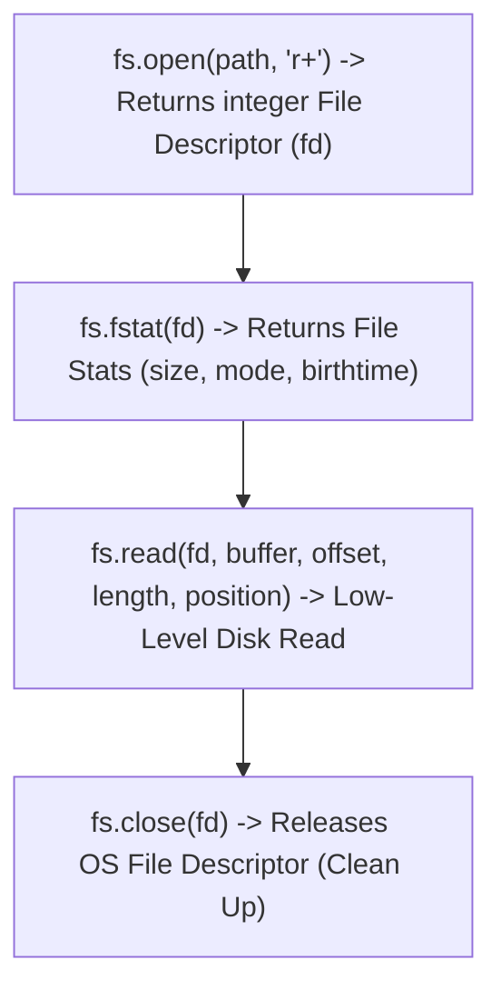

# File 08: Advanced File System (File Descriptors, Stats, Directory Watching)

## Overview
Advanced file system operations leverage **File Descriptors (`fs.open`)**, file metadata inspection (**`fs.stat`**), directory scanning (**`fs.readdir`**), and real-time file system watchers (**`fs.watch`**).

---

## 1. File Metadata & Descriptor Lifecycle



---

## 2. Advanced FS Operations Implementation

```javascript
const fs = require("fs").promises;
const path = require("path");

async function inspectFileStats() {
    const filePath = path.join(__dirname, "08-fs-advanced.js");

    try {
        // 1. Inspect File Stats
        const stats = await fs.stat(filePath);
        console.log("Is File:", stats.isFile());
        console.log("Is Directory:", stats.isDirectory());
        console.log("File Size (Bytes):", stats.size);
        console.log("Created Time:", stats.birthtime);

        // 2. Directory Recursive Search
        const files = await fs.readdir(__dirname, { withFileTypes: true });
        console.log("Directory Contents:");
        files.forEach(file => {
            console.log(`  [${file.isDirectory() ? "DIR" : "FILE"}] ${file.name}`);
        });
    } catch (err) {
        console.error("Advanced FS Error:", err.message);
    }
}

inspectFileStats();
```

---

## Key Takeaways
1. **File Descriptors (fd)** are low-level integer keys assigned by the OS to open file references.
2. Use **`fs.stat()`** to inspect permissions (`mode`), file size (`size`), and modification timestamps.
3. Always close file descriptors (`fs.close()`) to avoid leaking OS handles.
