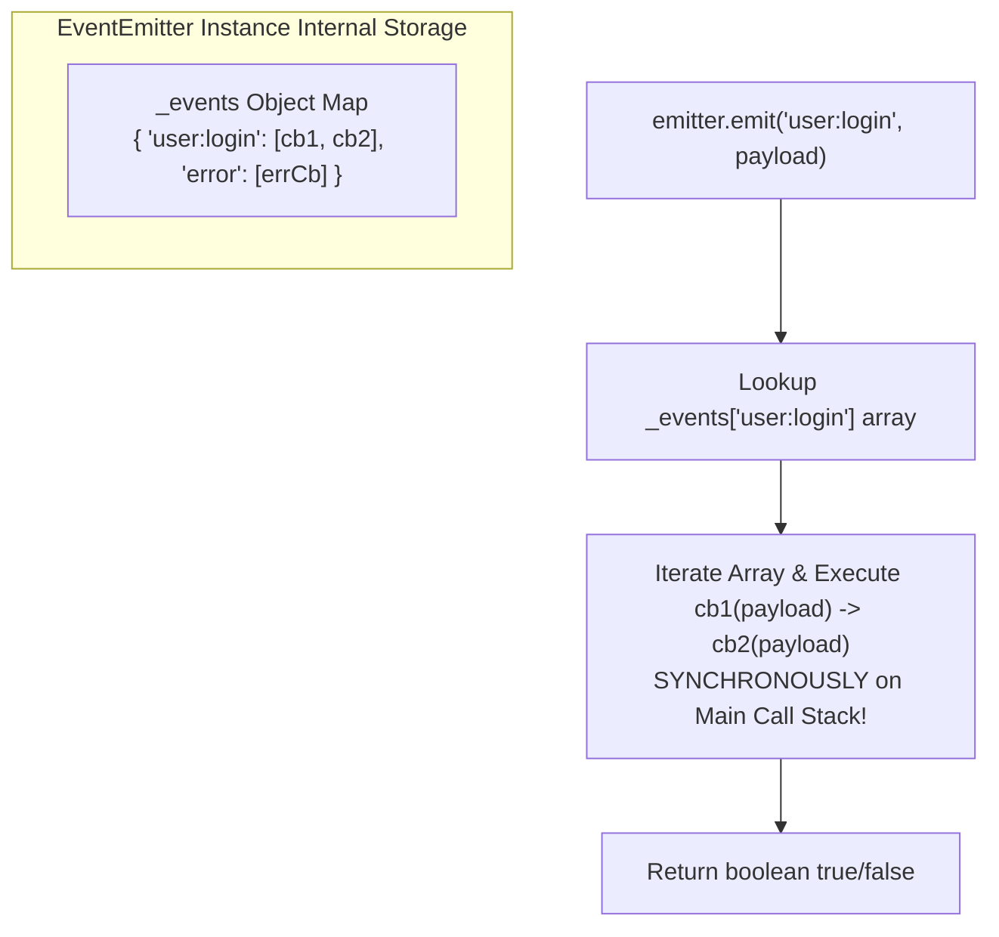
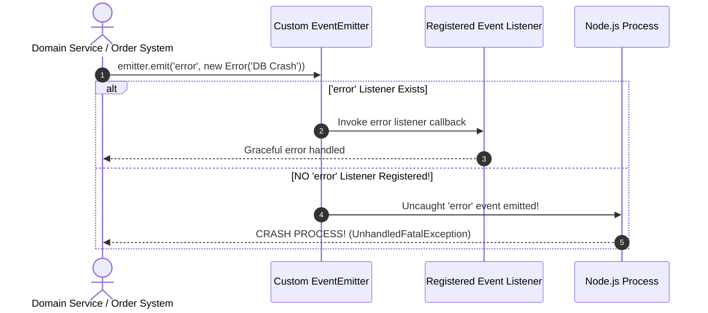

# Module 09: EventEmitter and Event-Driven Node.js Core Architecture

## Overview

The **`EventEmitter`** class from the core `node:events` module forms the foundational architecture of Node.js. Core components—including HTTP Servers, TCP Sockets, Stream Pipelines, and Process Signal handling—inherit from or compose `EventEmitter`.

It implements the asynchronous **Observer Pattern**, allowing objects to emit named events (`emit`) and register subscriber callbacks (`on`, `once`, `prependListener`).

---

## 1. Under the Hood: Internal Subscriber Map & Synchronous Dispatch

A common misconception is that `EventEmitter` callbacks execute asynchronously on the Event Loop. 

In reality, **`emitter.emit()` iterates through its internal callback listener array and executes every registered function SYNCHRONOUSLY** on the main thread call stack in the exact order they were registered.



### Async Listener Execution Pattern

If you require event listeners to run asynchronously without blocking the event emitting call stack, wrap the callback execution in `setImmediate()` or `queueMicrotask()`:

```javascript
const EventEmitter = require("node:events");
const emitter = new EventEmitter();

emitter.on("data:ingested", (data) => {
  // Offload processing to Check phase to keep dispatch non-blocking:
  setImmediate(() => {
    console.log("Async listener processing ingested data:", data.id);
  });
});
```

---

## 2. Event Dispatch Sequence & Error Handling Rules



> [!CAUTION]
> **Special Behavior of `'error'` Events**: If an `EventEmitter` emits an `'error'` event and **no listener** is currently attached to handle it, Node.js will print the stack trace and **crash the entire application process**! Always register an `on('error')` listener.

---

## 3. Memory Leak Prevention: `MaxListenersExceededWarning`

By default, an `EventEmitter` prints a memory leak warning if **more than 10 listeners** are attached to a single event key.

```text
(node:12345) MaxListenersExceededWarning: Possible EventEmitter memory leak detected. 
11 user:login listeners added to [UserTracker]. Use emitter.setMaxListeners() to increase limit.
```

### Memory Leak Root Causes & Mitigation

1. **Unsubscribing Temporary Listeners**: Failing to call `emitter.removeListener()` or `off()` when short-lived sockets or HTTP connections disconnect.
2. **Raising the Limit Explicitly**: If your design legitimately requires 50 subscribers, set `emitter.setMaxListeners(50)` to prevent false-positive warnings.
3. **Using AbortController for Auto-Cleanup**: Modern Node.js supports binding listeners tied to an `AbortSignal`.

```javascript
const EventEmitter = require("node:events");
const emitter = new EventEmitter();
const ac = new AbortController();

// Automatically removes listener when ac.abort() is called!
emitter.on("telemetry", (data) => {
  console.log("Telemetry record:", data);
}, { signal: ac.signal });

// Later when destroying subscriber component:
ac.abort(); // Unbinds listener cleanly without manual removeListener!
```

---

## 4. Production Domain EventEmitter Implementation

```javascript
const EventEmitter = require("node:events");
const { events } = require("node:events");

// Custom Domain Model extending EventEmitter
class OrderProcessingEngine extends EventEmitter {
  constructor() {
    super();
    // Increase default max listener threshold for high concurrency:
    this.setMaxListeners(25);
  }

  processOrder(orderId, amount) {
    console.log(`\n[ORDER ENGINE] Processing Order #${orderId} ($${amount})`);

    if (amount <= 0) {
      // Emit error event if payload invalid
      this.emit("error", new Error(`Invalid order amount: $${amount} for Order #${orderId}`));
      return;
    }

    // Emit domain event
    this.emit("order:created", { orderId, amount, timestamp: Date.now() });
  }
}

const engine = new OrderProcessingEngine();

// 1. Permanent Service Listener
engine.on("order:created", (order) => {
  console.log(`  [INVENTORY SERVICE] Deducting stock for Order #${order.orderId}`);
});

// 2. One-Time Audit Listener
engine.once("order:created", (order) => {
  console.log(`  [AUDIT LOG] Initial first-order metrics logged for #${order.orderId}`);
});

// 3. Mandatory Error Guard
engine.on("error", (err) => {
  console.error(`  [ERROR GUARD] Handled engine failure: ${err.message}`);
});

// Execute Domain Logic
engine.processOrder("ORD-9901", 149.99); // Triggers both on and once listeners
engine.processOrder("ORD-9902", 49.50);  // Triggers ONLY permanent 'on' listener
engine.processOrder("ORD-9903", -10.00); // Triggers 'error' listener cleanly without crash
```

---

## 5. Event Promisification with `events.once()`

Node.js provides `events.once(emitter, eventName)` to await an event emission as a native Promise:

```javascript
const { once, EventEmitter } = require("node:events");

async function waitForServerReady() {
  const server = new EventEmitter();

  // Simulate async server boot up
  setTimeout(() => {
    server.emit("ready", { port: 8080, status: "ONLINE" });
  }, 500);

  console.log("Awaiting 'ready' event emission...");
  // Pauses async function until 'ready' is emitted!
  const [eventPayload] = await once(server, "ready");
  
  console.log(`Server successfully started on port ${eventPayload.port}!`);
}

waitForServerReady();
```

---

## Key Production Takeaways

1. **EventEmitter Callbacks Run Synchronously**: `emitter.emit()` is synchronous. Long-running synchronous code inside an event handler blocks the event emitter caller.
2. **ALWAYS Register an `'error'` Handler**: Emitting `'error'` without a listener causes Node.js to throw an uncaught exception and crash the process.
3. **Use `AbortController` Signals for Cleanup**: Pass `{ signal: ac.signal }` to `emitter.on()` to easily detach event subscriptions when components unmount or disconnect.
4. **Use `once()` for Single-Event Triggers**: Avoid manual flags by using `.once()` for initialization events, socket connection closures, or single-shot task completions.

