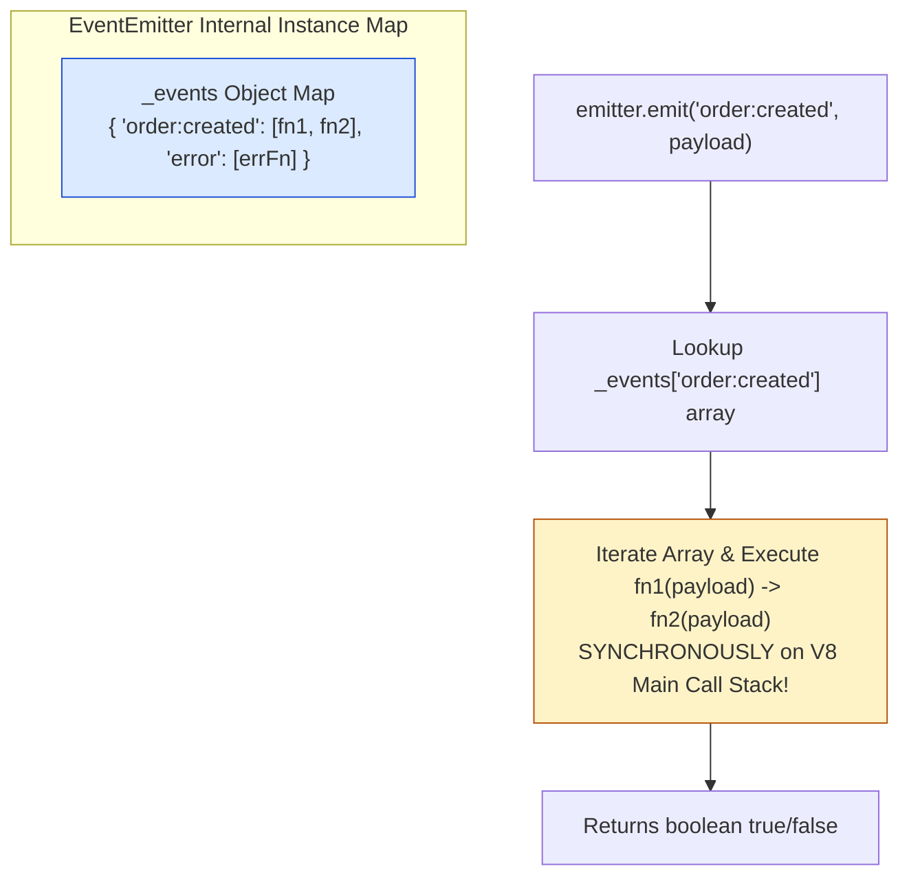
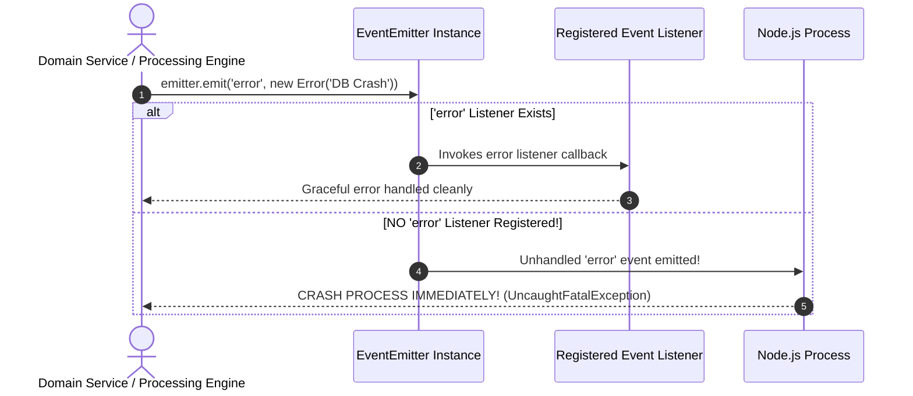
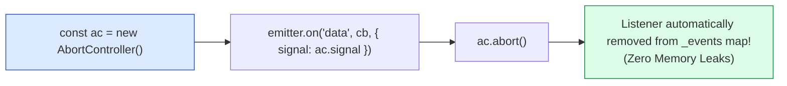

# Module 09: EventEmitter and Event-Driven Architecture in Node.js

## Overview

The **`EventEmitter`** class from the core `node:events` module forms the underlying event-driven foundation of Node.js. Core runtime primitives—including HTTP Servers, TCP Sockets, Stream Pipelines, and Process Signal listeners—inherit from or compose `EventEmitter`.

It implements the asynchronous **Observer Pattern**, allowing objects to emit named domain events (`emit`) and register subscriber callbacks (`on`, `once`, `prependListener`).

Understanding **Synchronous Dispatch Execution**, **Special `'error'` Crash Semantics**, **`MaxListenersExceededWarning` Mitigation via `AbortController`**, and **`events.once()` Promisification** is essential.

---

## 1. Under the Hood: Synchronous Dispatch Loop & Subscriber Map

A frequent architectural misconception is that `EventEmitter` subscriber callbacks execute asynchronously on the Event Loop.

In reality, **`emitter.emit()` iterates over its internal listener array and executes every registered callback SYNCHRONOUSLY** on the main V8 thread call stack in the exact order they were registered.



### Non-Blocking Asynchronous Listener Pattern

To prevent long-running listener callbacks from blocking the emitting call stack, offload execution to the Check phase or microtask queue:

```javascript
const EventEmitter = require("node:events");
const emitter = new EventEmitter();

emitter.on("user:registered", (user) => {
  // Offload heavy processing to Check phase to keep emit stack non-blocking:
  setImmediate(() => {
    console.log("Async background email dispatch for user:", user.email);
  });
});
```

---

## 2. Special `'error'` Event Crash Semantics



> [!CAUTION]
> **Special `'error'` Event Behavior**: If an `EventEmitter` instance emits an `'error'` event and **no listener** is currently attached to handle it, Node.js outputs the unhandled error stack trace and **terminates the entire process immediately**! Always attach a fallback `.on('error')` listener.

---

## 3. Memory Leak Prevention: `MaxListenersExceededWarning` & `AbortController`

By default, an `EventEmitter` prints a warning if **more than 10 listeners** are attached to a single event key:

```text
(node:14210) MaxListenersExceededWarning: Possible EventEmitter memory leak detected. 
11 order:created listeners added to [OrderEngine]. Use emitter.setMaxListeners() to increase limit.
```

### Automatic Subscription Cleanup via `AbortController`

Modern Node.js allows passing an `AbortSignal` to `emitter.on()`. Calling `.abort()` on the controller automatically detaches the listener from the event emitter:



---

## 4. Production Domain Code Showcase: Custom EventEmitter Engine

```javascript
const EventEmitter = require("node:events");
const { once } = require("node:events");

// Custom Domain Class extending EventEmitter
class OrderProcessingEngine extends EventEmitter {
  constructor() {
    super();
    // Increase default max listener threshold for high concurrency
    this.setMaxListeners(25);
  }

  processOrder(orderId, amount) {
    console.log(`\n[ENGINE]: Processing Order #${orderId} ($${amount})`);

    if (amount <= 0) {
      // Emit special 'error' event for invalid payload
      this.emit("error", new Error(`Invalid order amount $${amount} for #${orderId}`));
      return;
    }

    // Emit domain success event
    this.emit("order:created", { orderId, amount, timestamp: Date.now() });
  }
}

// Instantiate Engine
const engine = new OrderProcessingEngine();

// 1. Mandatory Error Handler Guard
engine.on("error", (err) => {
  console.error("  ✓ [ERROR HANDLER]: Gracefully caught failure:", err.message);
});

// 2. Permanent Domain Event Listener
engine.on("order:created", (order) => {
  console.log(`  ✓ [INVENTORY SERVICE]: Reserved stock for Order #${order.orderId}`);
});

// 3. One-Time Audit Listener
engine.once("order:created", (order) => {
  console.log(`  ✓ [AUDIT LOG]: First-order metrics recorded for #${order.orderId}`);
});

// 4. Subscription Managed via AbortController
const ac = new AbortController();
engine.on("order:created", (order) => {
  console.log(`  ✓ [TELEMETRY]: Temporary tracking for #${order.orderId}`);
}, { signal: ac.signal });

// Execution Flow
engine.processOrder("ORD-101", 150.00); // Fires all listeners
ac.abort(); // Detaches temporary telemetry listener cleanly!

engine.processOrder("ORD-102", 75.50);  // Telemetry listener skipped!
engine.processOrder("ORD-103", -20.00); // Triggers error handler cleanly without crashing!
```

---

## 5. Event Promisification with `events.once()`

Node.js provides `events.once(emitter, eventName)` to await an event emission as a native Promise:

```javascript
const { once, EventEmitter } = require("node:events");

async function waitForServerInitialization() {
  const bootEmitter = new EventEmitter();

  // Simulate async background boot sequence
  setTimeout(() => {
    bootEmitter.emit("ready", { port: 8080, status: "ONLINE" });
  }, 300);

  console.log("Awaiting 'ready' event emission...");
  // Pauses async function until 'ready' event is emitted!
  const [payload] = await once(bootEmitter, "ready");
  
  console.log(`Server initialized successfully on port ${payload.port}! Status: ${payload.status}`);
}

waitForServerInitialization();
```

---

## Key Production Takeaways

1. **EventEmitter Callbacks Run Synchronously**: `emitter.emit()` is synchronous. Long-running synchronous code inside an event handler blocks the event emitting thread.
2. **ALWAYS Register an `'error'` Listener**: Emitting `'error'` without a listener causes Node.js to throw an uncaught exception and crash the process.
3. **Use `AbortController` Signals for Cleanup**: Pass `{ signal: ac.signal }` to `emitter.on()` to automatically unbind event subscriptions when components unmount or disconnect.
4. **Use `once()` for Single-Event Triggers**: Avoid manual boolean flags by using `.once()` for initialization events, socket connection closures, or single-shot task completions.


