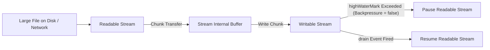

# File 10: Streams — Readable and Writable Streams

## Overview
**Streams** are collections of data that might not be available all at once and don't fit in memory. Instead of reading an entire file into memory as a single Buffer, streams process data sequentially chunk-by-chunk.

---

## 1. Stream Types & Backpressure Flow



---

## 2. Reading and Writing Streams Implementation

```javascript
const fs = require("fs");
const path = require("path");

const sourceFile = path.join(__dirname, "large_source.txt");
const destFile = path.join(__dirname, "large_copy.txt");

// 1. Create Streams with 64KB highWaterMark chunks
const readable = fs.createReadStream(sourceFile, { highWaterMark: 64 * 1024 });
const writable = fs.createWriteStream(destFile);

// 2. Event-Driven Stream Processing
readable.on("data", chunk => {
    console.log(`Received Chunk of size: ${chunk.length} bytes`);
    const canContinue = writable.write(chunk);
    
    // Handle Backpressure
    if (!canContinue) {
        console.log("Backpressure triggered! Pausing readable stream...");
        readable.pause();
    }
});

writable.on("drain", () => {
    console.log("Writable buffer drained! Resuming readable stream...");
    readable.resume();
});

readable.on("end", () => {
    console.log("Stream reading complete.");
    writable.end();
});
```

---

## Key Takeaways
1. Streams process large files in **chunks**, enabling low memory usage ($O(1)$ RAM overhead).
2. Four core stream types: **Readable**, **Writable**, **Duplex**, **Transform**.
3. **Backpressure** occurs when a writable stream cannot process data as fast as the readable stream pushes it.
