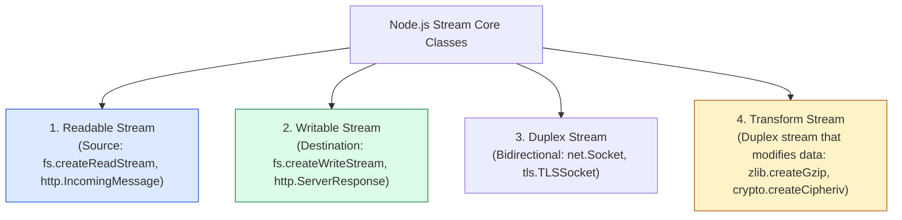
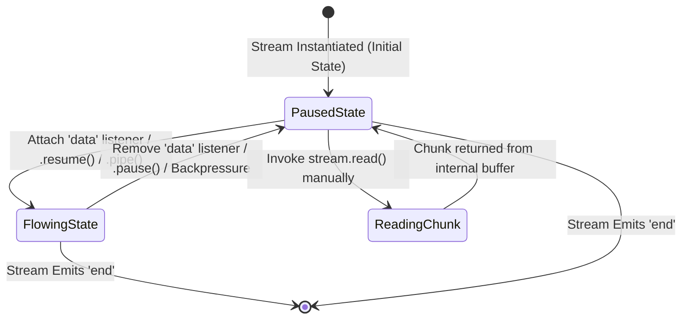
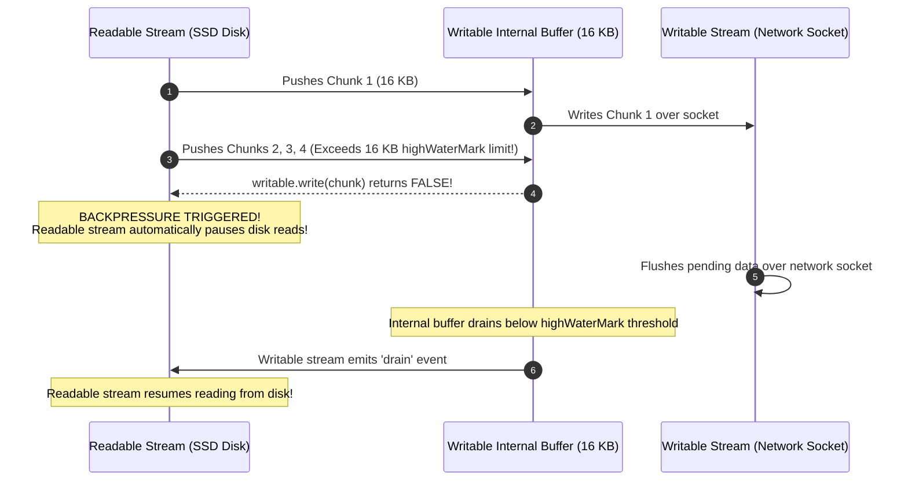

# Module 10: Stream Architecture — Readable, Writable, and Backpressure Mechanics

## Overview

**Streams** are Unix-inspired data processing primitives in Node.js designed to handle continuous sequences of data chunk-by-chunk without loading the entire payload into main memory.

Whether reading a 10 GB log file, streaming live video over HTTP, or processing high-concurrency TCP socket connections, streams reduce application RAM consumption from $O(N)$ (where $N$ is total payload byte size) to a constant $O(1)$ memory footprint governed by the stream's **`highWaterMark`** internal buffer threshold (typically 64 KB for file streams, 16 KB for standard sockets).

Understanding **The 4 Stream Archetypes**, **Readable Stream Flowing vs. Paused State Machines**, **Backpressure Feedback Loops**, and **Custom Writable Stream Architecture** is essential.

---

## 1. The Four Fundamental Stream Categories



---

## 2. Readable Stream State Machine: Flowing vs. Paused

A `Readable` stream operates in one of two internal data emission states:



| Operational State | Trigger Mechanism | How Data Is Consumed | Primary Use Case |
| :--- | :--- | :--- | :--- |
| **Flowing Mode** | Adding `.on('data')`, calling `.pipe()`, or `.resume()` | Data chunks are pushed automatically as fast as Libuv retrieves them. | High-throughput stream piping. |
| **Paused Mode** | Default state, or explicitly calling `.pause()` | Caller must explicitly invoke `stream.read()` inside a `.on('readable')` listener. | Custom frame boundary parsing. |

---

## 3. Backpressure Feedback Loops & `highWaterMark`

**Backpressure** is the automatic feedback mechanism that prevents a high-speed `Readable` stream from overwhelming a slower `Writable` destination (e.g. reading from an NVMe SSD at 3 GB/s and writing to a slow 10 Mbps Wi-Fi socket).



---

## 4. Code Showcase: Production Backpressure Handling & Custom Writable Stream

```javascript
const { Writable } = require("node:stream");
const fs = require("node:fs");
const path = require("node:path");

// ==========================================
// 1. CUSTOM WRITABLE STREAM IMPLEMENTATION
// ==========================================
class DatabaseBatchWriter extends Writable {
  constructor(options) {
    super(options);
    this.recordsInserted = 0;
  }

  // Overriding mandatory internal _write method
  _write(chunk, encoding, callback) {
    try {
      const record = JSON.parse(chunk.toString());
      this.recordsInserted++;
      console.log(`  ✓ [DB WRITER]: Inserted record #${record.id} (${record.user})`);

      // Invoke callback(null) to acknowledge successful chunk write:
      callback(null);
    } catch (err) {
      // Pass error to callback to abort stream:
      callback(err);
    }
  }
}

// ==========================================
// 2. MANUAL BACKPRESSURE DEMONSTRATION
// ==========================================
console.log("=== EXECUTING STREAM BACKPRESSURE SUITE ===");

const dbWriter = new DatabaseBatchWriter({ highWaterMark: 64 }); // Small 64 byte buffer for demo

// Generate sample payloads
const payload1 = Buffer.from(JSON.stringify({ id: 101, user: "Alice" }));
const payload2 = Buffer.from(JSON.stringify({ id: 102, user: "Bob" }));

const canAccept1 = dbWriter.write(payload1);
console.log("Write Payload 1 Buffer Accepted?:", canAccept1); // true

const canAccept2 = dbWriter.write(payload2);
console.log("Write Payload 2 Buffer Accepted?:", canAccept2); // false (Backpressure triggered!)

if (!canAccept2) {
  console.log("-> Backpressure active! Waiting for 'drain' event before sending more...");
}

dbWriter.on("drain", () => {
  console.log("  ✓ [DRAIN EVENT]: Writable buffer flushed! Resuming writes.");
  dbWriter.end();
});
```

---

## Key Production Takeaways

1. **Always Respect Backpressure**: If writing to a stream manually with `.write()`, check if it returns `false`. If it does, stop writing until the `'drain'` event fires to avoid exploding RAM consumption.
2. **Never Use Whole-File Reads (`fs.readFile`) for Large Files**: Using `fs.readFile()` loads the entire file into Node.js memory at once. Use `fs.createReadStream()` to keep memory consumption flat ($O(1)$).
3. **Tune `highWaterMark` for Network Throughput**: Tuning `highWaterMark` from 16 KB up to 256 KB on gigabit network streams can reduce CPU context switching overhead significantly.
4. **Prefer `stream.pipeline()` over Manual Event Binding**: Manual `.on('data')` listeners are error-prone; `stream.pipeline()` automatically manages backpressure, stream unpiping, and error cleanup.


