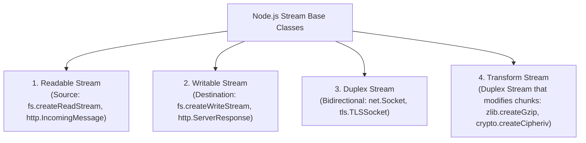
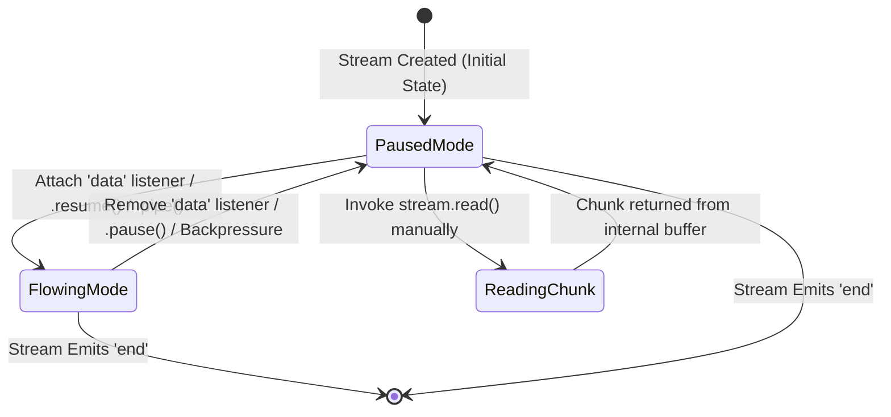
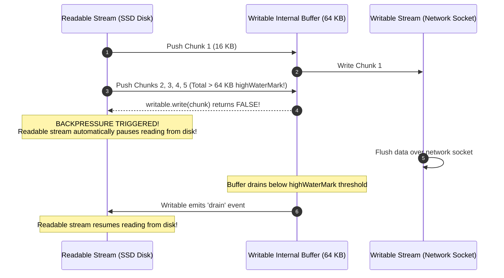

# Module 10: Streams Architecture — Readable, Writable, and Backpressure Mechanics

## Overview

**Streams** are Unix-inspired data handling primitives in Node.js designed to process continuous sequences of data chunk-by-chunk without loading the entire payload into main memory.

Whether reading a 10 GB log file, streaming video over HTTP, or receiving TCP network packets, streams reduce application RAM consumption from $O(N)$ (where $N$ is total payload size) to a constant $O(1)$ memory footprint determined by the stream's **`highWaterMark`** buffer limit (typically 64 KB for file streams, 16 KB for standard streams).

---

## 1. The Four Fundamental Stream Categories



---

## 2. Readable Stream Operating Modes: Flowing vs. Paused

A `Readable` stream operates in one of two distinct data emission modes:



| Mode | Trigger Mechanism | How Data Is Consumed | Best Use Case |
| :--- | :--- | :--- | :--- |
| **Flowing Mode** | Adding `.on('data')`, calling `.pipe()`, or `.resume()` | Data chunks are pushed automatically as fast as Libuv retrieves them. | High-throughput piping to writable streams. |
| **Paused Mode** | Default state, or explicitly calling `.pause()` | Caller must explicitly call `stream.read()` inside a `.on('readable')` listener. | Precise control over custom buffer boundaries. |

---

## 3. Backpressure Mechanics & The `highWaterMark`

**Backpressure** is the feedback mechanism that prevents a fast `Readable` stream from overwhelming a slower `Writable` stream destination (e.g. reading from an NVMe SSD disk at 3 GB/s and writing to a slow 10 Mbps Wi-Fi TCP network socket).



### Backpressure Code Logic

```javascript
const fs = require("node:fs");
const path = require("node:path");

const sourcePath = path.join(__dirname, "large_video.mp4");
const destPath = path.join(__dirname, "copy_video.mp4");

// 1. Create Readable & Writable Streams with custom 16 KB highWaterMark
const readable = fs.createReadStream(sourcePath, { highWaterMark: 16 * 1024 });
const writable = fs.createWriteStream(destPath, { highWaterMark: 16 * 1024 });

// 2. Manual Backpressure Handling Pattern (Piping emulates this under the hood!)
readable.on("data", (chunk) => {
  console.log(`[READ] Received ${chunk.length} bytes chunk.`);

  // Attempt to write chunk to destination
  const canAcceptMore = writable.write(chunk);

  if (!canAcceptMore) {
    console.log("  [BACKPRESSURE] Writable buffer full! Pausing readable disk stream...");
    readable.pause();
  }
});

// 3. Listen for 'drain' event to resume reading when writable buffer empties
writable.on("drain", () => {
  console.log("  [DRAIN] Writable stream flushed. Resuming readable disk stream...");
  readable.resume();
});

readable.on("end", () => {
  console.log("[SUCCESS] Readable stream completed.");
  writable.end(); // Close writable stream handle
});
```

---

## 4. Custom Writable Stream Implementation

You can implement custom writable streams by extending `Writable` and overriding the `_write` or `_writev` internal method:

```javascript
const { Writable } = require("node:stream");

class DatabaseBatchWriter extends Writable {
  constructor(options) {
    super(options);
    this.storage = [];
  }

  // Mandatory implementation method
  _write(chunk, encoding, callback) {
    try {
      const record = JSON.parse(chunk.toString());
      this.storage.push(record);
      console.log(`[DB WRITER] Inserted record ID #${record.id}`);

      // Invoke callback(null) to signal successful write completion:
      callback(null);
    } catch (err) {
      // Pass error to callback to signal stream failure:
      callback(err);
    }
  }
}

const dbWriter = new DatabaseBatchWriter({ highWaterMark: 64 * 1024 });
dbWriter.write(JSON.stringify({ id: 101, user: "Alice" }));
dbWriter.write(JSON.stringify({ id: 102, user: "Bob" }));
dbWriter.end();
```

---

## Key Production Takeaways

1. **Always Respect Backpressure**: If writing to a stream manually with `.write()`, check if it returns `false`. If it does, stop writing until the `'drain'` event fires to avoid exploding RAM consumption.
2. **Never Use Whole-File Reads (`fs.readFile`) for Large Files**: Using `fs.readFile()` loads the entire file into Node.js RAM at once. Use `fs.createReadStream()` to keep memory consumption at constant $O(1)$.
3. **Set Appropriate `highWaterMark`**: For high-throughput network applications, tuning `highWaterMark` from 16 KB up to 256 KB can significantly reduce event loop tick overhead.
4. **Prefer `.pipe()` or `stream.pipeline()` over Manual Event Binding**: Manual `.on('data')` listeners are error-prone; `.pipe()` automatically handles backpressure and buffer pauses for you.

