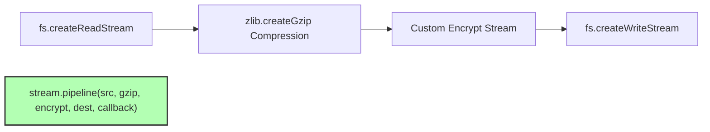

# File 11: Transform Streams and stream.pipeline

## Overview
A **Transform Stream** is a Duplex stream where the output is computed from the input. Using **`stream.pipeline()`** chains multiple streams together with proper error handling and automatic cleanup.

---

## 1. Stream Pipeline Architecture



---

## 2. Custom Transform Stream & Pipeline Implementation

```javascript
const { Transform, pipeline } = require("stream");
const fs = require("fs");
const zlib = require("zlib");
const path = require("path");

// Custom Uppercase Transform Stream
class UppercaseTransform extends Transform {
    _transform(chunk, encoding, callback) {
        // Modify chunk content on the fly
        const upperChunk = chunk.toString().toUpperCase();
        this.push(upperChunk);
        callback(); // Signal ready for next chunk
    }
}

const uppercaseStream = new UppercaseTransform();
const gzipStream = zlib.createGzip();

const sourcePath = path.join(__dirname, "input.txt");
const destinationPath = path.join(__dirname, "output.txt.gz");

// Safe Stream Chaining using stream.pipeline
pipeline(
    fs.createReadStream(sourcePath),
    uppercaseStream,
    gzipStream,
    fs.createWriteStream(destinationPath),
    (err) => {
        if (err) {
            console.error("Pipeline Failed:", err.message);
        } else {
            console.log("Pipeline Succeeded! File transformed and gzipped.");
        }
    }
);
```

---

## Key Takeaways
1. Use **`stream.pipeline()`** instead of `stream.pipe()` to automatically handle error propagation and clean up stream resources on failure.
2. **Transform Streams** modify data on the fly as it flows between source and destination streams.
