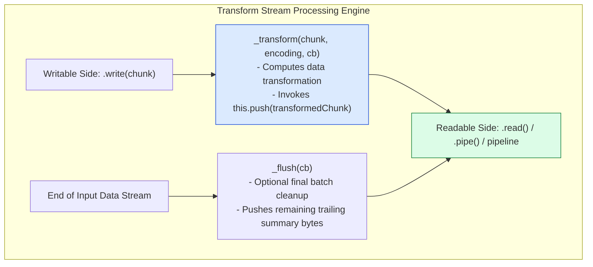

# Module 11: Transform Streams, `stream.pipeline`, and Resource Leak Prevention

## Overview

A **Transform Stream** is a specialized `Duplex` stream where the output bytes are calculated dynamically from the input bytes as data flows through the stream processing engine. Common core examples include `zlib.createGzip()` (compression), `crypto.createCipheriv()` (encryption), and custom data parsers/redactors.

While legacy Node.js code relied on `.pipe()`, modern production Node.js applications use **`stream.pipeline()`** (or `require('node:stream/promises').pipeline`) to safely chain stream stages together, automatically propagate errors across all stages, and prevent memory leaks or unclosed file handle vulnerabilities.

Understanding **Transform Stream `_transform()` & `_flush()` Internal Flows**, **`.pipe()` Resource Leak Hazards vs. `stream.pipeline()` Auto-Cleanup**, and **Async Stream Iteration (`for await...of`)** is essential.

---

## 1. Transform Stream Architecture & Internal Flow

Unlike a standard `Duplex` stream (where reading and writing operate on independent buffer channels, such as a TCP socket), a `Transform` stream passes written data through a `_transform()` processing step before pushing it to the readable buffer queue:



---

## 2. `.pipe()` Dangers vs. `stream.pipeline()` Resource Safety

Why is raw `.pipe()` considered a critical anti-pattern in production Node.js services?

```mermaid
flowchart TD
    subgraph Dangerous .pipe Chain (Resource Leak Hazard)
        Src1[Read Stream File] -->|pipe| Gzip1[Gzip Compress Stream]
        Gzip1 -->|pipe| Dest1[Write Stream Socket]
        
        Gzip1 -.->|Error Thrown inside Gzip| Error1[Error Event Emitted]
        Error1 -.->|Uncaught!| Leak1["RESOURCE LEAK VULNERABILITY!<br/>Dest1 and Src1 remain OPEN forever in RAM!"]
    end

    subgraph Safe stream.pipeline (Automatic Resource Destruction)
        Src2[Read Stream File] --> Pipeline[stream.pipeline Engine]
        Gzip2[Gzip Compress Stream] --> Pipeline
        Dest2[Write Stream Socket] --> Pipeline

        Pipeline -.->|Error in ANY Stream Stage| AutoDestroy["AUTOMATIC RESOURCE CLEANUP:<br/>Destroys ALL streams in chain & releases OS Handles!"]
    end

    style Leak1 fill:#fee2e2,stroke:#dc2626
    style AutoDestroy fill:#dcfce7,stroke:#15803d
```

### Critical Architectural Comparison Matrix

| Feature Dimension | Legacy `readable.pipe(writable)` | Modern `stream.pipeline(s1, s2, s3)` |
| :--- | :--- | :--- |
| **Error Propagation** | Errors in source streams are **NOT** forwarded to destination streams. | Errors in **any stage** immediately trigger the completion callback / promise rejection. |
| **Resource Cleanup** | If an intermediate stream errors, remaining handles stay open, leaking RAM/FDs. | **Automatically destroys** all streams in the pipeline upon error or completion. |
| **Promise Integration** | Does not natively return Promises. | Native Promise support via `require('node:stream/promises')`. |
| **Production Safety** | DANGEROUS for HTTP/TCP servers. | **MANDATORY production standard for all stream chaining.** |

---

## 3. Code Showcase: Custom Transform Stream & Encrypted Pipeline

```javascript
const { Transform } = require("node:stream");
const { pipeline } = require("node:stream/promises");
const fs = require("node:fs");
const zlib = require("node:zlib");
const crypto = require("node:crypto");
const path = require("node:path");

// 1. Custom Transform Stream: Redacts sensitive credit card numbers from CSV log stream
class CreditCardRedactorTransform extends Transform {
  constructor(options) {
    super(options);
    // Regex matching 16-digit credit card numbers
    this.cardRegex = /\b\d{4}[- ]?\d{4}[- ]?\d{4}[- ]?\d{4}\b/g;
  }

  _transform(chunk, encoding, callback) {
    try {
      const text = chunk.toString("utf-8");
      // Replace sensitive card numbers with redacted mask
      const redactedText = text.replace(this.cardRegex, "****-****-****-****");
      
      // Push modified data chunk to readable output queue
      this.push(redactedText);
      
      // Signal ready for next chunk
      callback(null);
    } catch (err) {
      callback(err); // Pass error to stream pipeline
    }
  }

  // Executed right before stream closes to append trailing audit log
  _flush(callback) {
    this.push("\n// REDACTION AUDIT SUMMARY: STREAM COMPLETED //\n");
    callback(null);
  }
}

// 2. Multi-Stage Pipeline Execution (Read -> Redact -> Gzip -> Encrypt -> File Write)
async function executeSecureLogPipeline() {
  const inputPath = path.join(__dirname, "sensitive_audit.csv");
  const outputPath = path.join(__dirname, "audit.csv.gz.enc");

  console.log("=== EXECUTING STREAM TRANSFORM & PIPELINE SUITE ===");

  // Create temporary input CSV file
  fs.writeFileSync(inputPath, "id,user,card\n101,Alice,4111-2222-3333-4444\n102,Bob,5500-0000-0000-0000\n");

  const redactor = new CreditCardRedactorTransform();
  const gzip = zlib.createGzip();
  
  // AES-256 Encryption Stream
  const cipherKey = crypto.randomBytes(32);
  const iv = crypto.randomBytes(16);
  const cipher = crypto.createCipheriv("aes-256-cbc", cipherKey, iv);

  try {
    // Modern Promise-based Stream Pipeline
    await pipeline(
      fs.createReadStream(inputPath),
      redactor,
      gzip,
      cipher,
      fs.createWriteStream(outputPath)
    );

    console.log("  ✓ Pipeline completed cleanly without memory leaks or unclosed handles!");

  } catch (err) {
    console.error("  !! PIPELINE FAILED safely:", err.message);
  } finally {
    // Cleanup temporary files
    if (fs.existsSync(inputPath)) fs.unlinkSync(inputPath);
    if (fs.existsSync(outputPath)) fs.unlinkSync(outputPath);
  }
}

executeSecureLogPipeline();
```

---

## 4. Consuming Streams via Async Iterators (`for await...of`)

In modern Node.js, any `Readable` stream is an `AsyncIterable`, allowing developers to consume stream chunks directly with `for await...of` loops without manual event listeners:

```javascript
const fs = require("node:fs");
const path = require("node:path");

async function parseStreamLineByLine(filePath) {
  const readable = fs.createReadStream(filePath, { encoding: "utf-8" });

  try {
    for await (const chunk of readable) {
      console.log("Read chunk directly via Async Iterator:", chunk.length, "bytes");
    }
    console.log("Stream async iteration complete.");
  } catch (err) {
    console.error("Stream reading error:", err.message);
  }
}
```

---

## Key Production Takeaways

1. **NEVER Use `.pipe()` in Server Code**: Raw `.pipe()` leaves file descriptors and network sockets open if an error occurs mid-stream. ALWAYS use `stream.pipeline()`.
2. **Import `node:stream/promises` for Async/Await**: Use `const { pipeline } = require('node:stream/promises')` or `import { pipeline } from 'node:stream/promises'` for clean, readable code.
3. **Override `_transform` for Processing Logic**: Push transformed data via `this.push(data)` and notify completion by calling `callback(null)`.
4. **Implement `_flush` for Trailing Operations**: Use `_flush(callback)` in Transform streams if you need to emit final data calculations (e.g. CRC checksums, summary statistics) after all input chunks have been processed.

