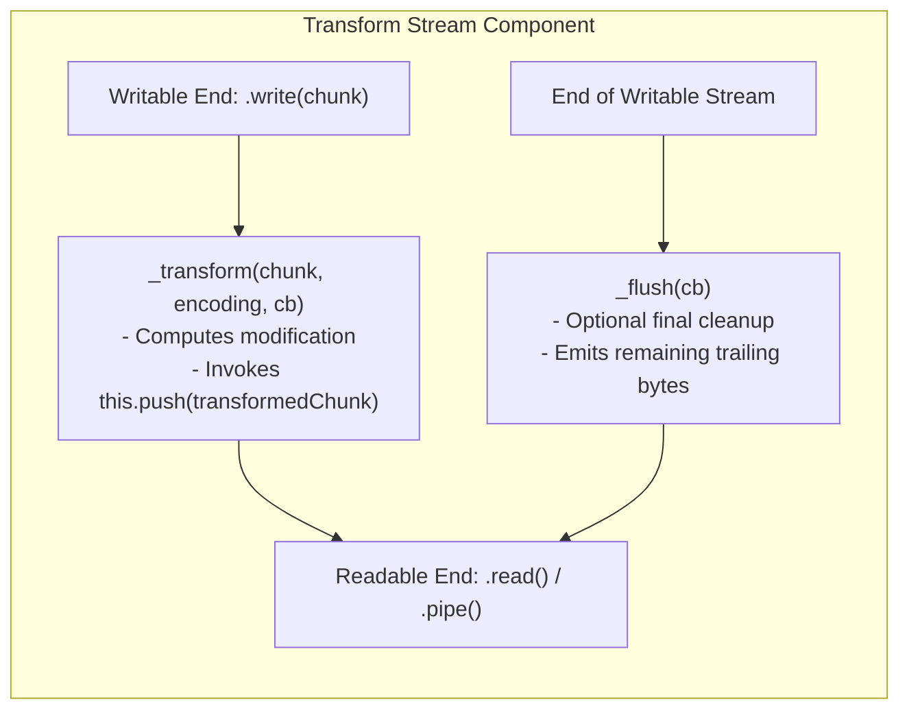
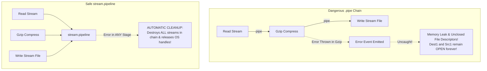

# Module 11: Transform Streams, `stream.pipeline`, and Error Propagation

## Overview

A **Transform Stream** is a specialized `Duplex` stream where the output bytes are calculated dynamically from the input bytes as data flows through the stream. Common examples include `zlib.createGzip()` (compression), `crypto.createCipheriv()` (encryption), and custom parsing streams.

While legacy Node.js code relied on `.pipe()`, modern Node.js applications use **`stream.pipeline()`** (or `require('node:stream/promises').pipeline`) to safely chain streams together, automatically propagate errors across all stream stages, and prevent memory leaks from unclosed handles.

---

## 1. Transform Stream Architecture & Internal Flow

Unlike a standard `Duplex` stream (where reading and writing operate on independent buffers, such as a TCP socket), a `Transform` stream passes written data through a `_transform()` processing step before pushing it to the readable buffer queue.



---

## 2. `.pipe()` Dangers vs. `stream.pipeline()` Safety

Why is using raw `.pipe()` considered an anti-pattern in production code?



### Critical Differences Table

| Feature | `readable.pipe(writable)` | `stream.pipeline(s1, s2, s3, cb)` |
| :--- | :--- | :--- |
| **Error Propagation** | Errors in source streams are **NOT** forwarded to destination streams. | Errors in **any stage** immediately trigger the completion callback. |
| **Resource Cleanup** | If an intermediate stream errors, remaining handles stay open, leaking RAM/FDs. | **Automatically destroys** all streams in the pipeline upon error or completion. |
| **Promise Integration** | Does not natively return Promises. | Native Promise support via `require('node:stream/promises')`. |
| **Production Safety** | DANGEROUS for server requests. | **MANDATORY standard for all stream chaining.** |

---

## 3. Custom Transform Stream & Async Pipeline Example

```javascript
const { Transform } = require("node:stream");
const { pipeline } = require("node:stream/promises");
const fs = require("node:fs");
const zlib = require("node:zlib");
const crypto = require("node:crypto");
const path = require("node:path");

// 1. Custom Transform Stream: Sanitizes CSV data by redacting credit card numbers
class CreditCardRedactorTransform extends Transform {
  constructor(options) {
    super(options);
    // Regex matching 16-digit credit card numbers
    this.cardRegex = /\b\d{4}[- ]?\d{4}[- ]?\d{4}[- ]?\d{4}\b/g;
  }

  _transform(chunk, encoding, callback) {
    try {
      const text = chunk.toString("utf-8");
      // Replace sensitive card numbers with redacted mask
      const redactedText = text.replace(this.cardRegex, "****-****-****-****");
      
      // Push modified data to readable output queue
      this.push(redactedText);
      
      // Signal ready for next chunk
      callback(null);
    } catch (err) {
      callback(err); // Pass error to stream pipeline
    }
  }

  // Optional: Executed once right before stream closes to append trailing summary data
  _flush(callback) {
    this.push("\n// REDACTION AUDIT COMPLETE //\n");
    callback(null);
  }
}

// 2. Executing Multi-Stage Pipeline (Read -> Redact -> Gzip -> Encrypt -> Disk Write)
async function processSensitiveLogs() {
  const inputPath = path.join(__dirname, "user_transactions.csv");
  const outputPath = path.join(__dirname, "transactions.csv.gz.enc");

  // Create temporary demo CSV file
  fs.writeFileSync(inputPath, "id,user,card\n101,Alice,4111-2222-3333-4444\n102,Bob,5500-0000-0000-0000\n");

  const redactor = new CreditCardRedactorTransform();
  const gzip = zlib.createGzip();
  
  // Create AES-256 encryption stream
  const cipherKey = crypto.randomBytes(32);
  const iv = crypto.randomBytes(16);
  const cipher = crypto.createCipheriv("aes-256-cbc", cipherKey, iv);

  try {
    // Modern Promise-based Stream Pipeline
    await pipeline(
      fs.createReadStream(inputPath),
      redactor,
      gzip,
      cipher,
      fs.createWriteStream(outputPath)
    );

    console.log("SUCCESS: Log pipeline completed cleanly without memory leaks!");

  } catch (error) {
    console.error("PIPELINE FAILED safely:", error.message);
  } finally {
    // Cleanup input CSV
    if (fs.existsSync(inputPath)) fs.unlinkSync(inputPath);
    if (fs.existsSync(outputPath)) fs.unlinkSync(outputPath);
  }
}

processSensitiveLogs();
```

---

## 4. Consuming Streams via Async Iterators (`for await...of`)

In modern Node.js, any `Readable` stream is an `AsyncIterable`, allowing you to consume stream chunks directly with `for await...of` loops without binding event listeners:

```javascript
const fs = require("node:fs");

async function parseLogFileLineByLine(filePath) {
  const readable = fs.createReadStream(filePath, { encoding: "utf-8" });

  try {
    for await (const chunk of readable) {
      console.log("Read chunk directly via Async Iterator:", chunk.length, "bytes");
    }
    console.log("Stream reading complete.");
  } catch (err) {
    console.error("Stream reading error:", err.message);
  }
}
```

---

## Key Production Takeaways

1. **NEVER Use `.pipe()` in Server Code**: Raw `.pipe()` leaves file descriptors and network sockets open if an error occurs mid-stream. ALWAYS use `stream.pipeline()`.
2. **Import `stream/promises` for Async/Await**: Use `const { pipeline } = require('node:stream/promises')` for clean, readable code with `await pipeline(...)`.
3. **Override `_transform` for Custom Processing**: When creating custom Transform streams, push transformed data via `this.push()` and notify stream completion by calling `callback(null)`.
4. **Implement `_flush` for Trailing Data**: Use `_flush(callback)` in Transform streams if you need to emit final data calculations (e.g. CRC checksums, summary statistics) after all input chunks have been processed.
