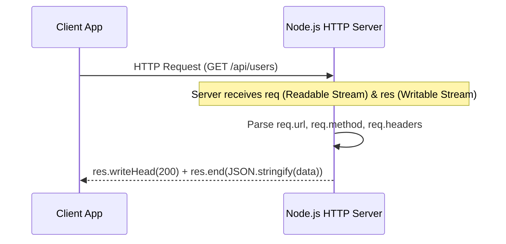

# File 12: Creating HTTP Servers in Node.js

## Overview
The built-in **`http`** module allows building HTTP servers without external dependencies. The server receives an incoming **`http.IncomingMessage`** (Readable Stream) request and returns an **`http.ServerResponse`** (Writable Stream).

---

## 1. HTTP Server Request / Response Stream Lifecycle



---

## 2. Low-Level HTTP Server Implementation

```javascript
const http = require("http");

const PORT = 3000;

const server = http.createServer((req, res) => {
    const { method, url } = req;

    console.log(`[HTTP REQUEST] ${method} ${url}`);

    // CORS & JSON Headers
    res.setHeader("Content-Type", "application/json");
    res.setHeader("Access-Control-Allow-Origin", "*");

    if (url === "/api/users" && method === "GET") {
        res.writeHead(200);
        res.end(JSON.stringify({ status: "SUCCESS", users: [{ id: 1, name: "Priya" }] }));
    } else if (url === "/api/users" && method === "POST") {
        let body = "";
        
        // Read JSON Request Body Stream
        req.on("data", chunk => { body += chunk.toString(); });
        req.on("end", () => {
            const userData = JSON.parse(body);
            res.writeHead(201);
            res.end(JSON.stringify({ status: "CREATED", user: userData }));
        });
    } else {
        res.writeHead(404);
        res.end(JSON.stringify({ error: "NOT_FOUND", message: "Route not found" }));
    }
});

server.listen(PORT, () => {
    console.log(`Node.js HTTP Server listening on port ${PORT}`);
});
```

---

## Key Takeaways
1. `req` is a **Readable Stream**; `res` is a **Writable Stream**.
2. Set response headers using `res.setHeader()` or `res.writeHead(statusCode, headers)`.
3. Parse request body streams asynchronously listening to `'data'` and `'end'` events.
