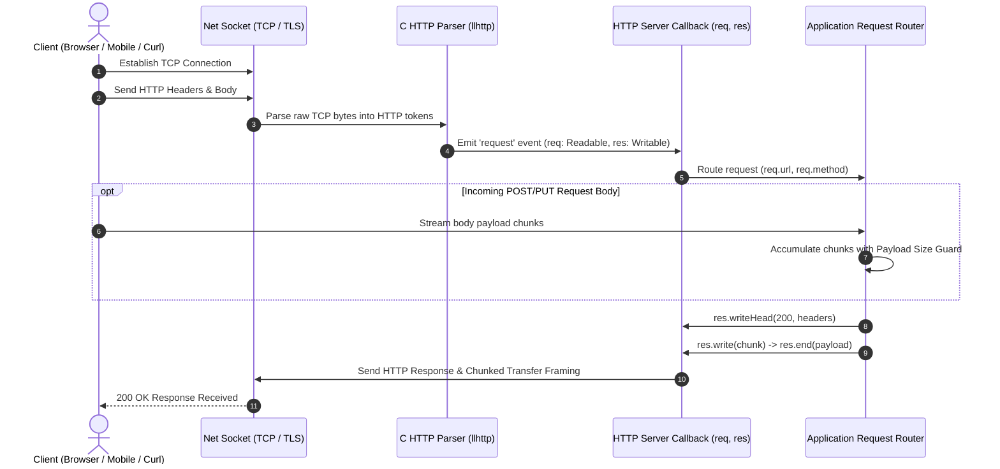

# Module 12: Creating Low-Level HTTP Servers in Node.js

## Overview

The built-in **`node:http`** module provides a low-level, high-performance HTTP server implementation built directly on top of Node.js TCP sockets (`node:net`) and C-based HTTP parsers (`llhttp`).

Understanding how `http.createServer()` operates under the hood is critical: the request parameter (`req`) is an instance of **`http.IncomingMessage`** (a Readable Stream), while the response parameter (`res`) is an instance of **`http.ServerResponse`** (a Writable Stream).

---

## 1. HTTP Server Request / Response Stream Lifecycle



---

## 2. Request / Response Architecture Breakdown

```mermaid
flowchart TD
    subgraph http.createServer((req, res))
        subgraph req: http.IncomingMessage (Readable Stream)
            ReqUrl["req.url (URL path & query string)"]
            ReqMethod["req.method (GET, POST, PUT, DELETE, OPTIONS)"]
            ReqHeaders["req.headers (Headers Object)"]
            ReqBody["req.on('data') (Readable stream body chunks)"]
        end

        subgraph res: http.ServerResponse (Writable Stream)
            SetHeader["res.setHeader(name, value) (Sets individual headers)"]
            WriteHead["res.writeHead(status, headers) (Sends HTTP status line & flushes headers)"]
            ResWrite["res.write(chunk) (Streams body payload)"]
            ResEnd["res.end(data) (Finalizes & closes response stream)"]
        end
    end
```

### Key Differences: `res.setHeader()` vs. `res.writeHead()`

| Feature | `res.setHeader(name, value)` | `res.writeHead(statusCode, [statusMessage], [headers])` |
| :--- | :--- | :--- |
| **Header Emission** | Buffers header setting in memory; headers are **NOT** sent over TCP yet. | **Immediately flushes** status code and headers to TCP socket! |
| **Call Timing** | Can be called repeatedly anywhere before first `res.write()` or `res.end()`. | Can only be called **ONCE** per response. |
| **Override Ability** | Individual headers can be overwritten before flushing. | Locks headers completely. |

---

## 3. Production HTTP Server Implementation (Routing, Body Parsing & DoS Security Guard)

```javascript
const http = require("node:http");
const { URL } = require("node:url");

const PORT = 3000;
const MAX_PAYLOAD_BYTES = 1e6; // 1 MB Payload Guard against DoS memory exhaustion

const server = http.createServer((req, res) => {
  // Parse URL & Query Parameters safely using WHATWG URL API
  const baseURL = `http://${req.headers.host || "localhost"}`;
  const parsedURL = new URL(req.url, baseURL);
  const pathname = parsedURL.pathname;
  const method = req.method.toUpperCase();

  console.log(`[${new Date().toISOString()}] ${method} ${pathname}`);

  // 1. Universal CORS Headers & Content-Type Helper
  res.setHeader("Content-Type", "application/json");
  res.setHeader("Access-Control-Allow-Origin", "*");
  res.setHeader("Access-Control-Allow-Methods", "GET, POST, OPTIONS");
  res.setHeader("Access-Control-Allow-Headers", "Content-Type, Authorization");

  // 2. Handle CORS Preflight OPTIONS Request
  if (method === "OPTIONS") {
    res.writeHead(204); // 204 No Content
    return res.end();
  }

  // 3. GET /api/health Endpoint
  if (pathname === "/api/health" && method === "GET") {
    res.writeHead(200);
    return res.end(JSON.stringify({ status: "UP", timestamp: new Date() }));
  }

  // 4. POST /api/users Endpoint with Body Stream Security Guard
  if (pathname === "/api/users" && method === "POST") {
    let bodyBuffer = Buffer.alloc(0);
    let receivedBytes = 0;

    // Listen to incoming body stream chunks
    req.on("data", (chunk) => {
      receivedBytes += chunk.length;

      // DoS Protection: Terminate connection if payload exceeds 1 MB
      if (receivedBytes > MAX_PAYLOAD_BYTES) {
        console.error(`[SECURITY ALERT] Payload size (${receivedBytes} bytes) exceeded limit!`);
        res.writeHead(413, { "Content-Type": "application/json" });
        res.end(JSON.stringify({ error: "PAYLOAD_TOO_LARGE", message: "Max body size is 1 MB." }));
        req.destroy(); // Destroy incoming socket handle immediately
        return;
      }

      bodyBuffer = Buffer.concat([bodyBuffer, chunk]);
    });

    req.on("end", () => {
      // Avoid processing if socket was destroyed due to size limit
      if (req.destroyed) return;

      try {
        const payload = JSON.parse(bodyBuffer.toString("utf-8"));
        
        // Process user creation...
        res.writeHead(201); // 201 Created
        res.end(JSON.stringify({ message: "User created successfully", data: payload }));
      } catch (err) {
        res.writeHead(400); // 400 Bad Request
        res.end(JSON.stringify({ error: "INVALID_JSON", message: "Malformed JSON payload." }));
      }
    });

    return;
  }

  // 5. 404 Fallback Route
  res.writeHead(404);
  res.end(JSON.stringify({ error: "NOT_FOUND", message: `Route ${method} ${pathname} does not exist.` }));
});

// Start listening for TCP connections
server.listen(PORT, () => {
  console.log(`HTTP Core Server listening on http://localhost:${PORT}`);
});
```

---

## Key Production Takeaways

1. **Always Enforce Payload Size Limits on Incoming Body Streams**: Never accumulate `req.on('data')` chunks unconditionally without a byte length check; malicious clients can stream gigabytes of garbage data to exhaust server RAM.
2. **Stream Big File Responses via `.pipe()`**: To serve files or large JSON reports, stream them directly to `res` using `fs.createReadStream().pipe(res)` instead of loading the whole file into RAM first.
3. **Handle CORS Preflight `OPTIONS` Requests**: Web browsers send an `OPTIONS` preflight request prior to cross-origin `POST`/`PUT`/`DELETE` calls. Respond immediately with status code `204`.
4. **Tune `keepAliveTimeout`**: Configure `server.keepAliveTimeout = 65000` (65 seconds) when deploying behind AWS Application Load Balancers (ALB) or NGINX to prevent HTTP 502 Bad Gateway errors caused by race conditions in socket reuse.

