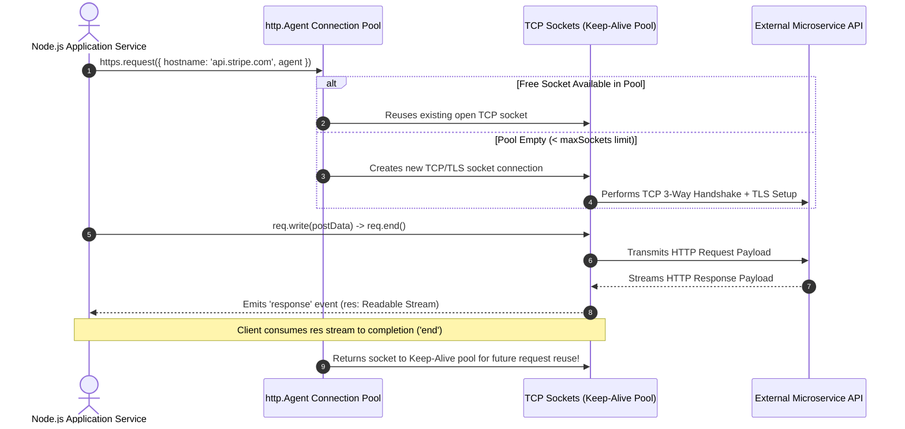
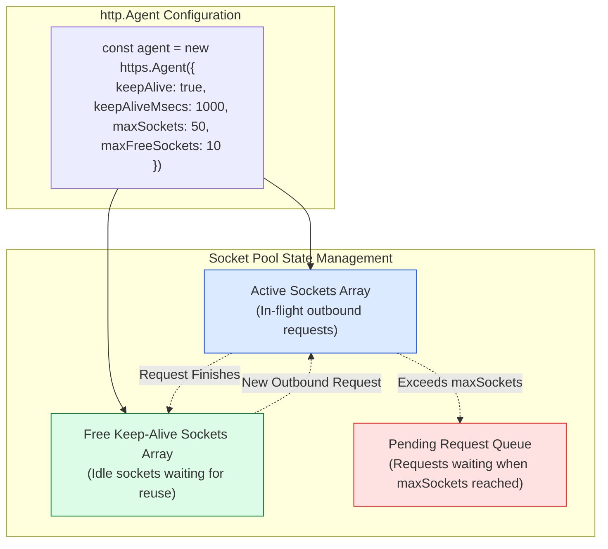

# Module 13: Outbound HTTP Client Architecture — `http.request`, Connection Pooling, and Timeout Mechanics

## Overview

Node.js provides low-level outbound HTTP client primitives via the built-in **`node:http`** and **`node:https`** modules (`http.request` and `https.request`), as well as the modern WHATWG-compliant **`fetch()`** API introduced in Node.js 18+.

Under the hood, outbound HTTP client requests instantiate an **`http.ClientRequest`** object (a Writable Stream used to push request headers and POST body payload bytes) and receive an **`http.IncomingMessage`** instance (a Readable Stream containing response status, headers, and body chunks).

Understanding **`http.Agent` Connection Pooling**, **Socket Keep-Alive Reuse**, **Timeout Safeguards (`req.setTimeout`)**, and **Outbound Network Error Handling (`ECONNREFUSED`, `ENOTFOUND`)** is essential.

---

## 1. Outbound Request Lifecycle & `http.Agent` Connection Pooling

Executing frequent outbound HTTP requests without connection reuse introduces significant latency due to continuous TCP 3-way handshakes and TLS encryption setup.

Node.js addresses this using **`http.Agent`**, which maintains a persistent pool of reusable TCP socket connections per target host:



---

## 2. Agent Connection Pool State Topology



---

## 3. Comparative Matrix: `http.request()` vs. Native `fetch()`

| Architectural Dimension | Low-Level `http.request()` | Native WHATWG `fetch()` |
| :--- | :--- | :--- |
| **API Paradigm** | Low-level event-driven stream API (`ClientRequest`) | Modern Promise-based API (`async/await`) |
| **Stream Fine-Tuning** | Full granular control over chunked writing & socket headers | High-level `ReadableStream` body abstraction |
| **Connection Pooling** | Configurable via custom `http.Agent` options | Managed automatically by Undici global agent pool |
| **Body Piping** | Directly pipe readable file streams (`fileStream.pipe(req)`) | Requires converting to `Blob` / `FormData` or Web Streams |
| **Timeout Handling** | Native `req.setTimeout(ms, cb)` socket method | Managed via `AbortController` signal |

---

## 4. Code Showcase: Production Outbound HTTP Client Engine

```javascript
const https = require("node:https");
const { URL } = require("node:url");

// 1. Configure Persistent Keep-Alive Agent for Microservice Communication
const customAgent = new https.Agent({
  keepAlive: true,
  keepAliveMsecs: 3000,
  maxSockets: 50,         // Max concurrent active sockets per host
  maxFreeSockets: 10,      // Max idle sockets retained in keep-alive pool
  timeout: 5000            // Socket connection timeout limit
});

function sendOutboundApiRequest(targetUrl, method = "GET", payload = null) {
  return new Promise((resolve, reject) => {
    const urlObj = new URL(targetUrl);
    const requestPayload = payload ? JSON.stringify(payload) : null;

    const options = {
      hostname: urlObj.hostname,
      port: urlObj.port || 443,
      path: urlObj.pathname + urlObj.search,
      method: method.toUpperCase(),
      agent: customAgent, // Attach persistent connection pool agent
      headers: {
        "User-Agent": "Enterprise-NodeJS-Client/2.0",
        "Accept": "application/json"
      }
    };

    if (requestPayload) {
      options.headers["Content-Type"] = "application/json";
      options.headers["Content-Length"] = Buffer.byteLength(requestPayload);
    }

    // 2. Dispatch Request (Returns Writable http.ClientRequest stream)
    const req = https.request(options, (res) => {
      let responseBuffer = Buffer.alloc(0);

      // Stream incoming response body chunks
      res.on("data", (chunk) => {
        responseBuffer = Buffer.concat([responseBuffer, chunk]);
      });

      res.on("end", () => {
        const rawString = responseBuffer.toString("utf-8");

        if (res.statusCode >= 200 && res.statusCode < 300) {
          try {
            resolve({ status: res.statusCode, data: JSON.parse(rawString) });
          } catch (e) {
            resolve({ status: res.statusCode, data: rawString });
          }
        } else {
          reject(new Error(`API Error [Status ${res.statusCode}]: ${rawString}`));
        }
      });
    });

    // 3. Socket Timeout Guard (Prevents hanging outbound requests)
    req.setTimeout(5000, () => {
      req.destroy(new Error("REQUEST_TIMEOUT: Outbound HTTP request timed out after 5000ms"));
    });

    // 4. Handle Outbound Network Errors (DNS failure ENOTFOUND, ECONNREFUSED)
    req.on("error", (err) => {
      reject(err);
    });

    // 5. Write Payload and Dispatch Request
    if (requestPayload) {
      req.write(requestPayload);
    }
    
    req.end(); // MANDATORY: Must call req.end() to finalize request transmission!
  });
}

// Execution Demonstration
console.log("=== EXECUTING OUTBOUND HTTP CLIENT REQUEST ===");
sendOutboundApiRequest("https://jsonplaceholder.typicode.com/posts/1", "GET")
  .then((res) => console.log("  ✓ Response Status:", res.status, "| Title:", res.data.title))
  .catch((err) => console.error("  !! Outbound Request Failed:", err.message));
```

---

## Key Production Takeaways

1. **ALWAYS Call `req.end()`**: When using `http.request()`, request headers and buffers remain queued until you explicitly call `req.end()`. Omitting `req.end()` causes outbound requests to hang indefinitely.
2. **Always Listen for `req.on('error')`**: If a DNS lookup fails (`ENOTFOUND`) or a TCP connection is refused (`ECONNREFUSED`), Node.js emits an `'error'` event on the `req` object. Unhandled `'error'` events will crash the entire process.
3. **Use Persistent `keepAlive` Agents**: Default HTTP agents in Node.js destroy sockets after every request. Always instantiate a custom `new http.Agent({ keepAlive: true })` instance for microservice calls.
4. **Enforce Timeouts via `req.setTimeout()`**: Outbound HTTP calls can hang indefinitely if remote servers stall. Always set explicit socket timeout guards on client requests.


