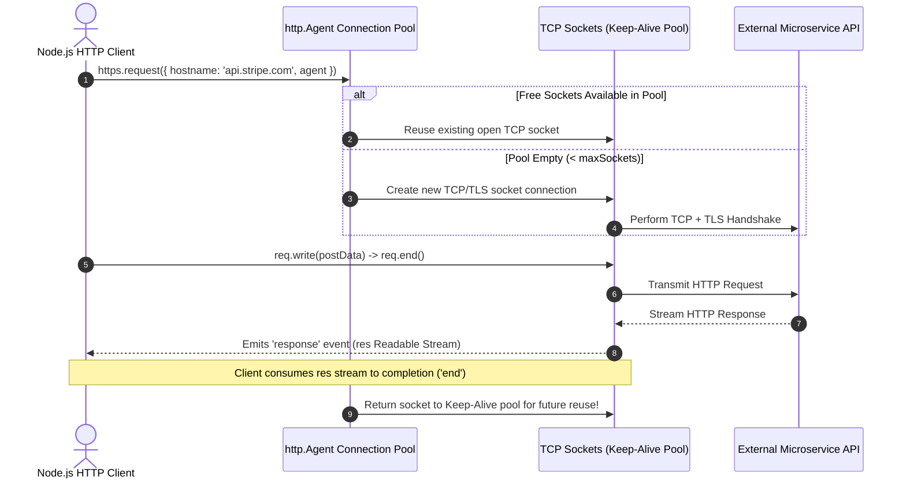
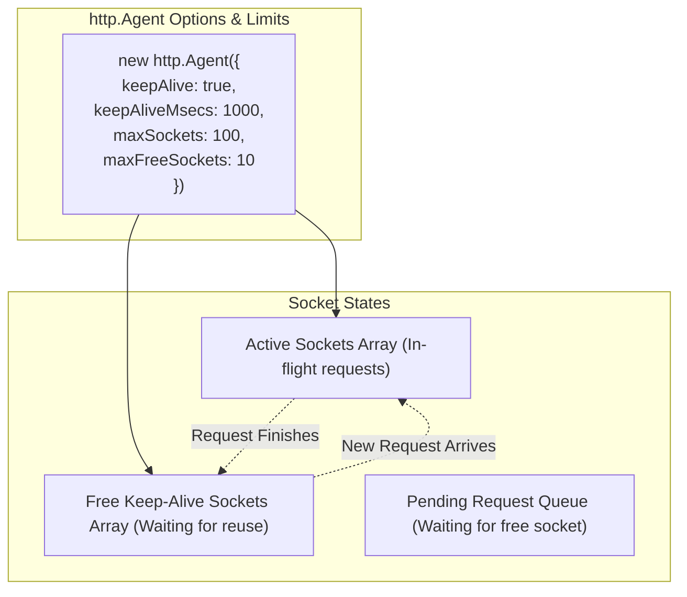

# Module 13: Low-Level Outbound HTTP Client Requests and Connection Pooling

## Overview

Node.js provides low-level outbound HTTP client primitives via the built-in **`node:http`** and **`node:https`** modules (`http.request` and `https.request`), as well as the modern WHATWG-compliant **`fetch()`** API introduced in Node.js 18+.

Under the hood, outbound HTTP client requests create an instance of **`http.ClientRequest`** (a Writable Stream used to push request headers and POST data) and receive an **`http.IncomingMessage`** (a Readable Stream containing response data).

---

## 1. Outbound Request Lifecycle & `http.Agent` Connection Pooling

Making frequent outbound HTTP requests without connection reuse creates high latency due to continuous TCP 3-way handshakes and TLS negotiations. 

Node.js solves this via **`http.Agent`**, which maintains a persistent pool of reusable TCP socket connections per host.



---

## 2. Agent Connection Pool Architecture



---

## 3. Low-Level `https.request` Client with Timeout & Connection Pooling

```javascript
const https = require("node:https");
const { URL } = require("node:url");

// 1. Configure Persistent Keep-Alive Agent for Microservice Communication
const customAgent = new https.Agent({
  keepAlive: true,
  keepAliveMsecs: 3000,
  maxSockets: 50,         // Max concurrent sockets per host
  maxFreeSockets: 10,      // Max idle sockets to retain
  timeout: 5000            // Socket connection timeout
});

function sendOutboundApiRequest(targetUrl, method = "GET", payload = null) {
  return new Promise((resolve, reject) => {
    const urlObj = new URL(targetUrl);
    
    const requestPayload = payload ? JSON.stringify(payload) : null;

    const options = {
      hostname: urlObj.hostname,
      port: urlObj.port || 443,
      path: urlObj.pathname + urlObj.search,
      method: method.toUpperCase(),
      agent: customAgent, // Attach persistent connection pool agent
      headers: {
        "User-Agent": "NodeJS-Production-Client/1.0",
        "Accept": "application/json"
      }
    };

    if (requestPayload) {
      options.headers["Content-Type"] = "application/json";
      options.headers["Content-Length"] = Buffer.byteLength(requestPayload);
    }

    // 2. Dispatch Request (Returns Writable http.ClientRequest stream)
    const req = https.request(options, (res) => {
      let responseBuffer = Buffer.alloc(0);

      // Stream incoming response body chunks
      res.on("data", (chunk) => {
        responseBuffer = Buffer.concat([responseBuffer, chunk]);
      });

      res.on("end", () => {
        const rawString = responseBuffer.toString("utf-8");

        if (res.statusCode >= 200 && res.statusCode < 300) {
          try {
            resolve({ status: res.statusCode, data: JSON.parse(rawString) });
          } catch (e) {
            resolve({ status: res.statusCode, data: rawString });
          }
        } else {
          reject(new Error(`API Error [Status ${res.statusCode}]: ${rawString}`));
        }
      });
    });

    // 3. Socket Timeout Guard
    req.setTimeout(5000, () => {
      req.destroy(new Error("REQUEST_TIMEOUT: Outbound HTTP request timed out after 5000ms"));
    });

    // 4. Handle Outbound Network Errors (DNS Failure, ECONNREFUSED, Connection Reset)
    req.on("error", (err) => {
      reject(err);
    });

    // 5. Write Payload and Dispatch Request
    if (requestPayload) {
      req.write(requestPayload);
    }
    
    req.end(); // IMPORTANT: Must call req.end() to finalize request transmission!
  });
}
```

---

## 4. Low-Level `http.request()` vs. Modern Native `fetch()`

Node.js 18+ includes the global WHATWG **`fetch()`** standard API:

| Capability | `http.request()` | Native `fetch()` |
| :--- | :--- | :--- |
| **API Style** | Low-level event-driven stream API (`ClientRequest`). | Modern Promise-based standard (`async/await`). |
| **Stream Control** | Full granular control over socket headers and body chunks. | Uses standard `ReadableStream` body interface. |
| **Keep-Alive Agent** | Configurable via custom `http.Agent` options. | Automatically managed by underlying Undici agent pool. |
| **Body Size / Piping** | Directly pipe files to request streams (`fileStream.pipe(req)`). | Requires wrapping into `FormData` or `Blob`. |

---

## Key Production Takeaways

1. **ALWAYS Call `req.end()`**: When using `http.request()`, the request headers are buffered until you explicitly call `req.end()`. Forgetting to invoke `req.end()` will cause the request to hang indefinitely.
2. **Always Handle `req.on('error')`**: If a DNS lookup fails or a TCP connection is refused, Node.js emits an `'error'` event on the `req` object. Unhandled `'error'` events will crash the entire process.
3. **Use Persistent `keepAlive` Agents**: Default HTTP agents in Node.js do not keep sockets open across requests. Always create a custom `new http.Agent({ keepAlive: true })` instance for microservice calls.
4. **Enforce Timeouts via `req.setTimeout()`**: Outbound HTTP requests can hang indefinitely if remote servers stall. Always set explicit timeouts on client requests.

