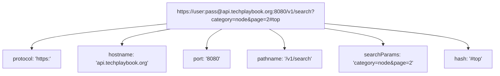

# File 14: URL Parsing and Query String Manipulation

## Overview
Node.js provides modern WHATWG standard **`URL`** and **`URLSearchParams`** APIs for parsing, validating, constructing, and manipulating web URLs and query parameter strings cleanly.

---

## 1. WHATWG URL Anatomy



---

## 2. URL & URLSearchParams Implementation

```javascript
const rawUrl = "https://api.techplaybook.org:8080/v1/search?category=node&tag=async&page=1";

// 1. Parsing URL via WHATWG URL Class
const parsedUrl = new URL(rawUrl);

console.log("Protocol:", parsedUrl.protocol);   // "https:"
console.log("Hostname:", parsedUrl.hostname);   // "api.techplaybook.org"
console.log("Pathname:", parsedUrl.pathname);   // "/v1/search"

// 2. Manipulating Query Parameters via URLSearchParams
const params = parsedUrl.searchParams;
console.log("Category Param:", params.get("category")); // "node"

// Mutate Parameters
params.append("tag", "performance");
params.set("page", "2");

console.log("Updated Full URL:", parsedUrl.href);
// "https://api.techplaybook.org:8080/v1/search?category=node&tag=async&page=2&tag=performance"
```

---

## Key Takeaways
1. Prefer the standard **`new URL()`** class over deprecated legacy Node `url.parse()`.
2. Use **`url.searchParams`** (`get`, `set`, `append`, `delete`) to manipulate URL parameters safely.
3. Automatically URL-encodes special characters and query strings.
