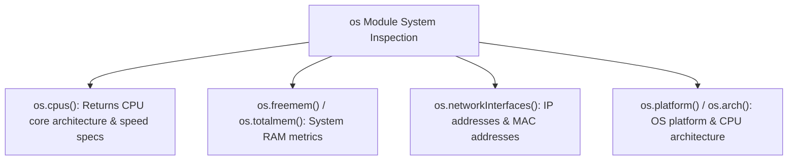

# File 15: OS Module and System Hardware Inspection

## Overview
The built-in **`os`** module provides operating system utility methods to inspect hardware resources (CPU cores, total/free memory, architecture, platform, network interfaces, uptime).

---

## 1. Operating System Resource Metrics



---

## 2. Hardware Resource Monitor Implementation

```javascript
const os = require("os");

console.log("=== SYSTEM HARDWARE METRICS ===");
console.log("OS Platform:", os.platform()); // "linux", "darwin", "win32"
console.log("OS Arch:", os.arch());         // "x64", "arm64"
console.log("CPU Cores:", os.cpus().length);

// Memory Metrics
const freeGB = (os.freemem() / 1024 / 1024 / 1024).toFixed(2);
const totalGB = (os.totalmem() / 1024 / 1024 / 1024).toFixed(2);
console.log(`Memory Usage: ${freeGB} GB Free / ${totalGB} GB Total`);

// System Uptime
console.log(`System Uptime: ${(os.uptime() / 3600).toFixed(1)} Hours`);
```

---

## Key Takeaways
1. Use **`os.cpus().length`** to determine worker thread or cluster process pool size.
2. Monitor system RAM using **`os.freemem()`** and **`os.totalmem()`**.
3. Inspect network interfaces (IP, IPv6, MAC address) using **`os.networkInterfaces()`**.
