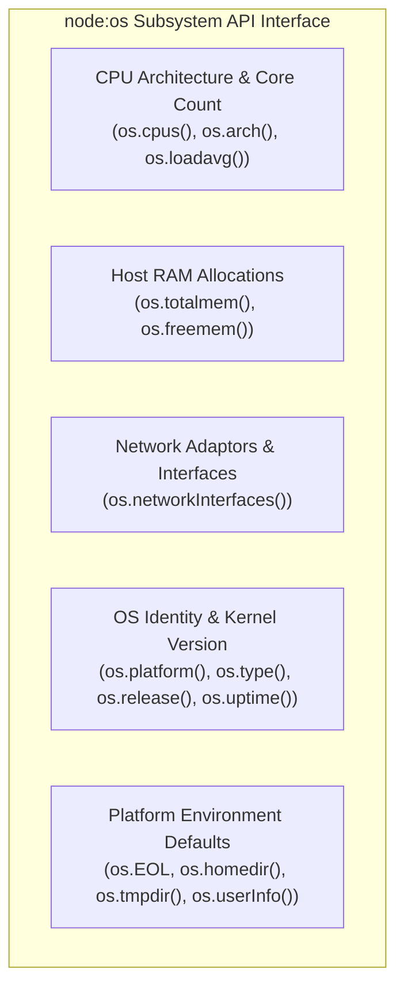
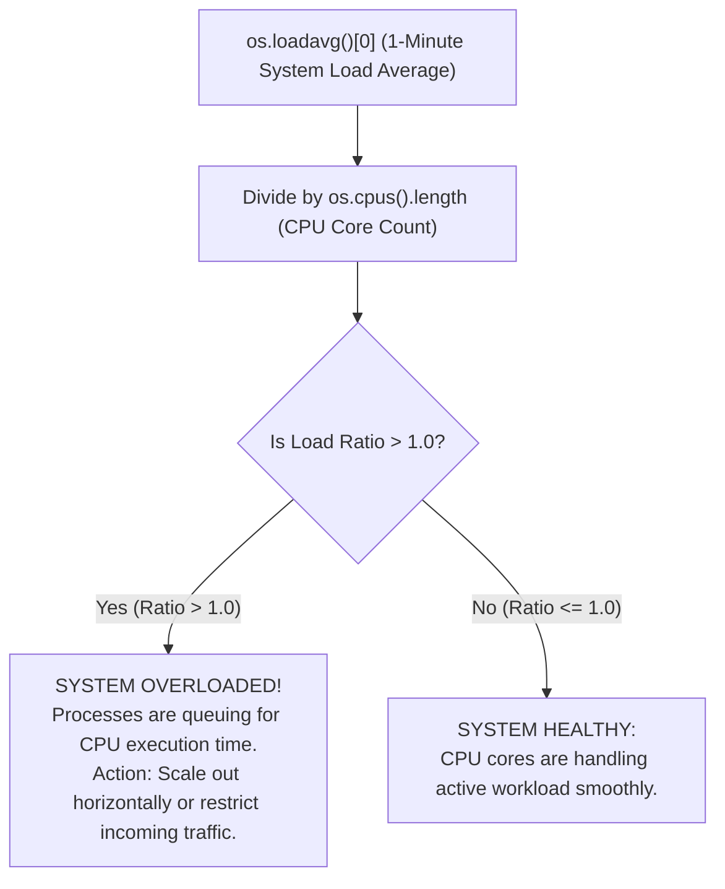

# Module 15: OS Module, System Hardware Inspection, and Resource Monitoring

## Overview

The core **`node:os`** module provides low-level operating system utility functions for inspecting hardware specifications, host system memory capacity, CPU core architectures, system load averages, network network interfaces, system uptime, and cross-platform configuration properties.

In production environments, `os` is extensively used to dynamically calculate **Cluster worker thread scale**, monitor host system health metrics, extract local IP addresses, and handle cross-platform line endings (`os.EOL`).

---

## 1. System Hardware Inspection Subsystems



---

## 2. Load Average Analysis & Auto-Scaling Decision Flow

On Unix/Linux environments, **`os.loadavg()`** returns an array containing the 1-minute, 5-minute, and 15-minute system load averages.



### Calculating CPU Load Capacity Percentage

```javascript
const os = require("node:os");

function inspectCpuLoadHealth() {
  const cpus = os.cpus().length;
  const [load1, load5, load15] = os.loadavg();
  
  // Calculate load per core ratio (Linux/macOS)
  const normalizedLoad1 = (load1 / cpus).toFixed(2);
  
  console.log(`CPU Cores Available: ${cpus}`);
  console.log(`1-Min Load Average : ${load1.toFixed(2)} (Per Core: ${normalizedLoad1})`);
  
  if (normalizedLoad1 > 1.0) {
    console.warn("WARNING: System is experiencing CPU saturation!");
  } else {
    console.log("SUCCESS: CPU load within safe operational limits.");
  }
}
```

---

## 3. Comprehensive OS Module API Reference

| API Method | Returns | Description & Usage Scenario |
| :--- | :--- | :--- |
| **`os.cpus()`** | `Array<CPUInfo>` | Detailed array of objects containing model, speed (MHz), and execution times (user, nice, sys, idle, irq) for every logical CPU core. |
| **`os.totalmem()`** | `number` (Bytes) | Total physical memory (RAM) installed on host hardware. |
| **`os.freemem()`** | `number` (Bytes) | Free system memory (RAM) available to the OS. |
| **`os.networkInterfaces()`** | `Object` | Map of network interface cards (e.g. `eth0`, `wlan0`, `lo`) detailing IP address, IPv4/IPv6 type, netmask, and MAC address. |
| **`os.platform()`** | `string` | OS platform compiled binary target (`'linux'`, `'darwin'`, `'win32'`). |
| **`os.arch()`** | `string` | CPU architecture (`'x64'`, `'arm64'`, `'arm'`). |
| **`os.uptime()`** | `number` (Seconds) | System uptime in seconds since last host reboot. |
| **`os.EOL`** | `string` | Platform line end character (`'\n'` on POSIX, `'\r\n'` on Windows). |
| **`os.tmpdir()`** | `string` | Default operating system directory for temporary files. |
| **`os.homedir()`** | `string` | Path of current logged-in user's home directory. |

---

## 4. Production System Health Monitor Code Example

```javascript
const os = require("node:os");

function generateSystemDiagnosticReport() {
  const totalRamGB = (os.totalmem() / 1024 ** 3).toFixed(2);
  const freeRamGB = (os.freemem() / 1024 ** 3).toFixed(2);
  const usedRamGB = (totalRamGB - freeRamGB).toFixed(2);
  const ramUsagePercent = ((usedRamGB / totalRamGB) * 100).toFixed(1);

  const uptimeHours = (os.uptime() / 3600).toFixed(1);
  const cpuCores = os.cpus();

  // Extract non-internal IPv4 Address
  const interfaces = os.networkInterfaces();
  let primaryIpAddress = "127.0.0.1";

  for (const interfaceName of Object.keys(interfaces)) {
    for (const net of interfaces[interfaceName]) {
      if (net.family === "IPv4" && !net.internal) {
        primaryIpAddress = net.address;
        break;
      }
    }
  }

  const report = {
    host: {
      hostname: os.hostname(),
      platform: `${os.platform()} (${os.arch()})`,
      release: os.release(),
      uptime: `${uptimeHours} Hours`,
      primaryIp: primaryIpAddress
    },
    cpu: {
      model: cpuCores[0].model,
      coreCount: cpuCores.length,
      clockSpeedMHz: cpuCores[0].speed,
      loadAverage1Min: os.loadavg()[0].toFixed(2)
    },
    memory: {
      totalGB: `${totalRamGB} GB`,
      usedGB: `${usedRamGB} GB`,
      freeGB: `${freeRamGB} GB`,
      percentUsed: `${ramUsagePercent}%`
    },
    environment: {
      homedir: os.homedir(),
      tmpdir: os.tmpdir(),
      user: os.userInfo().username
    }
  };

  return report;
}

console.log("=== SYSTEM DIAGNOSTIC SNAPSHOT ===");
console.log(JSON.stringify(generateSystemDiagnosticReport(), null, 2));
```

---

## Key Production Takeaways

1. **Dynamically Set Worker Process Count via `os.cpus().length`**: When using the `node:cluster` module or worker pools, initialize worker instances equal to `os.cpus().length` to fully utilize all CPU hardware threads.
2. **Use `os.EOL` for Text File Generation**: Never hardcode `\n` or `\r\n` when constructing text files (e.g. CSVs, log files); use `os.EOL` to ensure cross-platform line formatting compatibility.
3. **Monitor `os.freemem()` for Low-Memory Alerts**: Server applications should track host RAM availability; if `os.freemem() / os.totalmem()` drops below 10%, trigger garbage collection or alert infrastructure teams.
4. **Extract Local IP via `os.networkInterfaces()`**: Use `os.networkInterfaces()` to auto-discover local network IP addresses when binding microservices or service discovery registrations.

