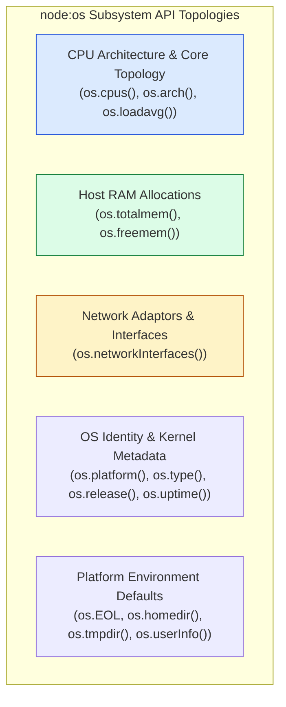
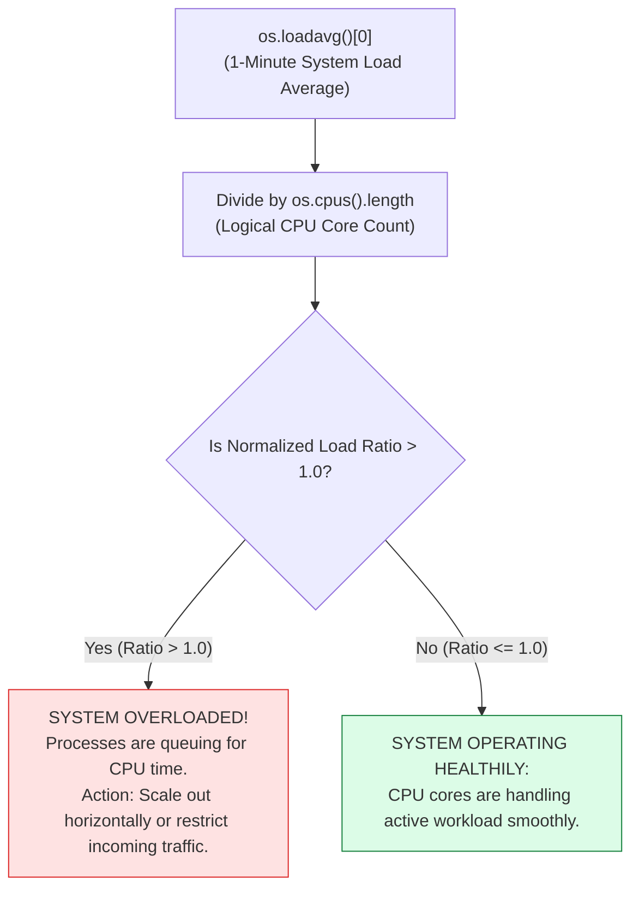

# Module 15: Operating System (`os`) Module — Hardware Inspection, CPU Load Saturation, and System Diagnostics

## Overview

The core **`node:os`** module provides low-level operating system utility functions for inspecting hardware specifications, host system memory capacity, CPU core architectures, system load averages, network network interfaces, system uptime, and cross-platform configuration properties.

In production environments, `os` is extensively used to dynamically calculate **Cluster Worker Process Scale**, monitor host system health metrics, extract local IP addresses for service discovery, and enforce cross-platform line endings (`os.EOL`).

Understanding **System Hardware Subsystem Topologies**, **CPU Load Average Saturation Metrics (`os.loadavg()`)**, **Network Adaptor IP Extraction**, and **Host RAM Metrics (`os.totalmem()`, `os.freemem()`)** is essential.

---

## 1. System Hardware Inspection Subsystems



---

## 2. Load Average Analysis & CPU Saturation Decision Flow

On Unix/Linux environments, **`os.loadavg()`** returns an array containing the 1-minute, 5-minute, and 15-minute system load averages:



### CPU Load Saturation Formula

$$\text{Normalized Load Ratio} = \frac{\text{os.loadavg()[0]}}{\text{os.cpus().length}}$$

A ratio of `1.0` represents $100\%$ CPU utilization across all available logical cores. A ratio of `2.0` indicates the system is receiving twice as much work as the CPU cores can process concurrently.

---

## 3. Comprehensive OS Module API Reference Matrix

| API Method | Return Data Type | Description & Primary Production Usage |
| :--- | :--- | :--- |
| **`os.cpus()`** | `Array<CPUInfo>` | Detailed array of objects containing model name, speed (MHz), and execution times (user, nice, sys, idle, irq) for every logical CPU core. |
| **`os.totalmem()`** | `number` (Bytes) | Total physical RAM installed on host hardware. |
| **`os.freemem()`** | `number` (Bytes) | Free system RAM currently available to the OS. |
| **`os.networkInterfaces()`** | `Object` | Map of network adaptors (`eth0`, `wlan0`, `lo`) detailing IP address, IPv4/IPv6 type, netmask, and MAC address. |
| **`os.platform()`** | `string` | Operating system platform binary target (`'linux'`, `'darwin'`, `'win32'`). |
| **`os.arch()`** | `string` | CPU architecture (`'x64'`, `'arm64'`, `'arm'`). |
| **`os.uptime()`** | `number` (Seconds) | System uptime in seconds since last host reboot. |
| **`os.EOL`** | `string` | Platform line end character (`'\n'` on POSIX, `'\r\n'` on Windows). |
| **`os.tmpdir()`** | `string` | Default operating system directory for temporary file storage. |
| **`os.homedir()`** | `string` | Path of current logged-in user's home directory. |

---

## 4. Production Code Showcase: System Health & Network Diagnostic Engine

```javascript
const os = require("node:os");

function generateSystemDiagnosticReport() {
  const totalRamGB = (os.totalmem() / 1024 ** 3).toFixed(2);
  const freeRamGB = (os.freemem() / 1024 ** 3).toFixed(2);
  const usedRamGB = (totalRamGB - freeRamGB).toFixed(2);
  const ramUsagePercent = ((usedRamGB / totalRamGB) * 100).toFixed(1);

  const uptimeHours = (os.uptime() / 3600).toFixed(1);
  const cpuCores = os.cpus();
  const [load1, load5, load15] = os.loadavg();
  const normalizedLoad1 = (load1 / cpuCores.length).toFixed(2);

  // Auto-discover primary non-internal IPv4 Address
  const interfaces = os.networkInterfaces();
  let primaryIpAddress = "127.0.0.1";

  for (const interfaceName of Object.keys(interfaces)) {
    for (const net of interfaces[interfaceName]) {
      if (net.family === "IPv4" && !net.internal) {
        primaryIpAddress = net.address;
        break;
      }
    }
  }

  const report = {
    host: {
      hostname: os.hostname(),
      platform: `${os.platform()} (${os.arch()})`,
      release: os.release(),
      uptime: `${uptimeHours} Hours`,
      primaryIp: primaryIpAddress
    },
    cpu: {
      model: cpuCores[0].model,
      coreCount: cpuCores.length,
      clockSpeedMHz: cpuCores[0].speed,
      loadAverage1Min: load1.toFixed(2),
      normalizedCoreRatio: normalizedLoad1
    },
    memory: {
      totalGB: `${totalRamGB} GB`,
      usedGB: `${usedRamGB} GB`,
      freeGB: `${freeRamGB} GB`,
      percentUsed: `${ramUsagePercent}%`
    },
    environment: {
      homedir: os.homedir(),
      tmpdir: os.tmpdir(),
      user: os.userInfo().username
    }
  };

  return report;
}

console.log("=== SYSTEM DIAGNOSTIC SNAPSHOT ===");
console.log(JSON.stringify(generateSystemDiagnosticReport(), null, 2));
```

---

## Key Production Takeaways

1. **Dynamically Set Worker Scale via `os.cpus().length`**: When configuring `node:cluster` or thread pools, initialize worker instances equal to `os.cpus().length` to maximize hardware parallelism without CPU context switching overhead.
2. **Use `os.EOL` for Text File Formatting**: Never hardcode `\n` or `\r\n` when writing CSVs or log files; use `os.EOL` to ensure cross-platform compatibility.
3. **Monitor `os.freemem()` for RAM Exhaustion Alerts**: Server processes should monitor host RAM availability; if `os.freemem() / os.totalmem()` drops below 10%, alert infrastructure teams or trigger auto-scaling.
4. **Auto-Discover IP via `os.networkInterfaces()`**: Use `os.networkInterfaces()` to extract local host IP addresses for service discovery registrations (Consul, Eureka) or cluster node communication.


