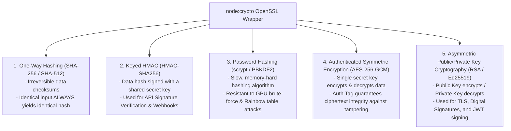
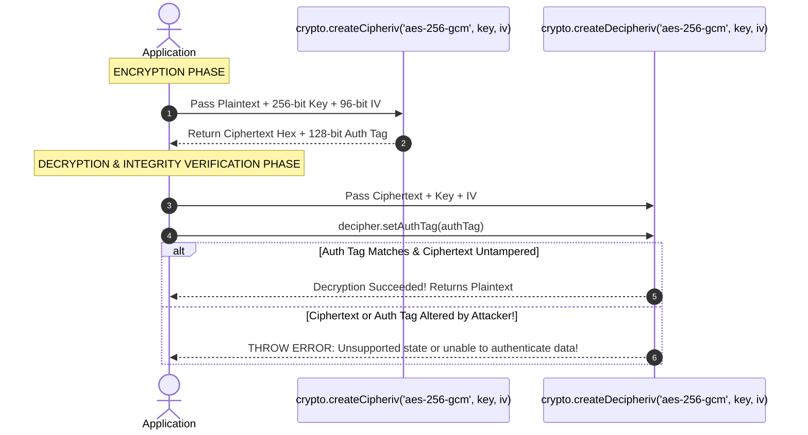

# Module 16: Cryptography, Hashing, and AES Encryption (`crypto`)

## Overview

The core **`node:crypto`** module exposes cryptographic primitives wrapping OpenSSL C/C++ libraries.

It enables secure data integrity verification via **Hashing** (SHA-256), API signature authentication via **HMAC**, authenticated data confidentiality via **Symmetric Encryption (AES-256-GCM)**, secure password storage via **`scrypt`** / **`pbkdf2`**, and public/private key cryptography via **Asymmetric RSA / ECC**.

---

## 1. Cryptographic Primitives Architecture



---

## 2. AES-256-GCM Authenticated Encryption Flow

Unlike legacy cipher modes (like AES-CBC), **AES-256-GCM** (Galois/Counter Mode) provides **Authenticated Encryption with Associated Data (AEAD)**. It outputs both encrypted ciphertext and an **Authentication Tag (`authTag`)** that verifies the payload was not tampered with.



---

## 3. Password Hashing Security: Why Plain Hashing Fails

> [!CAUTION]
> **NEVER hash user passwords with plain SHA-256 or MD5!** 
> Fast hashes can be computed at billions of hashes per second using modern GPUs. Always use memory-hard, multi-iteration password hashing functions like **`scrypt`** or **`pbkdf2`** with a unique random **Salt**.

```javascript
const crypto = require("node:crypto");

// Secure Password Hashing via Async scrypt (Offloaded to Libuv thread pool)
function hashPassword(password) {
  return new Promise((resolve, reject) => {
    // Generate unique 16-byte random salt per user
    const salt = crypto.randomBytes(16).toString("hex");

    // scrypt(password, salt, keylen, options, callback)
    crypto.scrypt(password, salt, 64, { N: 16384, r: 8, p: 1 }, (err, derivedKey) => {
      if (err) return reject(err);
      
      // Store salt + hash combined
      const hashHex = derivedKey.toString("hex");
      resolve(`${salt}:${hashHex}`);
    });
  });
}

function verifyPassword(password, storedHash) {
  return new Promise((resolve, reject) => {
    const [salt, originalHash] = storedHash.split(":");

    crypto.scrypt(password, salt, 64, { N: 16384, r: 8, p: 1 }, (err, derivedKey) => {
      if (err) return reject(err);
      
      const hashHex = derivedKey.toString("hex");
      // Use timingSafeEqual to prevent Timing Side-Channel Attacks!
      const keyBuffer = Buffer.from(hashHex, "hex");
      const originalBuffer = Buffer.from(originalHash, "hex");
      
      const isMatch = crypto.timingSafeEqual(keyBuffer, originalBuffer);
      resolve(isMatch);
    });
  });
}
```

---

## 4. Complete Production Encryption / Decryption Utilities

```javascript
const crypto = require("node:crypto");

class EncryptionEngine {
  constructor(secretKeyHex) {
    // Key must be exactly 32 bytes (256 bits) for AES-256
    this.key = Buffer.from(secretKeyHex, "hex");
    this.algorithm = "aes-256-gcm";
  }

  // Encrypts plaintext into a unified safe string: iv:authTag:ciphertext
  encrypt(plainText) {
    // Generate unique 12-byte (96-bit) Initialization Vector per encryption operation
    const iv = crypto.randomBytes(12);
    
    const cipher = crypto.createCipheriv(this.algorithm, this.key, iv);
    
    let encrypted = cipher.update(plainText, "utf-8", "hex");
    encrypted += cipher.final("hex");
    
    const authTag = cipher.getAuthTag().toString("hex");

    return `${iv.toString("hex")}:${authTag}:${encrypted}`;
  }

  // Decrypts unified string and validates integrity
  decrypt(encryptedCombined) {
    const [ivHex, authTagHex, ciphertextHex] = encryptedCombined.split(":");
    
    if (!ivHex || !authTagHex || !ciphertextHex) {
      throw new Error("Invalid encrypted payload format.");
    }

    const iv = Buffer.from(ivHex, "hex");
    const authTag = Buffer.from(authTagHex, "hex");
    
    const decipher = crypto.createDecipheriv(this.algorithm, this.key, iv);
    decipher.setAuthTag(authTag); // Set Auth Tag guard

    let decrypted = decipher.update(ciphertextHex, "hex", "utf-8");
    decrypted += decipher.final("utf-8");
    
    return decrypted;
  }
}

// Usage Example
const masterKey = crypto.randomBytes(32).toString("hex"); // Generate 256-bit key
const engine = new EncryptionEngine(masterKey);

const secretPayload = "CONFIDENTIAL_API_BEARER_TOKEN_99812";
const encryptedPayload = engine.encrypt(secretPayload);

console.log("Encrypted Output:", encryptedPayload);
console.log("Decrypted Output:", engine.decrypt(encryptedPayload));
```

---

## Key Production Takeaways

1. **Use `crypto.timingSafeEqual()` for Security Comparisons**: Standard string comparison (`===`) leaks timing information based on how many characters match; use `crypto.timingSafeEqual()` when verifying HMAC signatures or password hashes to defeat Timing Attack vectors.
2. **Always Use Unique IVs for AES Encryption**: Never hardcode or reuse Initialization Vectors (`iv`) across multiple AES encryptions. Reusing an IV with the same key breaks AES security.
3. **Prefer AES-256-GCM over AES-CBC**: GCM mode includes built-in authentication tags (`getAuthTag()`), preventing bit-flipping attacks and ciphertext manipulation.
4. **Use Asynchronous Crypto Functions**: Synchronous cryptographic operations (e.g. `crypto.pbkdf2Sync` or `crypto.scryptSync`) block the single-threaded Event Loop. Always use callback or promise-based async cryptographic functions.
