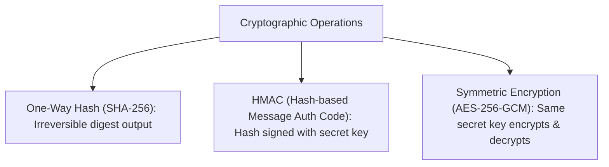

# File 16: Cryptography and Hashing (crypto module)

## Overview
The **`crypto`** module provides cryptographic functionality including **Hashing (SHA-256)**, **HMAC Signatures**, **Symmetric Encryption (AES-256-GCM)**, and **Asymmetric Key Encryption (RSA/ECC)**.

---

## 1. Hashing vs Encryption Architecture



---

## 2. Crypto Hashing & AES Encryption Implementation

```javascript
const crypto = require("crypto");

// 1. One-Way SHA-256 Hashing
function hashText(text) {
    return crypto.createHash("sha256").update(text).digest("hex");
}
console.log("SHA-256 Hash:", hashText("Hello World"));

// 2. Symmetric AES-256-GCM Encryption & Decryption
const algorithm = "aes-256-gcm";
const key = crypto.randomBytes(32); // 256-bit key
const iv = crypto.randomBytes(16);  // 128-bit Initialization Vector

function encrypt(text) {
    const cipher = crypto.createCipheriv(algorithm, key, iv);
    let encrypted = cipher.update(text, "utf8", "hex");
    encrypted += cipher.final("hex");
    const authTag = cipher.getAuthTag().toString("hex");
    return { encrypted, authTag };
}

function decrypt(encryptedText, authTag) {
    const decipher = crypto.createDecipheriv(algorithm, key, iv);
    decipher.setAuthTag(Buffer.from(authTag, "hex"));
    let decrypted = decipher.update(encryptedText, "hex", "utf8");
    decrypted += decipher.final("utf8");
    return decrypted;
}

const payload = encrypt("Sensitive Data Payload");
console.log("Encrypted Payload:", payload.encrypted);
console.log("Decrypted Text:", decrypt(payload.encrypted, payload.authTag));
```

---

## Key Takeaways
1. Use **`crypto.createHash('sha256')`** for checksum digests.
2. Use **AES-256-GCM** for symmetric encryption because GCM mode guarantees authenticated integrity checks (`authTag`).
3. Crypto operations execute off the main Event Loop thread via Libuv's thread pool.
