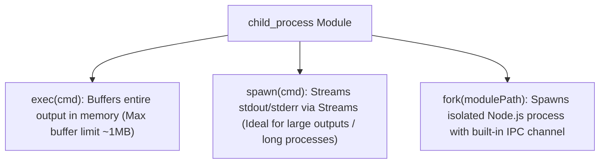

# File 17: Child Processes (exec, spawn, fork)

## Overview
The **`child_process`** module allows Node.js to spawn sub-processes to execute system shell commands, run external binaries, or fork isolated Node.js child processes communicating via IPC channels.

---

## 1. Child Process Spawning Methods Comparison



### Child Process API Matrix

| API Function | Output Mechanism | Shell Execution? | Best Use Case |
| :--- | :--- | :--- | :--- |
| **`exec`** | Memory Buffer Callback | **Yes** (Shell syntax) | Short CLI commands (`ls`, `git status`) |
| **`spawn`** | Stream (`stdout`/`stderr`) | Optional | Long-running processes, video transcoding |
| **`fork`** | IPC Communication (`send`) | No | Offloading CPU-heavy Node scripts |

---

## 2. Child Process `spawn` & `fork` Implementation

```javascript
const { spawn, fork } = require("child_process");
const path = require("path");

// 1. Spawning System Commands via Stream
const ls = spawn("ls", ["-la", __dirname]);

ls.stdout.on("data", data => {
    console.log(`[SPAWN STDOUT]:\n${data.toString()}`);
});

ls.stderr.on("data", data => {
    console.error(`[SPAWN STDERR]: ${data}`);
});

ls.on("close", code => {
    console.log(`Child process exited with code ${code}`);
});

// 2. Forking Node.js Process with IPC Messaging
// const child = fork(path.join(__dirname, 'worker_script.js'));
// child.send({ task: 'COMPUTE_HASH', data: 100 });
// child.on('message', result => console.log('Result from Child:', result));
```

---

## Key Takeaways
1. Use **`spawn()`** for streaming large outputs to avoid memory buffer overflows.
2. Use **`fork()`** to execute heavy Node.js background scripts communicating via `process.send()`.
3. Never concatenate untrusted user input directly into `exec()` commands to prevent **Command Injection Vulnerabilities**.
