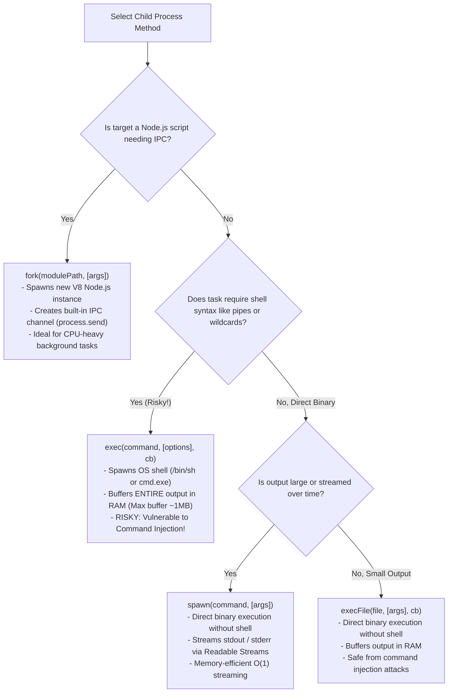
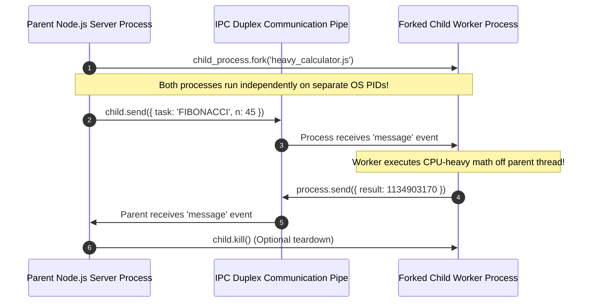

# Module 17: Child Processes — `exec`, `execFile`, `spawn`, and `fork`

## Overview

Because JavaScript executes on a single main thread, CPU-bound computational tasks (e.g. video encoding, machine learning model inference, heavy file archiving) can freeze the Node.js Event Loop.

The core **`node:child_process`** module allows Node.js to spawn sub-processes on host operating systems, execute system binaries, run shell commands, or **`fork`** isolated Node.js V8 instances connected via an **Inter-Process Communication (IPC)** channel.

---

## 1. Child Process Spawning Methods Comparison

Node.js provides **four distinct methods** for spawning sub-processes:



### Comprehensive Child Process Matrix

| API Method | Output Mechanism | Shell Execution? | IPC Channel? | Memory Overhead | Best Use Case |
| :--- | :--- | :--- | :--- | :--- | :--- |
| **`exec`** | Memory Buffer Callback | **Yes** (`/bin/sh`) | No | High (Buffers output in RAM) | Quick CLI commands with shell piping (`ls \| grep`). |
| **`execFile`** | Memory Buffer Callback | **No** (Direct Binary) | No | High (Buffers output in RAM) | Executing external executable binaries securely (`/usr/bin/ffmpeg`). |
| **`spawn`** | `stdout` / `stderr` Streams | Optional (`shell: false`) | No | **Low $O(1)$** (Streamed) | Long-running processes, video streaming, large log outputs. |
| **`fork`** | IPC Message Channel | No (Executes `node`) | **Yes** (`process.send`) | High (Full extra V8 instance) | Offloading CPU-bound tasks to child Node processes. |

---

## 2. IPC Channel Architecture with `fork()`

Calling **`child_process.fork()`** spawns a fresh V8 Node.js engine instance and establishes an IPC pipe between parent and child processes.



---

## 3. Security Vulnerability: Command Injection in `exec()`

> [!CAUTION]
> **Command Injection Security Risk**: Never interpolate untrusted user input directly into `child_process.exec()`. Because `exec()` passes the string to a shell, an attacker can append shell operators like `; rm -rf /` or `&& cat /etc/passwd`.

```javascript
const { exec, execFile, spawn } = require("node:child_process");

const userInput = "file.txt; cat /etc/passwd"; // Malicious injection attack!

// VULNERABLE APPROACH (DO NOT DO THIS!):
exec(`ls -la ${userInput}`, (err, stdout) => {
  // Attacker command 'cat /etc/passwd' WILL BE EXECUTED by the shell!
});

// SECURE APPROACH 1 (execFile):
execFile("ls", ["-la", userInput], (err, stdout) => {
  // Safe: 'file.txt; cat /etc/passwd' is treated strictly as a literal filename string!
});

// SECURE APPROACH 2 (spawn):
const child = spawn("ls", ["-la", userInput]);
child.stdout.on("data", (data) => console.log(data.toString()));
```

---

## 4. Practical Code Demonstration (`spawn` and `fork`)

### Parent Script (`parent.js`)

```javascript
const { spawn, fork } = require("node:child_process");
const path = require("node:path");

console.log(`[PARENT PROCESS] PID: ${process.pid}`);

// 1. Spawning System Command via Stream (spawn)
const pingProcess = spawn("ping", ["-c", "3", "127.0.0.1"]);

pingProcess.stdout.on("data", (chunk) => {
  console.log(`[SPAWN STDOUT]: ${chunk.toString().trim()}`);
});

pingProcess.on("close", (exitCode) => {
  console.log(`[SPAWN COMPLETE] Process exited with code ${exitCode}`);
});

// 2. Forking Dedicated Node.js Worker Process with IPC Communication
const childWorkerPath = path.join(__dirname, "child_worker.js");
const worker = fork(childWorkerPath);

// Send payload message to child
worker.send({ command: "START_COMPUTATION", payload: { number: 40 } });

// Receive message from child
worker.on("message", (msg) => {
  console.log("[PARENT RECV] Message from Child Worker:", msg);
  
  // Cleanly terminate child process after job completion
  worker.kill("SIGTERM");
});

worker.on("exit", (code) => {
  console.log(`[CHILD WORKER EXITED] Exit Code: ${code}`);
});
```

### Child Script (`child_worker.js`)

```javascript
// Child process script executed via fork()
console.log(`  [CHILD WORKER] Launched on PID: ${process.pid}`);

// Listen to IPC messages sent from Parent
process.on("message", (message) => {
  console.log("  [CHILD WORKER RECV] Received payload:", message);

  if (message.command === "START_COMPUTATION") {
    // Perform simulated heavy work off parent thread
    const result = message.payload.number * 2;

    // Send IPC result back to parent
    process.send({ status: "SUCCESS", result });
  }
});
```

---

## Key Production Takeaways

1. **Use `spawn()` for Large Outputs**: `exec()` buffers the entire output in RAM (default limit 1 MB), which throws an `ERR_CHILD_PROCESS_STDIO_MAXBUFFER` error if exceeded. Use `spawn()` to stream output via chunked streams.
2. **Avoid `exec()` for Dynamic Inputs**: Never pass user-controllable arguments to `exec()`. Always use `execFile()` or `spawn()` with an array of arguments to prevent Command Injection.
3. **Use `fork()` for CPU-Bound Node Tasks**: When offloading heavy JavaScript processing (e.g. data transformation, PDF generation), use `fork()` to run the task in an isolated V8 instance connected via IPC.
4. **Always Listen for `'error'` and `'exit'` Events**: Child processes can fail to launch due to missing binaries (`ENOENT`). Always attach `child.on('error', ...)` handlers.

