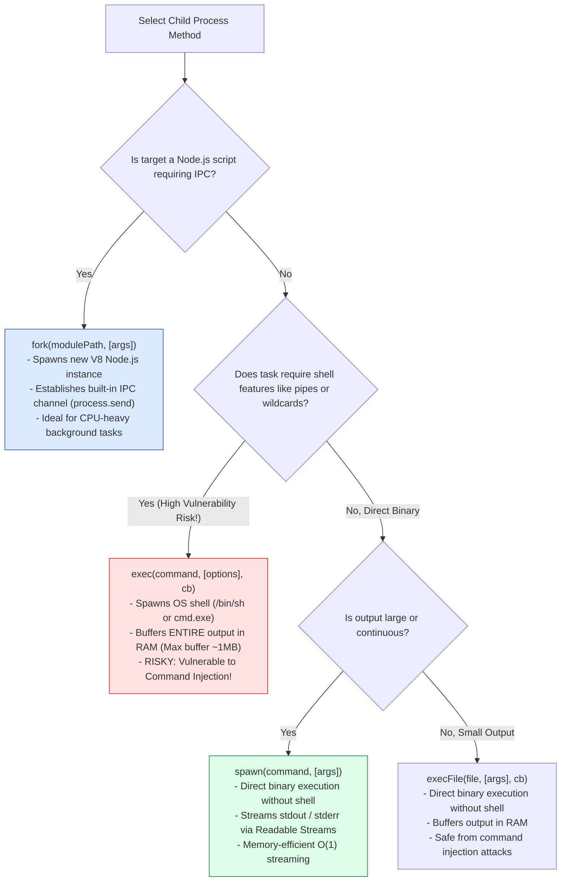
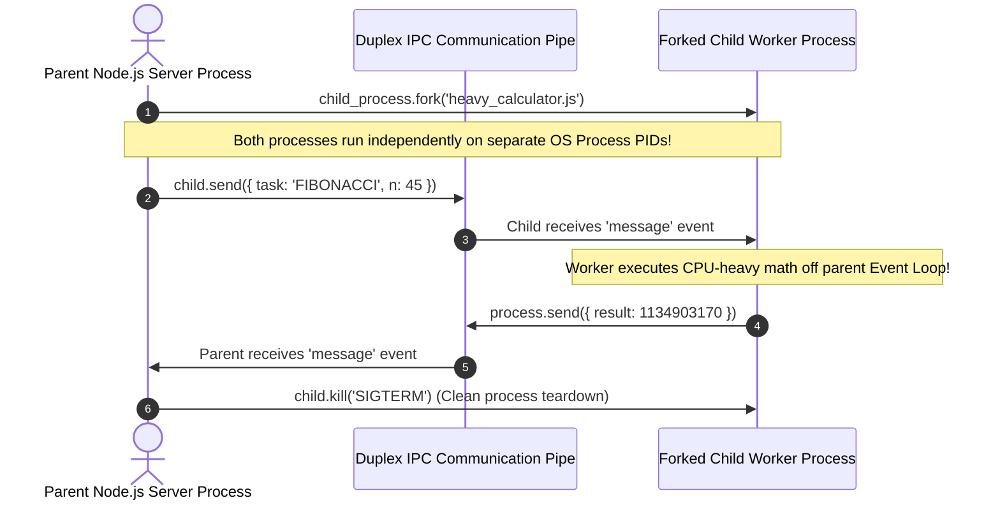
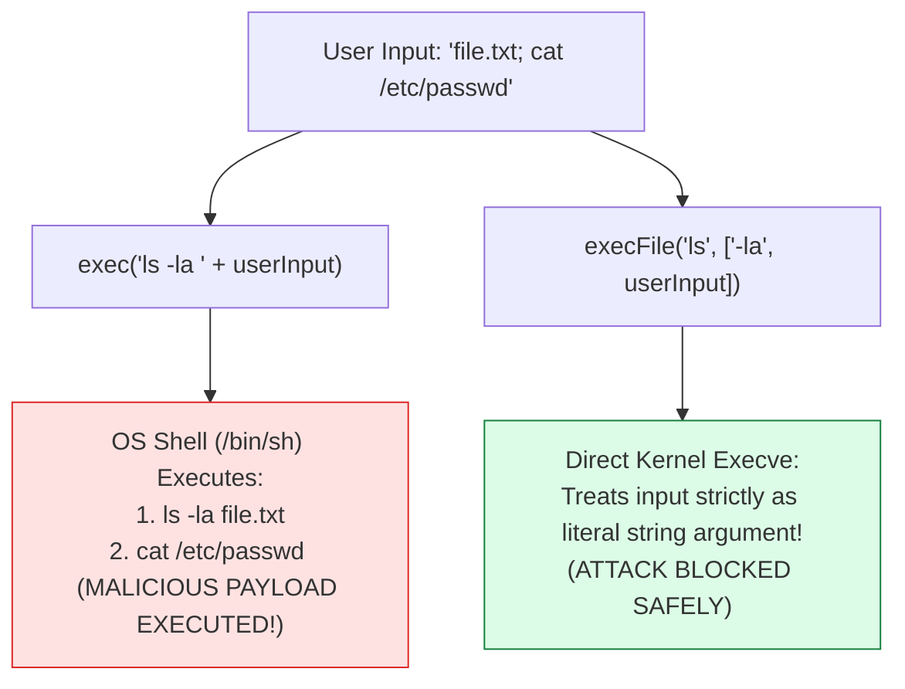

# Module 17: Child Processes — `exec`, `execFile`, `spawn`, `fork`, and IPC Communication Architecture

## Overview

Because JavaScript executes on a single main V8 thread, CPU-bound computational operations (e.g. video transposing, machine learning model inference, heavy file archiving) can freeze the Node.js Event Loop.

The core **`node:child_process`** module allows Node.js applications to spawn OS sub-processes, execute native binaries, run shell commands, or **`fork`** isolated Node.js V8 runtime instances connected via an **Inter-Process Communication (IPC)** duplex pipe.

Understanding **Child Process Spawning Topologies (`exec`, `execFile`, `spawn`, `fork`)**, **IPC Message Passing Mechanics**, **Command Injection Security Guards (CWE-78)**, and **MaxBuffer RAM Overflow Protection** is essential.

---

## 1. Child Process Spawning Decision Tree

Node.js exposes **four distinct methods** for spawning OS sub-processes:



### Comprehensive Child Process Architectural Matrix

| API Method | Output Interface | OS Shell Execution? | Duplex IPC Channel? | Memory Overhead | Primary Use Case |
| :--- | :--- | :--- | :--- | :--- | :--- |
| **`exec`** | Memory Buffer Callback | **Yes** (`/bin/sh` or `cmd.exe`) | No | High (Buffers output in RAM) | Quick CLI commands with shell piping (`ls \| grep`). |
| **`execFile`** | Memory Buffer Callback | **No** (Direct Binary Execution) | No | High (Buffers output in RAM) | Executing external binary executables safely (`/usr/bin/ffmpeg`). |
| **`spawn`** | `stdout` / `stderr` Streams | Optional (`shell: false`) | No | **Low $O(1)$** (Streamed) | Long-running processes, video transcoding, large log outputs. |
| **`fork`** | IPC Message Channel | No (Executes `node`) | **Yes** (`process.send`) | High (Full extra V8 instance) | Offloading CPU-bound tasks to child Node processes. |

---

## 2. Inter-Process Communication (IPC) Architecture with `fork()`

Executing **`child_process.fork()`** instantiates a fresh V8 Node.js engine process and initializes a dedicated IPC duplex socket pipe between parent and child processes:



---

## 3. Command Injection Vulnerabilities (CWE-78) in `exec()`



> [!CAUTION]
> **Command Injection Security Risk**: Never interpolate untrusted user input directly into `child_process.exec()`. Because `exec()` executes commands inside an OS shell, attackers can append shell operators like `; rm -rf /` or `&& cat /etc/passwd`. Always use `execFile()` or `spawn()` with argument arrays.

---

## 4. Code Showcase: Production `spawn` Streaming & `fork` IPC Engine

### Parent Process (`parent.js`)

```javascript
const { spawn, fork } = require("node:child_process");
const path = require("node:path");

console.log(`=== EXECUTING CHILD PROCESS ENGINE [Parent PID: ${process.pid}] ===`);

// 1. Spawning System Binary with Streamed Output (spawn)
const pingProcess = spawn("ping", ["-c", "3", "127.0.0.1"]);

pingProcess.stdout.on("data", (chunk) => {
  console.log(`  [SPAWN STDOUT]: ${chunk.toString().trim()}`);
});

pingProcess.on("close", (exitCode) => {
  console.log(`  ✓ [SPAWN COMPLETE]: Binary process exited with code ${exitCode}`);
});

// 2. Forking Dedicated Node.js Worker Process with Duplex IPC
const childWorkerPath = path.join(__dirname, "child_worker.js");

// Ensure child worker file exists for demonstration
const fs = require("node:fs");
fs.writeFileSync(childWorkerPath, `
  process.on('message', (msg) => {
    if (msg.command === 'START_COMPUTATION') {
      const result = msg.payload.number * 2;
      process.send({ status: 'SUCCESS', result });
    }
  });
`);

const worker = fork(childWorkerPath);

// Send message payload to child process via IPC
worker.send({ command: "START_COMPUTATION", payload: { number: 40 } });

// Receive message payload from child process via IPC
worker.on("message", (msg) => {
  console.log("  ✓ [PARENT RECV]: IPC Response from Child Worker:", msg);
  
  // Cleanly terminate child worker process
  worker.kill("SIGTERM");
});

worker.on("exit", (code) => {
  console.log(`  ✓ [CHILD WORKER EXITED]: Exit Code ${code}`);
  if (fs.existsSync(childWorkerPath)) fs.unlinkSync(childWorkerPath);
});
```

---

## Key Production Takeaways

1. **Use `spawn()` for Large Outputs**: `exec()` buffers the entire output in RAM (default limit 1 MB), throwing an `ERR_CHILD_PROCESS_STDIO_MAXBUFFER` error if exceeded. Use `spawn()` to stream output via chunked streams.
2. **Avoid `exec()` for Dynamic Inputs**: Never pass user-controllable arguments to `exec()`. Always use `execFile()` or `spawn()` with an array of arguments to prevent Command Injection (CWE-78).
3. **Use `fork()` for CPU-Bound Node Tasks**: When offloading heavy JavaScript processing (e.g. data transformation, PDF generation), use `fork()` to run the task in an isolated V8 instance connected via IPC.
4. **Always Listen for `'error'` and `'exit'` Events**: Child processes can fail to launch due to missing system binaries (`ENOENT`). Always attach `child.on('error', ...)` handlers to prevent unhandled process crashes.
