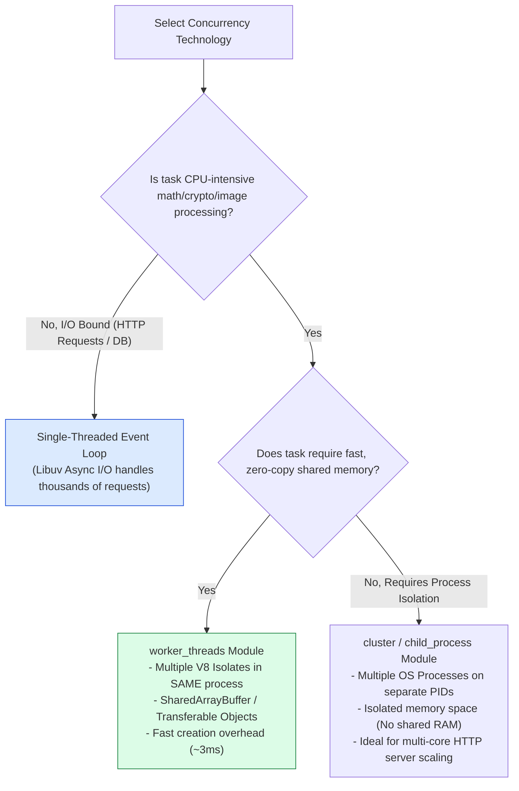
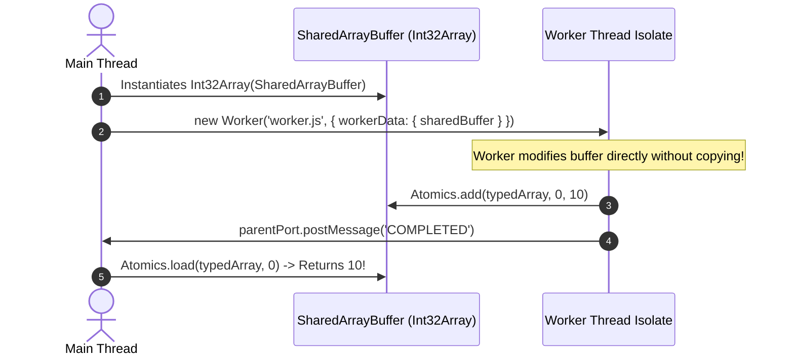

# Module 18: Multithreading in Node.js — Worker Threads (`worker_threads`), SharedArrayBuffer, and V8 Isolates

## Overview

Prior to Node.js 10.5, offloading CPU-heavy operations required spawning separate OS child processes (`child_process.fork`), which carried significant OS process creation overhead and memory duplication.

The **`node:worker_threads`** module enables running JavaScript execution in **multi-threaded Worker Isolates** inside a **single host OS process**. Each worker thread runs its own V8 engine instance (V8 Isolate) and event loop, sharing the same physical memory space via **`SharedArrayBuffer`** and zero-copy **Transferable Objects**.

Understanding **Process PID vs. Worker Thread Memory Architecture**, **V8 Isolates**, **`SharedArrayBuffer` & `Atomics` Thread Synchronization**, and **Worker Pools** is essential.

---

## 1. Process PID vs. Worker Thread Memory Topology

```mermaid
flowchart TD
    subgraph Single OS Host Process (PID 9401)
        subgraph Main V8 Engine Isolate
            MainStack["Main Thread Call Stack (Event Loop)"]
            MainHeap["Main V8 Heap Memory Space"]
        end

        subgraph Worker Thread 1 V8 Isolate
            Worker1Stack["Worker 1 Call Stack"]
            Worker1Heap["Worker 1 V8 Heap Memory"]
        end

        subgraph Worker Thread 2 V8 Isolate
            Worker2Stack["Worker 2 Call Stack"]
            Worker2Heap["Worker 2 V8 Heap Memory"]
        end

        SharedMem["Shared Memory Space: SharedArrayBuffer / Atomics Sync"]

        MainHeap <--> SharedMem
        Worker1Heap <--> SharedMem
        Worker2Heap <--> SharedMem
    end

    style Main V8 Engine Isolate fill:#dbeafe,stroke:#1d4ed8
    style SharedMem fill:#dcfce7,stroke:#15803d
```

---

## 2. Multi-Threading Concurrency Paradigm Decision Tree



### Concurrency Technology Architectural Comparison Matrix

| Metric Dimension | Single Main Thread | `child_process.fork()` | `worker_threads` |
| :--- | :--- | :--- | :--- |
| **Execution Context** | Single OS Thread & V8 Heap | Independent OS Processes (New PID) | Threads inside same OS Process |
| **V8 Heap Space** | Shared across async code | Completely isolated per process | Independent V8 Isolate per worker thread |
| **Memory Overhead** | Lowest (~30 MB) | High (~30 MB per process instance) | Medium (~3-5 MB per worker thread) |
| **Communication API** | Callbacks / Promises | IPC Pipe (JSON Serialization) | `postMessage` / `SharedArrayBuffer` |
| **Zero-Copy Memory** | N/A | No (Data is copied/cloned) | **Yes** (`ArrayBuffer` Transferables) |
| **Primary Use Case** | Web APIs & Network I/O | Standalone service isolation | Heavy math, crypto, image rendering |

---

## 3. Communication Channels: `MessagePort` & `SharedArrayBuffer`

Workers communicate via **MessagePorts** (`parentPort.postMessage()`) or via zero-copy binary memory sharing using **`SharedArrayBuffer`** paired with **`Atomics`** thread synchronization primitives (`Atomics.add`, `Atomics.load`, `Atomics.store`):



---

## 4. Code Showcase: Production Dual-Mode Worker Implementation

In Node.js, a single script can serve as both the Main Thread orchestrator and the Worker Thread script by checking **`isMainThread`**:

```javascript
const { Worker, isMainThread, parentPort, workerData } = require("node:worker_threads");

if (isMainThread) {
  console.log(`=== EXECUTING WORKER THREADS ENGINE [Main PID: ${process.pid}] ===`);

  // Spawning worker thread passing initial workerData payload
  const worker = new Worker(__filename, {
    workerData: { targetNumber: 40 }
  });

  // Listen for worker messages
  worker.on("message", (result) => {
    console.log(`  ✓ [MAIN THREAD]: Received computed result from Worker Isolate:\n    ${result}`);
  });

  // Listen for worker errors
  worker.on("error", (err) => {
    console.error("  !! [MAIN THREAD]: Worker threw unhandled error:", err);
  });

  // Listen for worker thread exit
  worker.on("exit", (code) => {
    if (code !== 0) {
      console.error(`  !! [MAIN THREAD]: Worker stopped abnormally with exit code ${code}`);
    } else {
      console.log("  ✓ [MAIN THREAD]: Worker thread finished execution cleanly.");
    }
  });

} else {
  // WORKER THREAD EXECUTION CONTEXT (Separate V8 Isolate)
  console.log(`  [WORKER THREAD ISOLATE]: Execution started for target number ${workerData.targetNumber}...`);

  // CPU-heavy recursive calculation
  function computeFibonacci(n) {
    if (n <= 1) return n;
    return computeFibonacci(n - 1) + computeFibonacci(n - 2);
  }

  const startTime = Date.now();
  const fibResult = computeFibonacci(workerData.targetNumber);
  const duration = Date.now() - startTime;

  console.log(`  [WORKER THREAD ISOLATE]: Calculation finished in ${duration} ms.`);

  // Post computed payload result back to Main Thread
  parentPort.postMessage(`Fibonacci(${workerData.targetNumber}) = ${fibResult}`);
}
```

---

## Key Production Takeaways

1. **Do NOT Use Worker Threads for I/O Workloads**: Single-threaded Libuv event loops handle network sockets and file streams efficiently. Spawning worker threads for standard I/O adds unnecessary overhead.
2. **Use Worker Pools in Production**: Spawning a new `Worker` thread per HTTP request is expensive (~3ms startup cost). Use a worker pool library (e.g. `piscina`) to reuse worker threads across jobs.
3. **Use Transferable Objects for Large Buffers**: When passing large `ArrayBuffer` instances between main thread and workers, pass the buffer in the transfer list (`parentPort.postMessage(buffer, [buffer.buffer])`) to transfer ownership instantly without copying bytes.
4. **Use `Atomics` with `SharedArrayBuffer`**: When multiple threads read and write to the same `SharedArrayBuffer`, always use `Atomics.load()`, `Atomics.store()`, and `Atomics.add()` to prevent race conditions.


