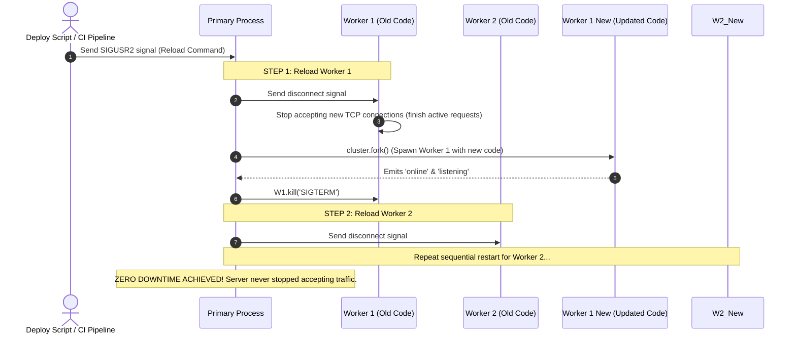

# Module 19: Horizontal Multi-Core Server Scaling with the `cluster` Module

## Overview

Because a single Node.js process runs its Event Loop on one CPU core, a 16-core server running a single `node app.js` process leaves 93% of host CPU capacity completely unutilized.

The built-in **`node:cluster`** module solves this by creating a **Primary (Master)** supervisor process that spawns multiple **Worker** sub-processes (one per CPU core) that **share the exact same server IP and TCP port**.

---

## 1. Master / Primary & Worker Cluster Architecture

```mermaid
flowchart TD
    ClientReq[Incoming Client HTTP Traffic (Port 8080)] --> PrimaryProcess[Primary / Master Process (PID 1000)]
    
    subgraph Master Process Role
        PrimaryProcess --> IPCManager[Master IPC Controller]
        PrimaryProcess --> LoadBalancer[Round-Robin Load Balancer: SCHED_RR]
    end

    LoadBalancer -->|Pass Socket Handle over IPC| Worker1["Worker 1 (PID 1001)<br/>Event Loop & HTTP Server"]
    LoadBalancer -->|Pass Socket Handle over IPC| Worker2["Worker 2 (PID 1002)<br/>Event Loop & HTTP Server"]
    LoadBalancer -->|Pass Socket Handle over IPC| Worker3["Worker 3 (PID 1003)<br/>Event Loop & HTTP Server"]
    LoadBalancer -->|Pass Socket Handle over IPC| Worker4["Worker 4 (PID 1004)<br/>Event Loop & HTTP Server"]
```

### How Shared TCP Port Listening Works

How can multiple independent processes listen on port `8080` without throwing `EADDRINUSE: address already in use` errors?

1. **Primary Process Creates Socket**: The Primary process creates the OS-level TCP server socket bound to port `8080`.
2. **Handle Passing via IPC**: The Primary process accepts incoming TCP connections and passes the raw socket handles to Worker processes over internal IPC pipes.
3. **Round-Robin Scheduling (`SCHED_RR`)**: On POSIX operating systems (Linux, macOS), Node.js uses Round-Robin scheduling to distribute incoming connections evenly across workers.

---

## 2. Zero-Downtime Rolling Restart Architecture

When deploying code updates to a multi-core production server, you can restart workers **one at a time** (rolling reload) to achieve **Zero-Downtime Deployments** without dropping active client connections.



---

## 3. Production Self-Healing Cluster Implementation

```javascript
const cluster = require("node:cluster");
const http = require("node:http");
const os = require("node:os");

// Modern Node.js check for Primary/Master process:
const isPrimary = cluster.isPrimary || cluster.isMaster;

if (isPrimary) {
  const cpuCount = os.cpus().length;
  console.log(`[PRIMARY PROCESS] Running on PID: ${process.pid}`);
  console.log(`[PRIMARY PROCESS] Forking cluster of ${cpuCount} workers...\n`);

  // 1. Fork Worker per CPU core
  for (let i = 0; i < cpuCount; i++) {
    cluster.fork();
  }

  // 2. Track Worker Online Status
  cluster.on("online", (worker) => {
    console.log(`  [WORKER ONLINE] Worker PID: ${worker.process.pid} is online.`);
  });

  // 3. Self-Healing Supervision: Auto-restart crashed workers
  cluster.on("exit", (worker, code, signal) => {
    console.error(`  [WORKER CRASH] Worker PID: ${worker.process.pid} exited (Code: ${code}, Signal: ${signal}).`);
    console.log("  [SUPERVISOR] Forking replacement worker process immediately...");
    cluster.fork(); // Spawn fresh worker to restore pool capacity
  });

  // 4. Handle Zero-Downtime Rolling Reload Signal (SIGUSR2)
  process.on("SIGUSR2", async () => {
    console.log("\n[PRIMARY PROCESS] Received SIGUSR2 signal. Initiating zero-downtime rolling reload...");
    
    const workers = Object.values(cluster.workers);
    for (const worker of workers) {
      if (!worker) continue;
      
      console.log(`  [RELOAD] Disconnecting old worker PID: ${worker.process.pid}...`);
      
      // Spawn new worker first
      const newWorker = cluster.fork();
      
      // Wait for new worker to be online before killing old worker
      await new Promise((resolve) => newWorker.once("listening", resolve));
      
      // Disconnect and terminate old worker
      worker.disconnect();
      worker.kill("SIGTERM");
    }
    console.log("[PRIMARY PROCESS] Rolling reload complete!\n");
  });

} else {
  // WORKER PROCESS CODE — Runs independent HTTP Server
  const server = http.createServer((req, res) => {
    // Simulate lightweight route
    res.writeHead(200, { "Content-Type": "application/json" });
    res.end(JSON.stringify({
      message: "Cluster Worker Active",
      handledByWorkerPid: process.pid
    }));
  });

  server.listen(8080, () => {
    console.log(`    Worker process listening on port 8080 (PID: ${process.pid})`);
  });
}
```

---

## 4. Native `cluster` Module vs. PM2 Process Manager

| Capability | Native `node:cluster` Module | **PM2 Process Manager** |
| :--- | :--- | :--- |
| **Setup Overhead** | Requires custom supervisor boilerplate code in JS file. | Zero code changes (`pm2 start app.js -i max`). |
| **Process Monitoring** | Basic `cluster.on('exit')` listener logic. | Built-in CLI dashboard, memory auto-restart, restart counts. |
| **Zero-Downtime Reload** | Custom signal listener implementation required. | Built-in zero-downtime command (`pm2 reload app.js`). |
| **Log Management** | Standard output requires manual file aggregation. | Automatic unified log rotation and log files. |

---

## Key Production Takeaways

1. **Do NOT Store Stateful Session Memory in Local Process Variables**: Worker processes run on completely separate V8 instances and memory heaps. Storing user sessions in global JS arrays will cause random session loss when client requests hit different worker processes. **Use Redis for Shared Session State**.
2. **Limit Workers to Available Physical CPU Cores**: Do not spawn 100 workers on a 4-core machine. Context switching overhead will degrade overall server throughput. Use `os.cpus().length`.
3. **Use PM2 in Production for Simplified Cluster Management**: For production deployments, PM2 (`pm2 start server.js -i max`) manages process clustering, log rotation, memory limits, and process crash recovery automatically.
4. **Implement Graceful Worker Disconnection**: When restarting workers, invoke `worker.disconnect()` before killing the process to allow in-flight HTTP requests to complete cleanly.

