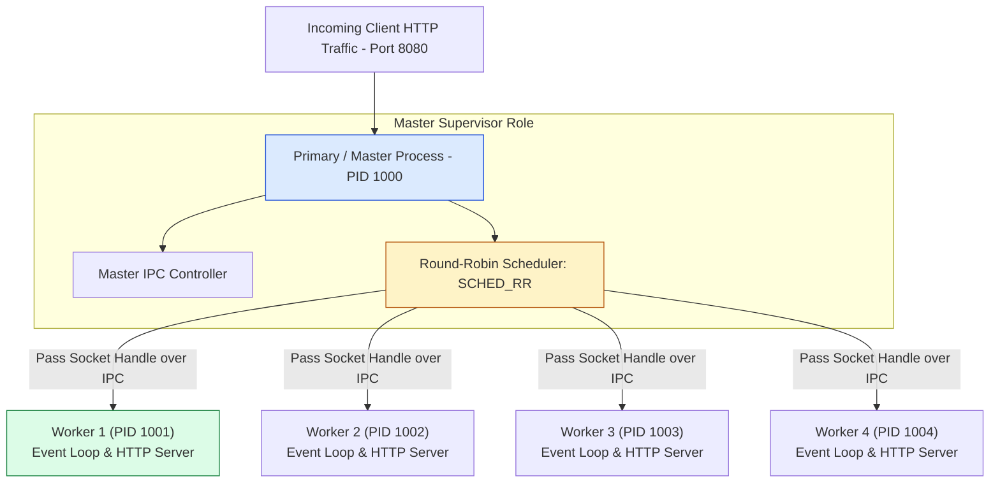
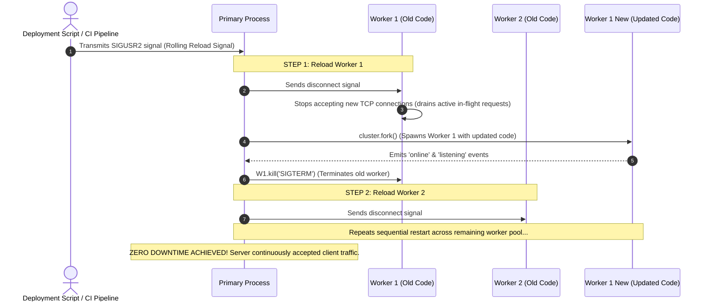
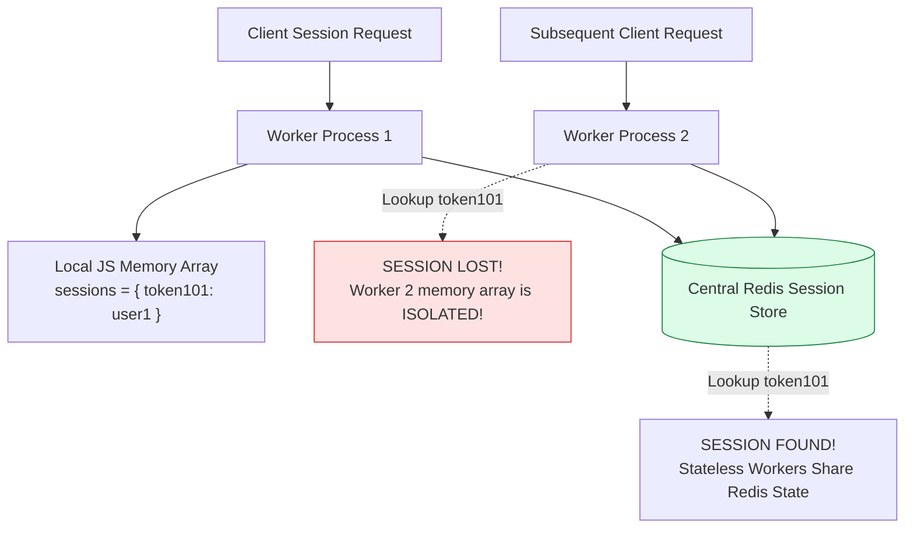

# Module 19: Horizontal Multi-Core Server Scaling — `cluster` Module, Round-Robin Scheduling, and Zero-Downtime Deployments

## Overview

Because a single Node.js process executes its Event Loop on one CPU core, a 16-core production server executing a single `node app.js` process leaves 93% of host CPU capacity unutilized.

The built-in **`node:cluster`** module solves this by instantiating a **Primary (Master)** supervisor process that spawns multiple **Worker** sub-processes (typically one per CPU core) that **share the exact same host IP address and TCP server port**.

Understanding **Primary/Worker Process Architecture**, **Round-Robin Connection Scheduling (`SCHED_RR`)**, **Zero-Downtime Rolling Reload Sequences**, **Stateful Memory Pitfalls (Redis Mitigation)**, and **PM2 vs. Native Clustering** is essential.

---

## 1. Primary & Worker Cluster Topology



### Shared TCP Port Listening Mechanics

How can multiple independent processes listen on port `8080` without triggering `EADDRINUSE: address already in use` operating system errors?

1. **Primary Process Socket Creation**: The Primary process creates the OS-level TCP server socket bound to port `8080`.
2. **Handle Passing via IPC**: The Primary process accepts incoming TCP connection requests and passes the raw socket file descriptor handles to Worker processes over internal IPC pipes.
3. **Round-Robin Scheduling (`SCHED_RR`)**: On POSIX operating systems (Linux, macOS), Node.js uses Round-Robin scheduling (`cluster.schedulingPolicy = cluster.SCHED_RR`) to distribute incoming TCP connections evenly across workers.

---

## 2. Zero-Downtime Rolling Reload Architecture

When deploying code updates to a multi-core production cluster, workers are restarted **sequentially** (rolling reload) to achieve **Zero-Downtime Deployments** without dropping active client connections:



---

## 3. Stateful Memory Hazards: The Need for Stateless Workers



---

## 4. Production Code Showcase: Self-Healing Cluster Engine with Rolling Reload

```javascript
const cluster = require("node:cluster");
const http = require("node:http");
const os = require("node:os");

// Modern Node.js check for Primary/Master process:
const isPrimary = cluster.isPrimary || cluster.isMaster;

if (isPrimary) {
  const cpuCount = os.cpus().length;
  console.log(`=== EXECUTING CLUSTER ENGINE [Primary Process PID: ${process.pid}] ===`);
  console.log(`[PRIMARY PROCESS]: Forking supervisor pool of ${cpuCount} workers...\n`);

  // 1. Fork Worker per CPU core
  for (let i = 0; i < cpuCount; i++) {
    cluster.fork();
  }

  // 2. Track Worker Online Status
  cluster.on("online", (worker) => {
    console.log(`  ✓ [WORKER ONLINE]: Worker PID ${worker.process.pid} online & ready.`);
  });

  // 3. Self-Healing Supervision: Auto-restart crashed workers
  cluster.on("exit", (worker, code, signal) => {
    console.error(`  !! [WORKER CRASH]: Worker PID ${worker.process.pid} exited (Code: ${code}, Signal: ${signal}).`);
    console.log("  -> [SUPERVISOR]: Forking replacement worker process immediately...");
    cluster.fork(); // Spawn fresh worker to restore pool capacity
  });

  // 4. Handle Zero-Downtime Rolling Reload Signal (SIGUSR2)
  process.on("SIGUSR2", async () => {
    console.log("\n[PRIMARY PROCESS]: Received SIGUSR2 signal. Initiating zero-downtime rolling reload...");
    
    const workers = Object.values(cluster.workers);
    for (const worker of workers) {
      if (!worker) continue;
      
      console.log(`  -> [RELOAD]: Disconnecting old worker PID: ${worker.process.pid}...`);
      
      // Spawn new worker first
      const newWorker = cluster.fork();
      
      // Wait for new worker to be online before killing old worker
      await new Promise((resolve) => newWorker.once("listening", resolve));
      
      // Disconnect and terminate old worker
      worker.disconnect();
      worker.kill("SIGTERM");
    }
    console.log("[PRIMARY PROCESS]: Rolling reload completed successfully!\n");
  });

} else {
  // WORKER PROCESS CODE — Executes independent HTTP Server
  const server = http.createServer((req, res) => {
    res.writeHead(200, { "Content-Type": "application/json" });
    res.end(JSON.stringify({
      message: "Cluster Worker Active",
      handledByWorkerPid: process.pid
    }));
  });

  server.listen(8080, () => {
    console.log(`    Worker process listening on port 8080 (PID: ${process.pid})`);
  });
}
```

---

## 5. Native `cluster` Module vs. PM2 Process Manager

| Feature Dimension | Native `node:cluster` Module | **PM2 Process Manager** |
| :--- | :--- | :--- |
| **Setup Overhead** | Requires custom supervisor boilerplate code in JS file. | Zero code changes (`pm2 start app.js -i max`). |
| **Process Supervision** | Manual `cluster.on('exit')` replacement logic. | Built-in CLI dashboard, memory auto-restart, restart counts. |
| **Zero-Downtime Reload** | Custom signal listener implementation required. | Built-in zero-downtime command (`pm2 reload app.js`). |
| **Log Management** | Standard output requires manual file aggregation. | Automatic unified log rotation and log files. |

---

## Key Production Takeaways

1. **Do NOT Store Stateful Session Memory in Local Process Variables**: Worker processes run on completely separate V8 instances and memory heaps. Storing user sessions in global JS arrays will cause random session loss when client requests hit different worker processes. **Use Redis for Shared Session State**.
2. **Limit Workers to Available Physical CPU Cores**: Do not spawn 100 workers on a 4-core machine. Context switching overhead will degrade overall server throughput. Use `os.cpus().length`.
3. **Use PM2 in Production for Simplified Cluster Management**: For production deployments, PM2 (`pm2 start server.js -i max`) manages process clustering, log rotation, memory limits, and process crash recovery automatically.
4. **Implement Graceful Worker Disconnection**: When restarting workers, invoke `worker.disconnect()` before killing the process to allow in-flight HTTP requests to complete cleanly.
y.

