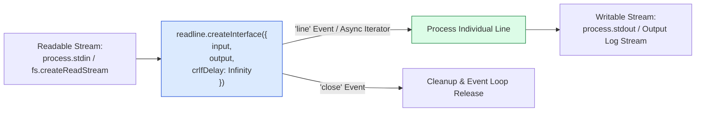
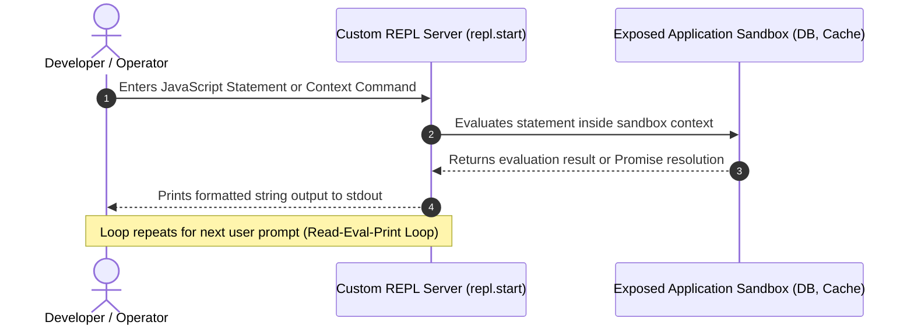

# Module 20: Readline Interface and Interactive REPL (`readline`, `repl`) Architecture

## Overview

The core **`node:readline`** module provides streaming interfaces for reading user input or log files line-by-line from readable input streams (such as `process.stdin` or `fs.createReadStream`).

Additionally, Node.js exposes the **`node:repl`** module to programmatically instantiate custom Read-Eval-Print Loop (REPL) interactive administrative consoles with custom evaluation contexts, sandboxed state handles, and command autocompletion.

Understanding **Readline Stream Architecture**, **`crlfDelay: Infinity` Line Ending Resolution**, **`readline/promises` Async CLI Wizards**, and **Embedded Server REPL Sandboxing** is essential.

---

## 1. Readline Stream Interface Architecture



### Purpose of `crlfDelay: Infinity`

When reading lines from text files, line endings differ across platforms (`\n` on POSIX vs. `\r\n` on Windows).

Setting **`crlfDelay: Infinity`** instructs the `readline` parser to treat any `\r` immediately followed by `\n` as a single newline sequence, preventing ghost empty line emissions when parsing Windows-formatted files on Linux servers.

---

## 2. Interactive REPL Server Architecture

The **`node:repl`** module powers the interactive Node.js terminal (`node`), but also allows embedding custom administrative REPL shells inside running server daemons:



---

## 3. Promise-Based `readline/promises` API

Node.js 17+ introduced **`node:readline/promises`**, eliminating nested callbacks when prompting CLI users:

```javascript
const readline = require("node:readline/promises");
const { stdin: input, stdout: output } = require("node:process");

async function runInteractiveDeploymentWizard() {
  // Create Promise-based Readline Interface
  const rl = readline.createInterface({ input, output });

  console.log("=== EXECUTING INTERACTIVE CLI WIZARD ===");

  try {
    const appName = await rl.question("  1. Enter Application Name: ");
    const environment = await rl.question("  2. Target Environment (staging/production): ");
    const confirm = await rl.question(`  3. Deploy '${appName}' to '${environment}'? (y/n): `);

    if (confirm.toLowerCase() === "y") {
      console.log(`\n  ✓ SUCCESS: Deployment of '${appName}' triggered for ${environment}!`);
    } else {
      console.log("\n  !! CANCELLED: Deployment operation aborted by user.");
    }
  } catch (err) {
    console.error("  !! CLI Wizard Error:", err.message);
  } finally {
    rl.close(); // ALWAYS close the readline interface to release process.stdin handle!
  }
}

runInteractiveDeploymentWizard();
```

---

## 4. Code Showcase: Production Line-by-Line Log Stream Processing & Embedded REPL

```javascript
const fs = require("node:fs");
const readline = require("node:readline");
const path = require("node:path");
const repl = require("node:repl");

// ==========================================
// 1. O(1) RAM LINE-BY-LINE LOG STREAM PARSER
// ==========================================
async function parseLargeLogFile(logFilePath) {
  const fileStream = fs.createReadStream(logFilePath);

  // Initialize Readline interface with crlfDelay guard
  const rl = readline.createInterface({
    input: fileStream,
    crlfDelay: Infinity
  });

  let totalLines = 0;
  let errorCount = 0;

  console.log("=== EXECUTING READLINE LOG STREAM PARSER ===");

  // Process file line-by-line in constant O(1) RAM!
  for await (const line of rl) {
    totalLines++;
    if (line.includes("500 Internal Server Error") || line.includes("ERROR")) {
      errorCount++;
    }
  }

  console.log(`  ✓ Log Analysis Complete: Processed ${totalLines} lines. Detected ${errorCount} Errors.`);
}

// ==========================================
// 2. EMBEDDED ADMINISTRATIVE REPL SHELL
// ==========================================
function startAdminReplShell() {
  const mockDatabase = {
    users: [{ id: 101, name: "Alice" }],
    queryCount: 142
  };

  const replServer = repl.start({
    prompt: "admin-shell> ",
    useColors: true
  });

  // Context Binding: Expose live app variables into interactive shell
  replServer.context.db = mockDatabase;
  replServer.context.resetCounters = () => {
    mockDatabase.queryCount = 0;
    console.log("  ✓ Query counter reset to 0.");
  };

  console.log("\nEmbedded Administrative REPL initialized. Type 'db' or 'resetCounters()' to inspect state.");
}

// Create temporary log file for demonstration
const demoLogPath = path.join(__dirname, "demo_server.log");
fs.writeFileSync(demoLogPath, "2026-08-31 INFO System Boot\n2026-08-31 ERROR 500 Internal Server Error\n2026-08-31 INFO Processing Complete\n");

parseLargeLogFile(demoLogPath).then(() => {
  if (fs.existsSync(demoLogPath)) fs.unlinkSync(demoLogPath);
});
```

---

## Key Production Takeaways

1. **Always Set `crlfDelay: Infinity` when Parsing Files**: Prevents empty line parsing bugs when reading Windows-formatted text files on POSIX servers.
2. **Close Readline Interfaces Explicitly**: Failing to call `rl.close()` on `process.stdin` keeps the Event Loop open, preventing CLI applications from exiting naturally.
3. **Use `for await (const line of rl)` for Log Analysis**: Stream large log files through `readline` instead of loading and splitting huge string payloads in memory.
4. **Leverage Embedded REPLs for Diagnostics**: Embedding `repl.start()` bound to internal service singletons allows live inspection and state management in long-running Node.js daemons.


