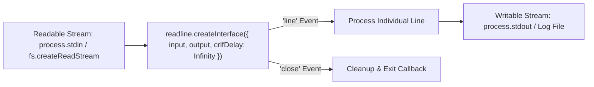
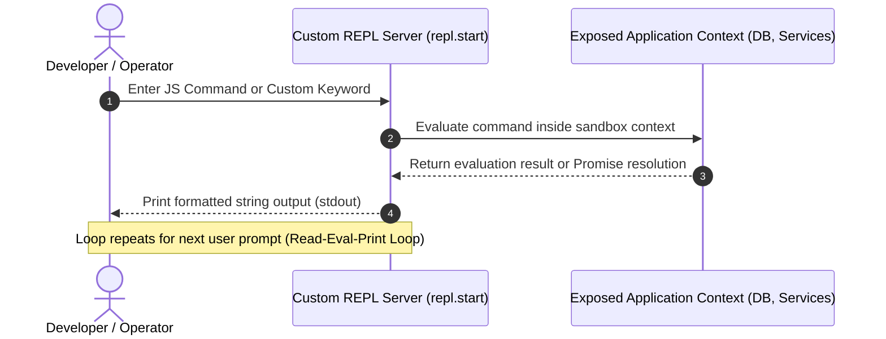

# Module 20: Readline Interface and Interactive REPL (`readline`, `repl`)

## Overview

The core **`node:readline`** module provides streaming interfaces for reading user input or log files line-by-line from readable streams (such as `process.stdin` or `fs.createReadStream`).

Additionally, Node.js exposes the **`node:repl`** module to programmatically instantiate custom Read-Eval-Print Loop (REPL) interactive consoles with custom evaluation contexts and command autocompletion.

---

## 1. Readline Stream Interface Architecture



### Purpose of `crlfDelay: Infinity`

When reading lines from text files, line endings differ across platforms (`\n` on POSIX vs `\r\n` on Windows). 

Setting **`crlfDelay: Infinity`** instructs the `readline` interface to treat any `\r` immediately followed by `\n` as a single newline character, preventing ghost empty line emissions when parsing Windows files on Linux.

---

## 2. Interactive REPL Server Architecture

The **`node:repl`** module powers the interactive Node.js terminal (`node`), but also allows embedding custom administrative REPL shells inside running server processes.



---

## 3. Modern Promise-Based `readline/promises` API

Node.js 17+ introduced **`node:readline/promises`**, eliminating callback nesting when prompting CLI users:

```javascript
const readline = require("node:readline/promises");
const { stdin: input, stdout: output } = require("node:process");

async function runInteractiveCliWizard() {
  // Create Promise-based Readline Interface
  const rl = readline.createInterface({ input, output });

  try {
    console.log("=== APPLICATION DEPLOYMENT WIZARD ===");

    const appName = await rl.question("1. Enter Application Name: ");
    const environment = await rl.question("2. Target Environment (staging/production): ");
    const confirm = await rl.question(`3. Deploy ${appName} to ${environment}? (y/n): `);

    if (confirm.toLowerCase() === "y") {
      console.log(`\nSUCCESS: Deployment of ${appName} triggered for ${environment}!`);
    } else {
      console.log("\nCANCELLED: Deployment aborted by user.");
    }
  } catch (err) {
    console.error("CLI Wizard Error:", err.message);
  } finally {
    rl.close(); // ALWAYS close the readline interface to release stdin handle!
  }
}

runInteractiveCliWizard();
```

---

## 4. Line-by-Line Large File Stream Processing Code

```javascript
const fs = require("node:fs");
const readline = require("node:readline");
const path = require("node:path");

async function parseLargeLogFile(logFilePath) {
  const fileStream = fs.createReadStream(logFilePath);

  // Initialize Readline interface with crlfDelay guard
  const rl = readline.createInterface({
    input: fileStream,
    crlfDelay: Infinity
  });

  let totalLines = 0;
  let errorCount = 0;

  // Process file chunk-by-chunk, line-by-line in O(1) RAM!
  for await (const line of rl) {
    totalLines++;
    if (line.includes("500 Internal Server Error")) {
      errorCount++;
    }
  }

  console.log(`Log Parsing Complete: Analyzed ${totalLines} lines. Found ${errorCount} 500 Errors.`);
}
```

---

## 5. Custom Administrative REPL Implementation

```javascript
const repl = require("node:repl");
const http = require("node:http");

// Simulated backend database service
const db = {
  users: [{ id: 1, name: "Alice" }],
  queryCount: 42
};

// Start custom embedded REPL shell
const replServer = repl.start({
  prompt: "admin-shell> ",
  useColors: true
});

// Context Binding: Expose live app variables into interactive shell!
replServer.context.db = db;
replServer.context.resetCounters = () => {
  db.queryCount = 0;
  console.log("Query counter reset to 0.");
};

console.log("Embedded Administrative REPL started. Type 'db' or 'resetCounters()' to inspect state.");
```

---

## Key Production Takeaways

1. **Always Set `crlfDelay: Infinity` when Parsing Files**: Prevents empty line parsing bugs when reading Windows-formatted text files on POSIX servers.
2. **Close Readline Interfaces explicitly**: Failing to call `rl.close()` on `process.stdin` keeps the Event Loop open, preventing CLI applications from exiting naturally.
3. **Use `for await (const line of rl)` for Log Analysis**: Stream large log files through `readline` instead of splitting huge strings in memory.
4. **Leverage Custom REPLs for Diagnostic Debugging**: Embedding `repl.start()` bound to internal services allows live inspection and state management in long-running node daemons.

