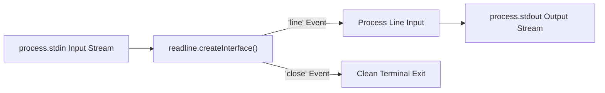

# File 20: Readline and Interactive REPL (readline module)

## Overview
The **`readline`** module provides an interface for reading input streams line-by-line (e.g. `process.stdin`), making it ideal for interactive CLI tools, line processing scripts, and custom REPL interfaces.

---

## 1. Readline Stream Interface Architecture



---

## 2. Interactive CLI Prompt & Stream Reader Implementation

```javascript
const readline = require("readline");
const { Readable } = require("stream");

// 1. Line-by-Line Stream Processor
const sampleInput = [
    "LOG: User logged in",
    "WARN: High CPU usage",
    "ERROR: Database connection timeout"
];

const rl = readline.createInterface({
    input: Readable.from(sampleInput.map(l => l + "\n")),
    crlfDelay: Infinity
});

let errorCount = 0;

rl.on("line", line => {
    console.log(`Processing: "${line}"`);
    if (line.includes("ERROR")) {
        errorCount++;
    }
});

rl.on("close", () => {
    console.log(`Stream complete. Total Errors found: ${errorCount}`);
});

// 2. Interactive User Prompt
function askQuestion(query) {
    const rlInteractive = readline.createInterface({
        input: process.stdin,
        output: process.stdout
    });

    return new Promise(resolve => {
        rlInteractive.question(query, answer => {
            rlInteractive.close();
            resolve(answer);
        });
    });
}
```

---

## Key Takeaways
1. Use **`readline.createInterface()`** to process input streams line-by-line without loading entire files into memory.
2. Specify **`crlfDelay: Infinity`** to treat `\r\n` line endings cleanly.
3. Listen to **`line`** and **`close`** events for asynchronous stream completion.
