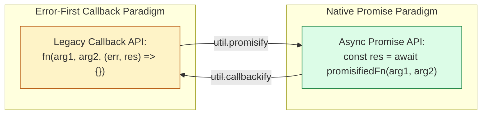
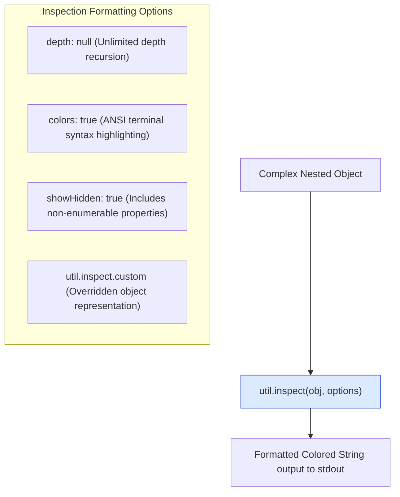

# Module 21: System Utilities — Promisification, Inspection, and Type Verification (`util`)

## Overview

The built-in **`node:util`** module supplies internal runtime utilities designed for low-level debugging, object inspection, function signature transformation, and strict type verification.

Key capabilities include **`util.promisify()`** (converting error-first callback APIs into native Promises), **`util.callbackify()`** (the inverse operation), **`util.inspect()`** (customizable object formatting), **`util.types`** (unambiguous V8 engine type checking), and **`util.deprecate()`** (marking deprecated API methods).

Understanding **Function Signature Promisification Topologies**, **`util.promisify.custom` Symbols**, **`util.inspect.custom` Sensitive Field Redaction**, and **V8 `util.types` Verification** is essential.

---

## 1. Function Transformation Architecture: `promisify` & `callbackify`



### Custom Promisification Symbol (`util.promisify.custom`)

If a legacy library does not adhere to the standard `(err, result)` callback signature, `util.promisify()` will fail unless you attach the **`util.promisify.custom`** symbol:

```javascript
const util = require("node:util");

// Non-standard legacy API (Passes result BEFORE error!)
function legacyCustomApi(value, callback) {
  setTimeout(() => callback(value * 2, null), 100);
}

// Attach custom promisifier function to the symbol
legacyCustomApi[util.promisify.custom] = (value) => {
  return new Promise((resolve) => {
    legacyCustomApi(value, (result) => resolve(result));
  });
};

// Now util.promisify() correctly uses the custom promise handler!
const customPromiseFn = util.promisify(legacyCustomApi);
customPromiseFn(21).then((res) => console.log("Custom Promisify Result:", res)); // 42
```

---

## 2. Deep Object Inspection & Sensitive Data Redaction (`util.inspect.custom`)

By default, `console.log()` truncates deeply nested objects into `[Object]` or `[Array]` placeholders. **`util.inspect()`** forces complete recursive object tree printing:



---

## 3. Strict Type Verification Matrix (`util.types`)

JavaScript `typeof` and `instanceof` checks can be unreliable across different execution contexts or V8 Isolates. **`util.types`** provides unambiguous type checking backed directly by V8 C++ engine internal types:

| Type Guard Method | Evaluates `true` For | Contrast with Standard JS Operator |
| :--- | :--- | :--- |
| **`util.types.isDate(val)`** | Native `Date` instances | Immune to cross-realm iframe/VM prototype pollution. |
| **`util.types.isPromise(val)`** | Native `Promise` instances | Differing from duck-typed thenable objects. |
| **`util.types.isRegExp(val)`** | Native `RegExp` objects | Standard `typeof /abc/ === 'object'`. |
| **`util.types.isNativeError(val)`**| `Error`, `TypeError`, `RangeError` | Reliably catches custom error subclasses. |
| **`util.types.isAnyArrayBuffer(val)`**| `ArrayBuffer` & `SharedArrayBuffer` | Checks raw binary memory buffer allocations. |
| **`util.types.isAsyncFunction(val)`**| Functions declared with `async` | Distinguishes `async` functions from normal functions. |

---

## 4. Production Code Showcase: Custom Inspection Redaction & Type Checking

```javascript
const util = require("node:util");

// ==========================================
// 1. SENSITIVE FIELD REDACTION WITH INSPECT CUSTOM
// ==========================================
class UserAccount {
  constructor(id, name, secretToken) {
    this.id = id;
    this.name = name;
    this._secretToken = secretToken; // Sensitive field
  }

  // Override default console / util.inspect formatting to prevent credential leaks in logs
  [util.inspect.custom](depth, options, inspect) {
    return `UserAccount [ID: ${this.id}, Name: '${this.name}', Token: '***REDACTED***']`;
  }
}

console.log("=== EXECUTING SYSTEM UTILITIES SUITE ===");

const user = new UserAccount(101, "Alice", "Bearer_eyJhbGciOi...");
console.log("1. Custom Inspected Object Output:");
console.log("  ", util.inspect(user)); 
// Output: UserAccount [ID: 101, Name: 'Alice', Token: '***REDACTED***']

// ==========================================
// 2. DEPRECATION API WARNING
// ==========================================
const legacyCalculateTax = util.deprecate(
  (subtotal) => subtotal * 0.15,
  "WARNING: legacyCalculateTax() is deprecated. Use TaxEngine.calculate() instead.",
  "DEP0099" // Unique Deprecation Identifier
);

console.log("\n2. Deprecated Function Call Result:", legacyCalculateTax(100));

// ==========================================
// 3. V8 TYPE VALIDATION VIA UTIL.TYPES
// ==========================================
const samplePromise = Promise.resolve(42);
const sampleDate = new Date();

console.log("\n3. V8 Engine Type Guards (util.types):");
console.log("   Is Native Promise? :", util.types.isPromise(samplePromise)); // true
console.log("   Is Native Date?    :", util.types.isDate(sampleDate));       // true
console.log("   Is Async Function? :", util.types.isAsyncFunction(async () => {})); // true
```

---

## Key Production Takeaways

1. **Use `util.inspect(obj, { depth: null })` for Debugging Complex Objects**: Avoid truncation (`[Object]`) in diagnostic logs by passing `{ depth: null }`.
2. **Implement `util.inspect.custom` on Domain Models**: Mask sensitive fields (passwords, JWT secrets, credit cards) by implementing the `util.inspect.custom` symbol method on domain classes.
3. **Prefer `util.types` over `instanceof` in Library Code**: `util.types` methods are immune to prototype manipulation and cross-realm V8 Isolate type confusion.
4. **Use `util.promisify` for Third-Party Callback Libraries**: Wrap legacy callback functions cleanly with `util.promisify` to consume them with modern `async/await`.


