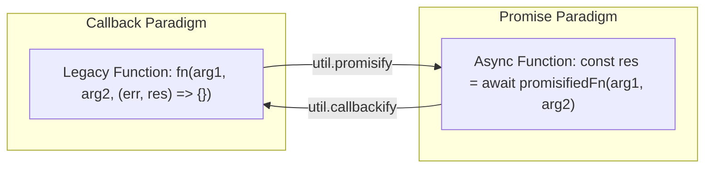
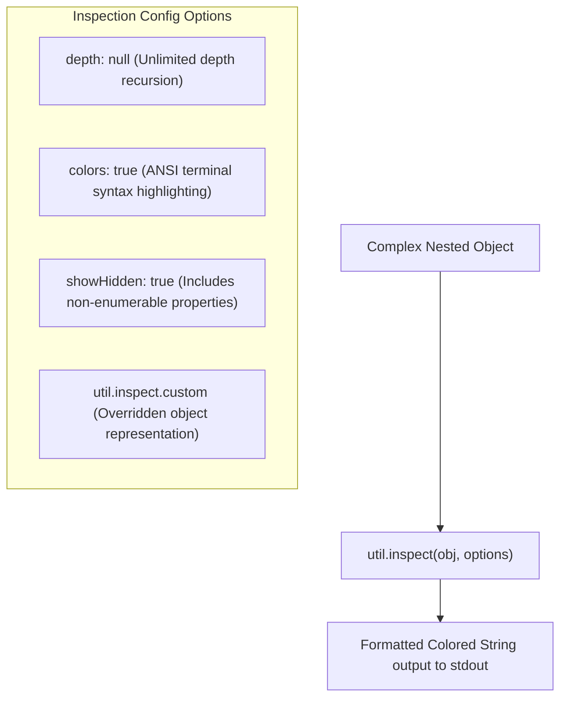

# Module 21: System Utilities — Promisification, Inspection, and Type Checking (`util`)

## Overview

The built-in **`node:util`** module supplies internal runtime utilities designed for debugging, object inspection, function signature transformation, and strict type verification.

Key capabilities include **`util.promisify()`** (converting error-first callback APIs into native Promises), **`util.callbackify()`** (the inverse operation), **`util.inspect()`** (customizable object formatting), **`util.types`** (unambiguous V8 C++ type checking), and **`util.deprecate()`** (marking deprecated code APIs).

---

## 1. Function Transformation Architecture: `promisify` and `callbackify`



### Custom Promisification Symbol (`util.promisify.custom`)

If a legacy library does not adhere to the standard `(err, result)` callback signature, `util.promisify()` will fail unless you attach the **`util.promisify.custom`** symbol:

```javascript
const util = require("node:util");

// Non-standard legacy API (Passes result BEFORE error!)
function legacyCustomApi(value, callback) {
  setTimeout(() => callback(value * 2, null), 100);
}

// Attach custom promisifier function to the symbol
legacyCustomApi[util.promisify.custom] = (value) => {
  return new Promise((resolve) => {
    legacyCustomApi(value, (result) => resolve(result));
  });
};

// Now util.promisify() correctly uses the custom promise handler!
const customPromiseFn = util.promisify(legacyCustomApi);
customPromiseFn(21).then((res) => console.log("Custom Promisify Result:", res)); // 42
```

---

## 2. Deep Object Inspection & Custom Formatter (`util.inspect.custom`)

By default, `console.log()` truncates deeply nested objects into `[Object]` or `[Array]` placeholders. **`util.inspect()`** forces complete recursive object tree printing.



### Custom Inspection Output via `util.inspect.custom`

You can customize how your domain classes print in logs without exposing internal private keys:

```javascript
const util = require("node:util");

class UserAccount {
  constructor(id, name, secretToken) {
    this.id = id;
    this.name = name;
    this._secretToken = secretToken; // Sensitive property
  }

  // Override default console / util.inspect formatting
  [util.inspect.custom](depth, options, inspect) {
    return `UserAccount [ID: ${this.id}, Name: '${this.name}', Token: 'REDACTED']`;
  }
}

const user = new UserAccount(101, "Alice", "Bearer_eyJhbGciOi...");
console.log(util.inspect(user)); 
// Prints: UserAccount [ID: 101, Name: 'Alice', Token: 'REDACTED']
```

---

## 3. Strict Type Verification via `util.types`

JavaScript `typeof` and `instanceof` can be unreliable across different execution contexts or V8 isolates. **`util.types`** provides unambiguous type checking backed directly by V8 engine internal types:

| Type Guard API | Evaluates `true` For | Contrast with Standard JS |
| :--- | :--- | :--- |
| **`util.types.isDate(val)`** | Native `Date` instances | Safe against cross-realm iframe/VM objects. |
| **`util.types.isPromise(val)`** | Native `Promise` instances | Differing from thenable duck-typing. |
| **`util.types.isRegExp(val)`** | Native `RegExp` objects | `typeof /abc/ === 'object'`. |
| **`util.types.isNativeError(val)`**| `Error`, `TypeError`, `RangeError` | Catches custom subclasses reliably. |
| **`util.types.isAnyArrayBuffer(val)`**| `ArrayBuffer` & `SharedArrayBuffer` | Checks raw binary memory allocations. |
| **`util.types.isAsyncFunction(val)`**| Functions declared with `async` | Distinguishes from standard functions. |

---

## 4. Practical Code Demonstration

```javascript
const util = require("node:util");

// 1. Deprecating Legacy API Functions
const legacyCalculateTax = util.deprecate(
  (subtotal) => subtotal * 0.15,
  "WARNING: legacyCalculateTax() is deprecated. Use taxEngine.calculate() instead.",
  "DEP0099" // Unique Deprecation Code
);

console.log("Tax Result:", legacyCalculateTax(100)); // Prints deprecation warning to stderr on first call!

// 2. String Formatting via util.format()
const logMessage = util.format("Server Process %d (%s) initialized in %d ms", process.pid, "main.js", 450);
console.log("\nFormatted Log:", logMessage);

// 3. Robust Type Checking via util.types
const samplePromise = Promise.resolve(42);
const sampleDate = new Date();

console.log("\n--- util.types Validation ---");
console.log("Is Native Promise?", util.types.isPromise(samplePromise)); // true
console.log("Is Native Date?   ", util.types.isDate(sampleDate));       // true
console.log("Is Async Function?", util.types.isAsyncFunction(async () => {})); // true
```

---

## Key Production Takeaways

1. **Use `util.inspect(obj, { depth: null })` for Debugging Complex Objects**: Avoid truncation (`[Object]`) in diagnostic logs by passing `{ depth: null }`.
2. **Implement `util.inspect.custom` on Domain Models**: Mask sensitive fields (passwords, JWT secrets, credit cards) by implementing the `util.inspect.custom` symbol method on domain classes.
3. **Prefer `util.types` over `instanceof` in Library Code**: `util.types` methods are immune to prototype manipulation and cross-realm V8 Isolate type confusion.
4. **Use `util.promisify` for Third-Party Callback Libraries**: Wrap legacy callback functions cleanly with `util.promisify` to consume them with modern `async/await`.

