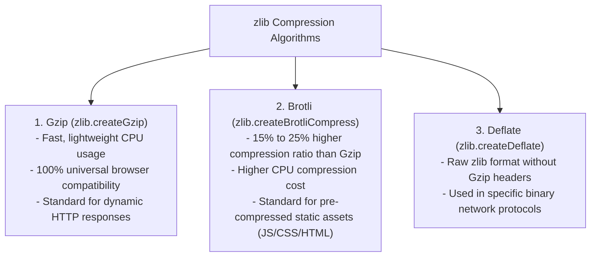
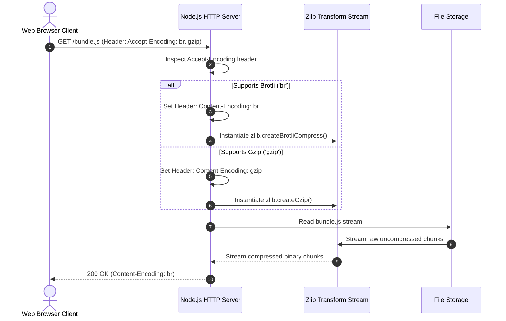

# Module 22: Data Compression and Decompression with `zlib` (Gzip, Brotli, Deflate)

## Overview

The core **`node:zlib`** module provides binding wrappers around native C++ compression libraries, implementing **Gzip**, **Brotli**, and **Deflate** compression algorithms.

Compressing HTTP response payloads and static assets reduces network transfer bandwidth by **60% to 80%**, accelerating page load speeds and lowering infrastructure bandwidth costs.

---

## 1. Algorithm Comparison: Gzip vs. Brotli vs. Deflate



### Algorithm Selection Matrix

| Metric | Gzip (`gzip`) | Brotli (`br`) | Deflate (`deflate`) |
| :--- | :--- | :--- | :--- |
| **Compression Ratio** | High (~70% reduction) | **Maximum** (~80% reduction) | High (~68% reduction) |
| **CPU Speed (Compression)** | **Very Fast** | Slower (High quality setting) | Fast |
| **CPU Speed (Decompression)** | Extremely Fast | Extremely Fast | Extremely Fast |
| **Browser Support** | 100% Universal | 98%+ Modern Browsers | Universal |
| **Best Target** | Dynamic HTTP API JSON responses | Pre-built static bundles (JS, CSS) | Legacy protocols |

---

## 2. HTTP `Accept-Encoding` Content Negotiation Sequence



---

## 3. Security Guard: Decompression (Zip Bomb) Protection

> [!WARNING]
> **Decompression Bomb Vulnerability**: Malicious clients can send a tiny 1 KB Gzip payload ("Zip Bomb") that decompresses into 10 GB of zeros, instantly crashing Node.js servers with an out-of-memory error. Always set `maxOutputLength` guards when decompressing untrusted inputs!

```javascript
const zlib = require("node:zlib");

// Safe Decompression Helper with Max Uncompressed Byte Limit
function safeGunzip(compressedBuffer, maxAllowedBytes = 10 * 1024 * 1024) { // 10 MB limit
  return new Promise((resolve, reject) => {
    zlib.gunzip(compressedBuffer, { maxOutputLength: maxAllowedBytes }, (err, decompressed) => {
      if (err) {
        if (err.code === "ERR_BUFFER_TOO_LARGE") {
          return reject(new Error("SECURITY ALERT: Decompression payload exceeded max memory limit (Zip Bomb)!"));
        }
        return reject(err);
      }
      resolve(decompressed);
    });
  });
}
```

---

## 4. Production HTTP Server Compression Stream Example

```javascript
const http = require("node:http");
const fs = require("node:fs");
const zlib = require("node:zlib");
const { pipeline } = require("node:stream/promises");
const path = require("node:path");

const PORT = 3000;
const staticFilePath = path.join(__dirname, "large_report.json");

// Ensure dummy report file exists
if (!fs.existsSync(staticFilePath)) {
  fs.writeFileSync(staticFilePath, JSON.stringify({ data: "SAMPLE_DATA_ROW\n".repeat(10000) }));
}

const server = http.createServer(async (req, res) => {
  const acceptEncoding = req.headers["accept-encoding"] || "";

  res.setHeader("Content-Type", "application/json");

  try {
    const rawReadStream = fs.createReadStream(staticFilePath);

    // 1. Content Negotiation: Check for Brotli support first, fallback to Gzip
    if (acceptEncoding.includes("br")) {
      res.setHeader("Content-Encoding", "br");
      const brotliStream = zlib.createBrotliCompress({
        params: {
          [zlib.constants.BROTLI_PARAM_QUALITY]: 4 // Fast quality setting for HTTP responses
        }
      });
      await pipeline(rawReadStream, brotliStream, res);

    } else if (acceptEncoding.includes("gzip")) {
      res.setHeader("Content-Encoding", "gzip");
      const gzipStream = zlib.createGzip({ level: 6 }); // Default balanced level 6
      await pipeline(rawReadStream, gzipStream, res);

    } else {
      // Uncompressed fallback
      await pipeline(rawReadStream, res);
    }

  } catch (err) {
    if (!res.headersSent) {
      res.writeHead(500);
      res.end(JSON.stringify({ error: "COMPRESSION_FAILURE", message: err.message }));
    }
  }
});

server.listen(PORT, () => {
  console.log(`Compression HTTP Server listening on http://localhost:${PORT}`);
});
```

---

## Key Production Takeaways

1. **Always Use Streams for File Compression**: Never load whole uncompressed files into RAM before compressing; use `stream.pipeline(readStream, zlib.createGzip(), writeStream)` to maintain constant $O(1)$ memory usage.
2. **Use Brotli for Static Assets, Gzip for Dynamic APIs**: Pre-compress static JS/CSS bundles at build time using Brotli level 11. For dynamic HTTP API responses, use Gzip or low-level Brotli (quality level 4) to minimize CPU latency.
3. **Set `Content-Encoding` Headers Correctly**: Browsers will fail to render responses if you compress data without setting the corresponding `Content-Encoding: gzip` or `Content-Encoding: br` header.
4. **Protect Against Decompression Bombs**: When unzipping user-uploaded archives, always pass `{ maxOutputLength }` limits to prevent Denial of Service attacks.

