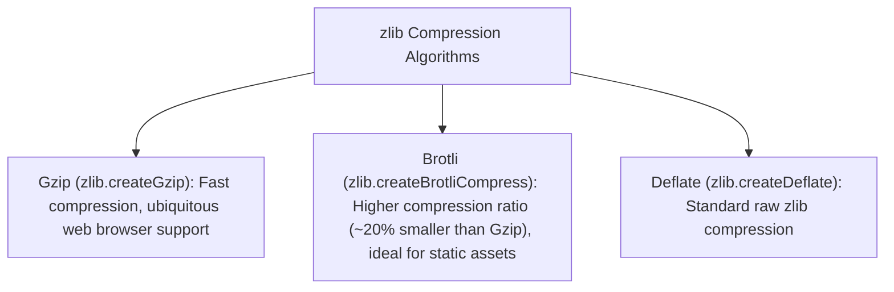

# File 22: Zlib Compression (Gzip, Brotli, Deflate)

## Overview
The **`zlib`** module provides raw stream compression and decompression utilities supporting **Gzip**, **Brotli**, and **Deflate** algorithms, shrinking network payloads and storage footprints.

---

## 1. Gzip vs Brotli Compression Comparison



---

## 2. Gzip & Brotli Stream Compression Implementation

```javascript
const zlib = require("zlib");
const { promisify } = require("util");

const gzip = promisify(zlib.gzip);
const gunzip = promisify(zlib.gunzip);

async function compressPayload() {
    const inputString = "Hello Node.js ".repeat(100);
    console.log("Original String Length:", inputString.length, "bytes");

    // 1. Gzip Compression
    const compressedBuffer = await gzip(Buffer.from(inputString));
    console.log("Compressed Gzip Buffer Length:", compressedBuffer.length, "bytes");

    // 2. Decompression
    const decompressedBuffer = await gunzip(compressedBuffer);
    console.log("Decompressed Match:", decompressedBuffer.toString() === inputString);
}

compressPayload();
```

---

## Key Takeaways
1. **`zlib.createGzip()`** compresses data streams on the fly with low memory usage.
2. Use **Brotli (`createBrotliCompress`)** for maximum compression ratio on static text assets (HTML/JS/CSS).
3. Always include `Content-Encoding: gzip` or `br` headers when sending compressed HTTP responses.
