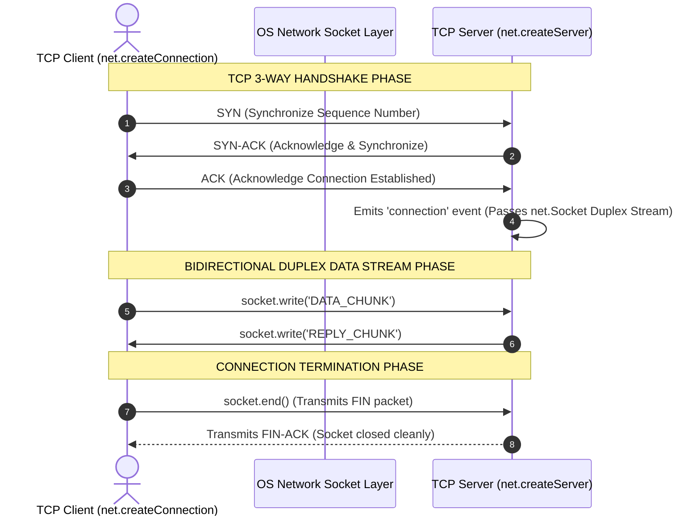

# Module 23: Low-Level TCP Networking — `net` Module, Stream Framing, and Socket Optimization

## Overview

The core **`node:net`** module provides an asynchronous network wrapper for creating raw **TCP (Transmission Control Protocol)** servers (`net.createServer`) and client sockets (`net.createConnection` / `net.Socket`).

Higher-level application layer protocols—including HTTP (`node:http`), TLS/SSL (`node:tls`), database drivers (PostgreSQL, MySQL, Redis), and WebSockets—are constructed directly on top of `net.Socket` Duplex streams.

Understanding **TCP Connection Lifecycle & 3-Way Handshake**, **TCP Stream Boundary Fragmentation & Message Framing**, **Low-Latency Socket Flags (`setNoDelay`, `setKeepAlive`)**, and **Duplex Stream Handling** is essential.

---

## 1. TCP Connection Lifecycle & 3-Way Handshake



---

## 2. The TCP Framing & Stream Boundary Problem

A fundamental principle when working with TCP sockets is that **TCP is a stream-based protocol, NOT a message-based protocol**.

If a client executes three separate `socket.write()` calls, the OS TCP stack may aggregate them into a single packet, or split one message across multiple `data` events depending on MTU boundaries!

```mermaid
flowchart TD
    subgraph Client Application Writes
        W1["socket.write('MSG_1\n')"]
        W2["socket.write('MSG_2\n')"]
        W3["socket.write('MSG_3\n')"]
    end

    subgraph OS Network Buffer (TCP Stream Fragmentation)
        TCPStream["Combined Raw Byte Buffer Stream:<br/>'MSG_1\nMSG_2\nMSG_3\n'"]
    end

    subgraph Server Protocol Parser (Delimiter Splitter)
        Splitter["Split Stream on '\n' Delimiter"] --> Msg1["Message 1: 'MSG_1'"]
        Splitter --> Msg2["Message 2: 'MSG_2'"]
        Splitter --> Msg3["Message 3: 'MSG_3'"]
    end

    W1 --> TCPStream
    W2 --> TCPStream
    W3 --> TCPStream
    TCPStream --> Splitter

    style TCPStream fill:#fef3c7,stroke:#b45309
    style Splitter fill:#dcfce7,stroke:#15803d
```

### Solving TCP Framing in Node.js

To parse discrete application messages from a continuous TCP stream, systems utilize:
1. **Delimiter-based Framing** (e.g. terminating messages with `\n` or `\r\n`).
2. **Length-Prefixed Framing** (e.g. prepending a 4-byte integer indicating incoming payload byte length).

---

## 3. Low-Latency TCP Socket Configuration Reference Matrix

| Socket API Method | Technical Purpose | Primary Production Scenario |
| :--- | :--- | :--- |
| **`socket.setNoDelay(true)`** | Disables **Nagle's Algorithm** (which buffers small packets to reduce IP header overhead). | **MANDATORY** for low-latency real-time applications (microservices, gaming, trading). |
| **`socket.setKeepAlive(true, msecs)`**| Sends periodic TCP ACK probes to detect unclosed ghost TCP connections. | Essential for discovering dead client sockets across cloud routers and firewalls. |
| **`socket.setTimeout(msecs, cb)`** | Triggers callback if socket remains idle without read/write activity. | Prevents abandoned connections from leaking host file descriptors (`EMFILE`). |

---

## 4. Production Multi-Client Echo TCP Server with Delimiter Parsing

```javascript
const net = require("node:net");

const PORT = process.env.PORT || 5000;
const clients = new Set(); // Track active client socket connections

// Create TCP Server
const server = net.createServer((socket) => {
  const clientAddr = `${socket.remoteAddress}:${socket.remotePort}`;
  console.log(`[TCP SERVER] Client connected from ${clientAddr}`);

  // Socket Performance Configurations
  socket.setEncoding("utf-8");
  socket.setKeepAlive(true, 30000); // Send Keep-Alive ACK probes every 30s
  socket.setNoDelay(true);          // Disable Nagle's algorithm for low latency

  clients.add(socket);

  let bufferAccumulator = "";

  // Handle incoming data chunks
  socket.on("data", (chunk) => {
    bufferAccumulator += chunk;

    // Delimiter-based framing: Process complete lines terminated by '\n'
    let newlineIndex;
    while ((newlineIndex = bufferAccumulator.indexOf("\n")) !== -1) {
      const completeMessage = bufferAccumulator.slice(0, newlineIndex).trim();
      bufferAccumulator = bufferAccumulator.slice(newlineIndex + 1);

      console.log(`  [RECV from ${clientAddr}]: ${completeMessage}`);

      // Broadcast message to all connected TCP clients
      for (const clientSocket of clients) {
        if (clientSocket !== socket && !clientSocket.destroyed) {
          clientSocket.write(`[BROADCAST ${clientAddr}]: ${completeMessage}\n`);
        }
      }
    }
  });

  // Handle Client Disconnect
  socket.on("end", () => {
    console.log(`[TCP SERVER] Client ${clientAddr} disconnected cleanly.`);
    clients.delete(socket);
  });

  // Handle Socket Errors
  socket.on("error", (err) => {
    console.error(`[TCP SOCKET ERROR] (${clientAddr}):`, err.message);
    clients.delete(socket);
  });
});

// Start listening for incoming TCP connections
server.listen(PORT, () => {
  console.log(`=== TCP ECHO SERVER ACTIVE: Listening on port ${PORT} ===`);
});
```

---

## Key Production Takeaways

1. **`net.Socket` is a Duplex Stream**: Treat TCP sockets as readable and writable streams (`socket.on('data')`, `socket.write()`, `socket.pipe()`).
2. **Always Implement Stream Framing**: Never assume a single `socket.write()` on a client corresponds to a single `socket.on('data')` emission on the server. Always parse using delimiters (`\n`) or length prefixes.
3. **Disable Nagle's Algorithm via `socket.setNoDelay(true)`**: By default, OS TCP stacks delay sending small data packets to consolidate them. Call `socket.setNoDelay(true)` to flush small packets immediately for low latency.
4. **Enable TCP Keep-Alive Probes**: Call `socket.setKeepAlive(true, 30000)` to clean up unclosed "ghost" TCP sockets caused by network disconnects or client crashes.


