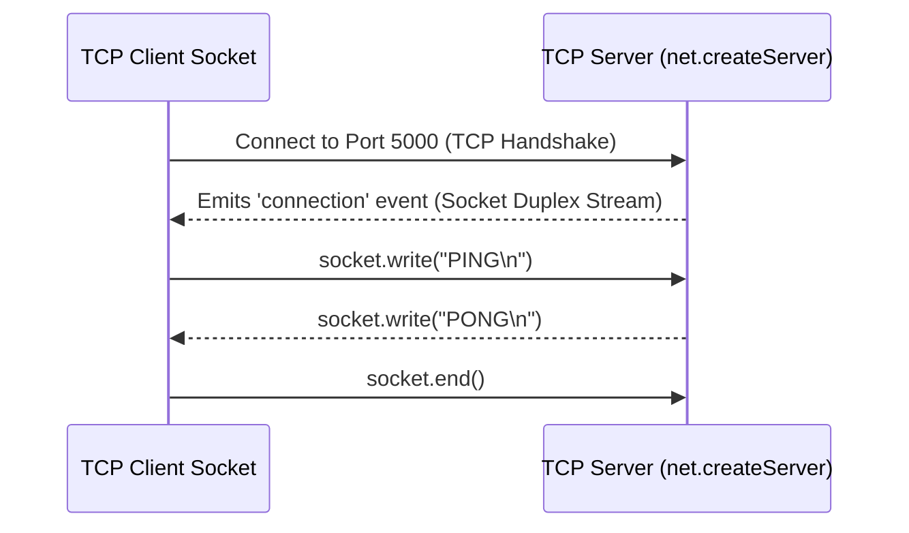

# File 23: Net Module and TCP Socket Networking

## Overview
The built-in **`net`** module provides an asynchronous network wrapper for creating raw **TCP Servers** and **TCP Clients** (`net.Socket`), forming the foundation for higher-level protocols like HTTP, FTP, and WebSockets.

---

## 1. TCP Client-Server Socket Architecture



---

## 2. Low-Level TCP Server & Client Implementation

```javascript
const net = require("net");

const PORT = 5000;

// 1. Create Raw TCP Server
const server = net.createServer(socket => {
    console.log(`[TCP CLIENT CONNECTED] Remote IP: ${socket.remoteAddress}:${socket.remotePort}`);

    socket.on("data", data => {
        console.log("Received TCP Data:", data.toString().trim());
        socket.write(`ECHO: ${data.toString()}`);
    });

    socket.on("end", () => {
        console.log("[TCP CLIENT DISCONNECTED]");
    });
});

server.listen(PORT, () => {
    console.log(`TCP Server listening on port ${PORT}`);

    // 2. Create TCP Client Connection
    const client = net.connect({ port: PORT }, () => {
        console.log("[CLIENT] Connected to TCP Server!");
        client.write("Hello TCP Server!");
    });

    client.on("data", data => {
        console.log("[CLIENT] Received Server Reply:", data.toString().trim());
        client.end(); // Close connection
        server.close();
    });
});
```

---

## Key Takeaways
1. The **`net`** module handles low-level **TCP raw stream communication**.
2. A `net.Socket` instance is a **Duplex Stream** (readable and writable).
3. Forms the underlying layer for HTTP, SMTP, Database drivers, and custom IPC protocols.
