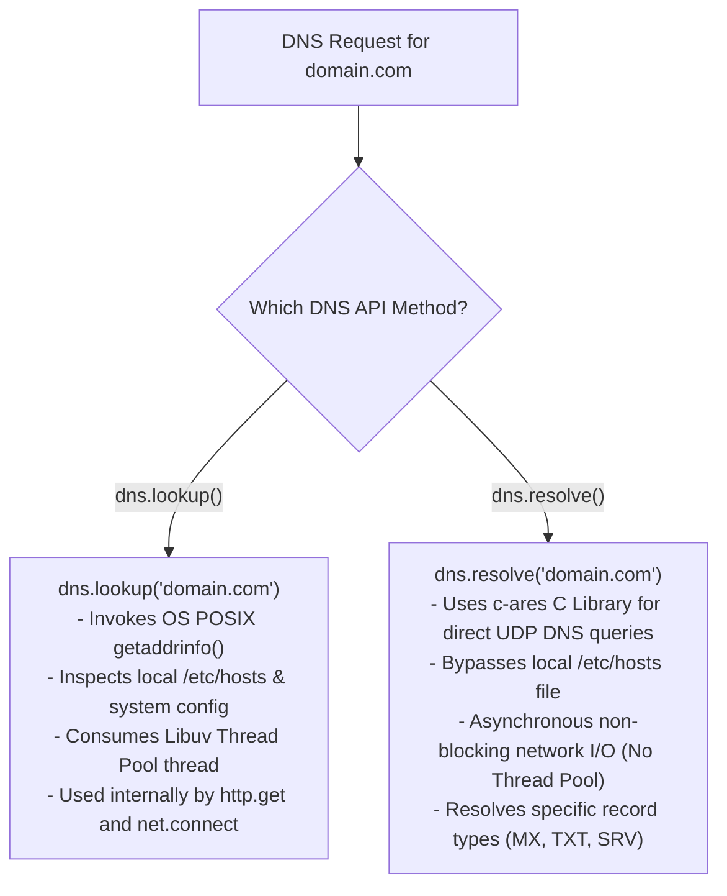
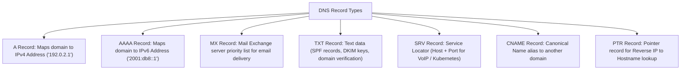

# Module 24: Domain Name System Resolution with the `dns` Module

## Overview

The built-in **`node:dns`** module enables domain name resolution, IP address lookups, and specialized DNS record queries (`A`, `AAAA`, `MX`, `TXT`, `SRV`, `NS`, `PTR`).

A critical architectural distinction in Node.js is understanding the difference between **`dns.lookup()`** (which uses OS-level `getaddrinfo` via the Libuv Thread Pool) and **`dns.resolve()`** (which performs direct non-blocking network DNS queries via the bundled **`c-ares`** C library).

---

## 1. Architectural Comparison: `dns.lookup()` vs. `dns.resolve()`



### Key Differences Table

| Feature | `dns.lookup(hostname)` | `dns.resolve(hostname, [rrtype])` |
| :--- | :--- | :--- |
| **Underlying Engine** | OS POSIX `getaddrinfo()` system call | `c-ares` Asynchronous C Library |
| **`/etc/hosts` Respect** | **Yes** (Evaluates local hosts file overrides) | **No** (Bypasses `/etc/hosts`, queries DNS nameservers directly) |
| **Libuv Thread Impact** | **Consumes 1 Libuv Thread Pool thread** | **No thread pool usage** (Uses non-blocking network socket) |
| **Custom Name Servers** | Uses OS system DNS settings | Custom DNS servers can be set (`dns.setServers(...)`) |
| **Default Node Use** | Used internally by `http.get()`, `net.connect()` | Used for domain auditing, MX verification, custom resolution |

---

## 2. DNS Record Types Reference



---

## 3. Promise-Based DNS Resolution Code Example

```javascript
const dns = require("node:dns/promises");

// Custom Name Servers (Google Public DNS & Cloudflare DNS)
dns.setServers(["8.8.8.8", "1.1.1.1"]);

async function executeDnsDiagnostics(domainName) {
  console.log(`=== DNS DIAGNOSTICS FOR: ${domainName} ===\n`);

  try {
    // 1. OS-level IP Lookup (dns.lookup)
    const ipLookup = await dns.lookup(domainName, { all: true });
    console.log("1. OS Lookup (getaddrinfo):");
    ipLookup.forEach((entry) => console.log(`   - IPv${entry.family}: ${entry.address}`));

    // 2. Direct Network A Record Resolution (IPv4)
    const ipv4Addresses = await dns.resolve4(domainName);
    console.log("\n2. Direct IPv4 (A Records):", ipv4Addresses);

    // 3. Direct Network AAAA Record Resolution (IPv6)
    try {
      const ipv6Addresses = await dns.resolve6(domainName);
      console.log("\n3. Direct IPv6 (AAAA Records):", ipv6Addresses);
    } catch (e) {
      console.log("\n3. Direct IPv6: No AAAA records found.");
    }

    // 4. Mail Exchange (MX) Records
    const mxRecords = await dns.resolveMx(domainName);
    console.log("\n4. Mail Exchange (MX Records):");
    mxRecords.forEach((mx) => {
      console.log(`   - Host: ${mx.exchange} (Priority: ${mx.priority})`);
    });

    // 5. Text (TXT) Records (SPF & Security Policies)
    const txtRecords = await dns.resolveTxt(domainName);
    console.log("\n5. TXT Records (SPF / Domain Verification):");
    txtRecords.forEach((txtArray) => {
      console.log(`   - "${txtArray.join("")}"`);
    });

  } catch (error) {
    console.error("DNS Diagnostics Failure:", error.message);
  }
}

executeDnsDiagnostics("google.com");
```

---

## 4. Reverse DNS Lookup (`dns.reverse`)

You can map an IP address back to its associated hostname using `dns.reverse()`:

```javascript
const dns = require("node:dns/promises");

async function reverseLookupIp(ipAddress) {
  try {
    const hostnames = await dns.reverse(ipAddress);
    console.log(`IP ${ipAddress} resolves back to hostnames:`, hostnames);
  } catch (err) {
    console.error(`Reverse lookup failed for ${ipAddress}:`, err.message);
  }
}

reverseLookupIp("8.8.8.8"); // Resolves to ['dns.google']
```

---

## Key Production Takeaways

1. **Be Mindful of Libuv Thread Pool Starvation in `dns.lookup()`**: High-volume applications making thousands of outbound HTTP requests per second can starve the 4-thread Libuv pool due to `dns.lookup()`. Consider caching DNS IP lookups or tuning `UV_THREADPOOL_SIZE`.
2. **Use `dns.resolve*()` for Specific Record Audits**: When validating domain ownership (TXT records) or verifying email server endpoints (MX records), always use `dns.resolveMx()` or `dns.resolveTxt()` which bypass `/etc/hosts`.
3. **Use `dns.setServers()` for Custom Resolution**: To prevent OS DNS caching or override system DNS resolvers, set custom nameservers using `dns.setServers(['8.8.8.8', '1.1.1.1'])`.
4. **Import `node:dns/promises`**: Use the native Promise-based API `const dns = require('node:dns/promises')` for clean `async/await` syntax.

