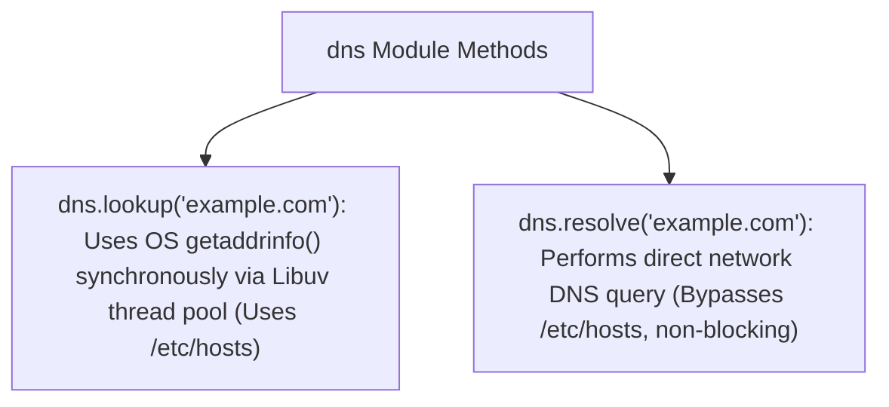

# File 24: DNS Module and Domain Name Resolution

## Overview
The **`dns`** module enables performing domain name lookups (`A`, `AAAA`, `MX`, `TXT` records) using underlying OS resolution calls or direct network DNS queries.

---

## 1. dns.lookup vs dns.resolve Architecture



---

## 2. DNS Resolution Implementation

```javascript
const dns = require("dns");
const { promisify } = require("util");

const lookup = promisify(dns.lookup);
const resolveMx = promisify(dns.resolveMx);

async function performDnsLookups() {
    try {
        // 1. IP Lookup (A Record via OS getaddrinfo)
        const ipResult = await lookup("google.com");
        console.log("google.com IP Address:", ipResult.address, "| Family: IPv" + ipResult.family);

        // 2. Mail Exchange (MX Record Direct Resolution)
        const mxRecords = await resolveMx("gmail.com");
        console.log("gmail.com MX Records:");
        mxRecords.forEach(rec => {
            console.log(`  Exchange: ${rec.exchange} (Priority: ${rec.priority})`);
        });
    } catch (err) {
        console.error("DNS Resolution Error:", err.message);
    }
}

performDnsLookups();
```

---

## Key Takeaways
1. **`dns.lookup()`** uses the OS `getaddrinfo` system call (respects `/etc/hosts`) and uses Libuv's thread pool.
2. **`dns.resolve()`** executes direct network DNS queries asynchronously without using thread pool threads.
3. Query record types using specialized methods (`resolveMx`, `resolveTxt`, `resolveSrv`).
