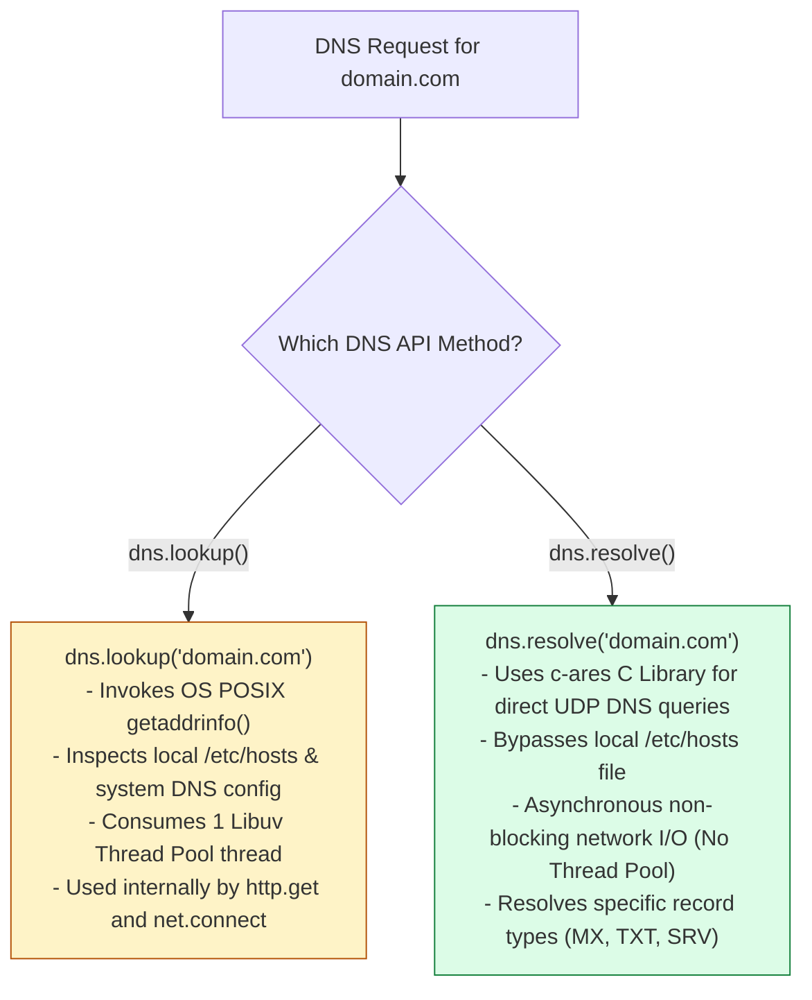
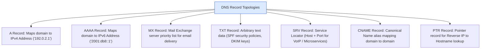
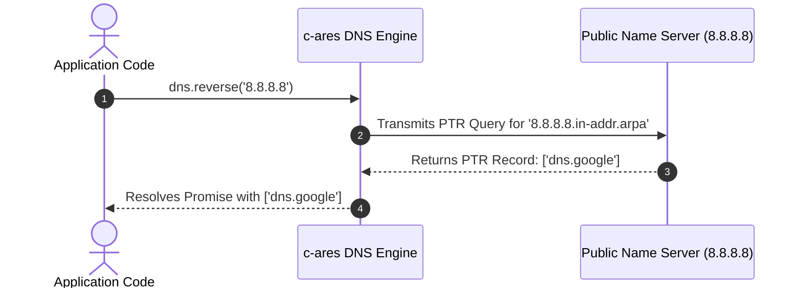

# Module 24: Domain Name System (DNS) Resolution — `dns.lookup` vs. `dns.resolve`, `c-ares` Engine, and Record Auditing

## Overview

The core **`node:dns`** module enables domain name resolution, IP address lookups, and specialized DNS record queries (`A`, `AAAA`, `MX`, `TXT`, `SRV`, `NS`, `PTR`).

A critical architectural distinction in Node.js is understanding the difference between **`dns.lookup()`** (which invokes the OS-level POSIX `getaddrinfo` system call via the Libuv Thread Pool) and **`dns.resolve()`** (which performs direct non-blocking network DNS queries via the bundled **`c-ares`** C library).

Understanding **`dns.lookup()` vs. `dns.resolve()` Trade-offs**, **Libuv Thread Pool Starvation Risks**, **`c-ares` Asynchronous Resolution**, **DNS Record Topologies**, and **Reverse Lookup Mechanics** is essential.

---

## 1. Architectural Comparison: `dns.lookup()` vs. `dns.resolve()`



### Comprehensive DNS Resolution Architectural Comparison

| Metric Dimension | `dns.lookup(hostname)` | `dns.resolve(hostname, [rrtype])` |
| :--- | :--- | :--- |
| **Underlying Engine** | OS POSIX `getaddrinfo()` C system call | `c-ares` Asynchronous C Network Library |
| **`/etc/hosts` Respect** | **Yes** (Evaluates local `/etc/hosts` file overrides) | **No** (Bypasses local hosts file, queries nameservers directly) |
| **Libuv Thread Impact** | **Consumes 1 Libuv Thread Pool thread** per lookup | **Zero thread pool usage** (Non-blocking UDP socket I/O) |
| **Custom Name Servers** | Uses OS system default DNS configuration | Custom DNS servers set via `dns.setServers(...)` |
| **Default Internal Use** | Used internally by `http.get()`, `net.connect()` | Used for domain validation, MX mail audits, custom resolution |

---

## 2. DNS Record Types Topology



---

## 3. Reverse DNS Lookup Mechanics (`dns.reverse`)



---

## 4. Production Code Showcase: Promise-Based DNS Diagnostic Engine

```javascript
const dns = require("node:dns/promises");

// Configure Custom Name Servers (Google Public DNS & Cloudflare DNS)
dns.setServers(["8.8.8.8", "1.1.1.1"]);

async function executeDnsDiagnostics(domainName) {
  console.log(`=== EXECUTING DNS DIAGNOSTICS FOR: ${domainName} ===\n`);

  try {
    // 1. OS-level IP Lookup (dns.lookup via Libuv Thread Pool)
    const ipLookup = await dns.lookup(domainName, { all: true });
    console.log("1. OS Lookup (getaddrinfo /etc/hosts):");
    ipLookup.forEach((entry) => console.log(`   - IPv${entry.family}: ${entry.address}`));

    // 2. Direct Network A Record Resolution (IPv4 via c-ares)
    const ipv4Addresses = await dns.resolve4(domainName);
    console.log("\n2. Direct IPv4 (A Records via c-ares):", ipv4Addresses);

    // 3. Direct Network AAAA Record Resolution (IPv6)
    try {
      const ipv6Addresses = await dns.resolve6(domainName);
      console.log("\n3. Direct IPv6 (AAAA Records):", ipv6Addresses);
    } catch (e) {
      console.log("\n3. Direct IPv6: No AAAA records present.");
    }

    // 4. Mail Exchange (MX) Records
    const mxRecords = await dns.resolveMx(domainName);
    console.log("\n4. Mail Exchange (MX Records):");
    mxRecords.forEach((mx) => {
      console.log(`   - Exchange Host: ${mx.exchange} (Priority: ${mx.priority})`);
    });

    // 5. Text (TXT) Records (SPF / DKIM Security Policies)
    const txtRecords = await dns.resolveTxt(domainName);
    console.log("\n5. TXT Records (SPF / Domain Verification):");
    txtRecords.forEach((txtArray) => {
      console.log(`   - "${txtArray.join("")}"`);
    });

    // 6. Reverse IP Lookup (PTR)
    const reverseHosts = await dns.reverse("8.8.8.8");
    console.log("\n6. Reverse Lookup (8.8.8.8):", reverseHosts);

  } catch (error) {
    console.error("!! DNS Diagnostics Failure:", error.message);
  }
}

executeDnsDiagnostics("google.com");
```

---

## Key Production Takeaways

1. **Be Mindful of Libuv Thread Pool Starvation in `dns.lookup()`**: High-volume microservices issuing thousands of outbound HTTP requests per second can starve the default 4-thread Libuv pool due to `dns.lookup()`. Consider caching DNS lookups in application RAM or increasing `UV_THREADPOOL_SIZE`.
2. **Use `dns.resolve*()` for Specific Record Audits**: When validating domain ownership (TXT records) or verifying email server endpoints (MX records), always use `dns.resolveMx()` or `dns.resolveTxt()` to execute non-blocking queries via `c-ares`.
3. **Use `dns.setServers()` for Custom Resolution**: To bypass OS DNS caching or override system DNS resolvers, configure custom nameservers using `dns.setServers(['8.8.8.8', '1.1.1.1'])`.
4. **Import `node:dns/promises`**: Use `const dns = require('node:dns/promises')` for clean `async/await` control flow without callback nesting.


