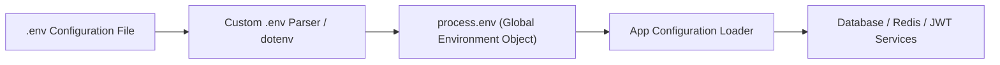

# File 25: Environment Variables and Configuration Management

## Overview
Managing application configuration parameters (`PORT`, `DATABASE_URL`, `API_SECRET`) securely across development, staging, and production environments uses environment variables (`process.env`) and `.env` parser files.

---

## 1. Environment Configuration Pipeline



---

## 2. Environment Configuration Loader Implementation

```javascript
const fs = require("fs");
const path = require("path");

class ConfigLoader {
    static loadEnvFile(envPath) {
        if (!fs.existsSync(envPath)) return;

        const content = fs.readFileSync(envPath, "utf-8");
        content.split("\n").forEach(line => {
            const trimmed = line.trim();
            if (trimmed && !trimmed.startsWith("#")) {
                const [key, ...valueParts] = trimmed.split("=");
                const value = valueParts.join("=").replace(/^["']|["']$/g, "");
                if (key && !process.env[key]) {
                    process.env[key.trim()] = value.trim(); // Populate process.env
                }
            }
        });
    }

    static get(key, defaultValue = null) {
        return process.env[key] || defaultValue;
    }
}

// Usage
process.env.NODE_ENV = "development";
ConfigLoader.loadEnvFile(path.join(__dirname, ".env"));

console.log("App Port:", ConfigLoader.get("PORT", 3000));
console.log("Database Target:", ConfigLoader.get("DB_HOST", "localhost"));
```

---

## Key Takeaways
1. **NEVER commit `.env` files** containing production secrets or passwords to Git version control.
2. Provide default fallback values for non-critical configuration options.
3. Validate required environment variables at application startup to fail fast on missing configuration parameters.
