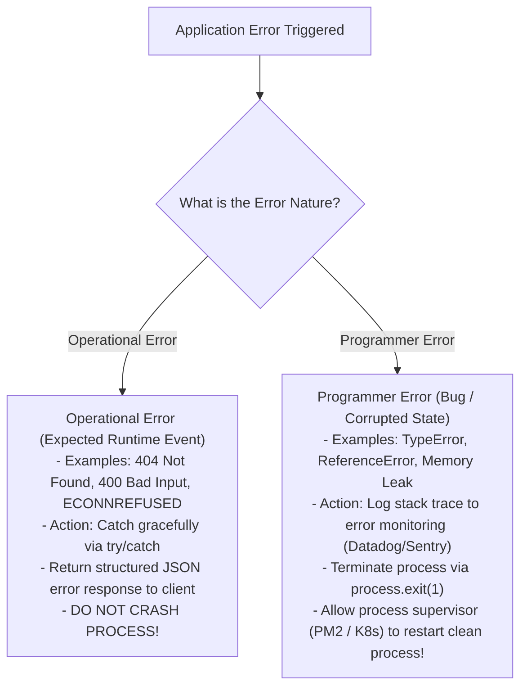
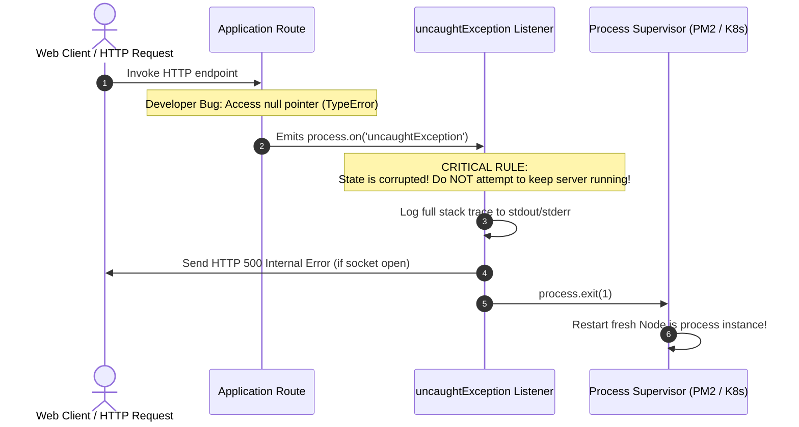

# Module 26: Error Handling in Node.js — Operational vs. Programmer Errors

## Overview

Error handling is a critical architectural discipline in Node.js. A single unhandled exception in synchronous code will crash the entire Node.js process, dropping active client connections across the instance.

Building resilient Node.js applications requires distinguishing between **Operational Errors** (expected runtime failures like network timeouts, invalid client payloads, database connection loss) and **Programmer Errors** (bugs like `TypeError`, accessing properties of `undefined`, or syntax errors).

---

## 1. Operational vs. Programmer Error Taxonomy



### Comparative Error Matrix

| Property | Operational Errors | Programmer Errors |
| :--- | :--- | :--- |
| **Origin** | External environment or invalid client input | Software bug in developer code |
| **Predictability** | High (Known failure mode) | Low (Unintended runtime state) |
| **Process Action** | Handle & return error response | **Must crash process (`process.exit(1)`)** |
| **App State Impact** | System state remains intact | System state may be corrupted |
| **Example** | `ENOENT: file not found`, `401 Unauthorized` | `Cannot read property 'id' of undefined` |

---

## 2. Global Exception Guards & Crash Mechanics



> [!CAUTION]
> **Why You MUST Crash on Programmer Errors**: Continuing execution after an `uncaughtException` leaves your Node.js application in an undefined, corrupted state (e.g. unclosed database transactions, memory leaks, dangling file locks). Always call `process.exit(1)`.

---

## 3. Custom Domain Error Class Hierarchy

Inheriting from native JavaScript `Error` and invoking **`Error.captureStackTrace()`** ensures accurate stack trace lines without polluting traces with constructor frames:

```javascript
// Base Application Operational Error Class
class AppError extends Error {
  constructor(message, statusCode, errorCode = "INTERNAL_ERROR") {
    super(message);
    this.name = this.constructor.name;
    this.statusCode = statusCode;
    this.errorCode = errorCode;
    this.isOperational = true; // Flag distinguishing operational vs bug

    // Omits constructor call from V8 stack trace
    Error.captureStackTrace(this, this.constructor);
  }
}

// Specialized Domain Error Subclasses
class NotFoundError extends AppError {
  constructor(resourceName = "Resource") {
    super(`${resourceName} not found.`, 404, "NOT_FOUND");
  }
}

class ValidationError extends AppError {
  constructor(details) {
    super("Invalid input validation payload.", 400, "VALIDATION_FAILED");
    this.details = details;
  }
}

class UnauthorizedError extends AppError {
  constructor(message = "Authentication token required.") {
    super(message, 401, "UNAUTHORIZED");
  }
}

module.exports = { AppError, NotFoundError, ValidationError, UnauthorizedError };
```

---

## 4. Production Centralized Error Handling Code

```javascript
const http = require("node:http");
const { AppError, NotFoundError, ValidationError } = require("./CustomErrors");

// 1. Process Level Global Exception Guards
process.on("uncaughtException", (error) => {
  console.error("CRITICAL [uncaughtException]: Unhandled synchronous error!");
  console.error(error.stack);
  
  // ALWAYS exit process on uncaught programmer exception:
  process.exit(1);
});

process.on("unhandledRejection", (reason, promise) => {
  console.error("WARNING [unhandledRejection]: Unhandled promise rejection!");
  console.error("Reason:", reason);
  // Log to Sentry / APM tools here...
});

// 2. Simulated Route Business Logic
async function handleUserRoute(reqUrl) {
  if (reqUrl === "/api/user/missing") {
    throw new NotFoundError("User Account"); // Operational Error
  }
  if (reqUrl === "/api/user/invalid") {
    throw new ValidationError(["Email is required", "Age must be positive"]); // Operational Error
  }
  if (reqUrl === "/api/user/bug") {
    // Programmer Error (Bug!)
    const nullObj = null;
    return nullObj.nonExistentMethod();
  }
  return { id: 101, username: "Alice" };
}

// 3. Centralized HTTP Request Handler
const server = http.createServer(async (req, res) => {
  res.setHeader("Content-Type", "application/json");

  try {
    const data = await handleUserRoute(req.url);
    res.writeHead(200);
    res.end(JSON.stringify({ status: "SUCCESS", data }));

  } catch (error) {
    // Distinguish Operational Errors vs Programmer Errors
    if (error.isOperational) {
      console.warn(`[OPERATIONAL ERROR] ${error.statusCode} - ${error.message}`);
      res.writeHead(error.statusCode);
      res.end(JSON.stringify({
        error: error.errorCode,
        message: error.message,
        details: error.details || null
      }));
    } else {
      // Programmer Error (Bug)
      console.error("[PROGRAMMER ERROR BUG] Unexpected Failure:", error.stack);
      res.writeHead(500);
      res.end(JSON.stringify({
        error: "INTERNAL_SERVER_ERROR",
        message: "An unexpected system error occurred."
      }));
    }
  }
});

server.listen(3000, () => {
  console.log("Error Handling Server listening on port 3000");
});
```

---

## Key Production Takeaways

1. **Tag Errors with `isOperational = true`**: Subclass `Error` to create custom operational errors. If `error.isOperational` is `true`, handle it gracefully without restarting the server.
2. **Call `Error.captureStackTrace()`**: Always invoke `Error.captureStackTrace(this, this.constructor)` inside custom Error constructors to keep stack traces clean and focused on caller frames.
3. **Crash Process on `uncaughtException`**: Never attempt to ignore uncaught exceptions. Allow process managers (PM2, Kubernetes) to restart fresh Node.js worker instances.
4. **Listen to `unhandledRejection`**: Attach a handler to `process.on('unhandledRejection')` to log unhandled Promise rejections before they escalate to uncaught exceptions.

