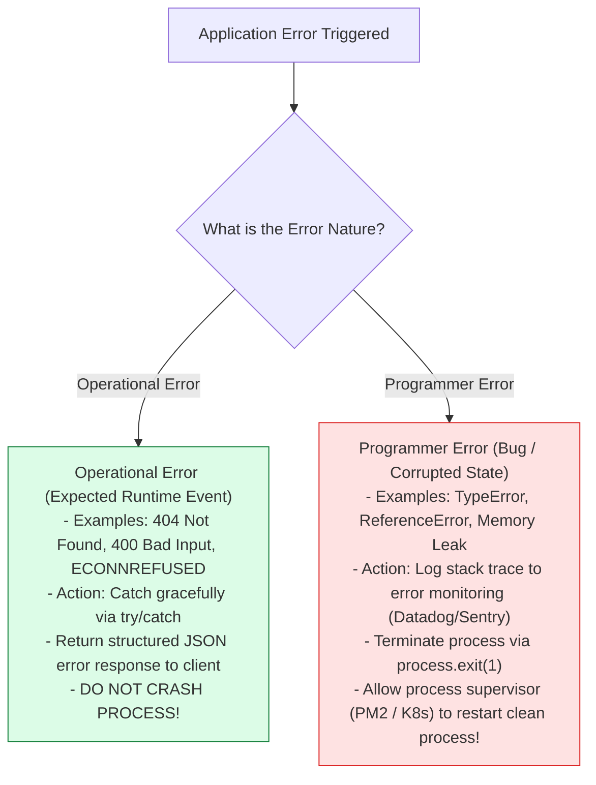
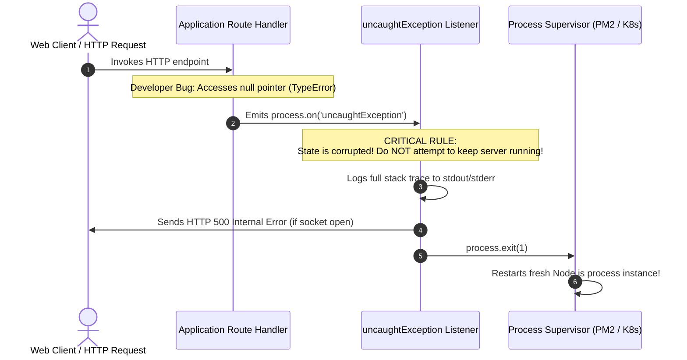

# Module 26: Error Handling in Node.js — Operational vs. Programmer Errors, Crash Mechanics, and Custom Error Hierarchies

## Overview

Error handling is a critical architectural discipline in server-side Node.js engineering. A single unhandled exception in synchronous code will crash the entire Node.js process, dropping active client TCP connections across the instance.

Building resilient Node.js applications requires distinguishing between **Operational Errors** (expected runtime failures like network timeouts, invalid client payloads, database connection losses) and **Programmer Errors** (bugs like `TypeError`, accessing properties of `undefined`, or unhandled promise rejections).

Understanding **Operational vs. Programmer Error Taxonomies**, **Global Exception Guards (`uncaughtException`, `unhandledRejection`)**, **Custom Error Classes (`Error.captureStackTrace`)**, and **Centralized Error Handling Architecture** is essential.

---

## 1. Operational vs. Programmer Error Taxonomy



### Comprehensive Error Architectural Matrix

| Metric Dimension | Operational Errors | Programmer Errors |
| :--- | :--- | :--- |
| **Origin** | External network environment or invalid client input | Software bug in developer code logic |
| **Predictability** | High (Known runtime failure mode) | Low (Unintended state anomaly) |
| **Process Action** | Handle gracefully & return error response | **Must crash process (`process.exit(1)`)** |
| **App State Impact** | System state remains intact & uncorrupted | System state may be corrupted or leaking RAM |
| **Examples** | `ENOENT: file not found`, `401 Unauthorized`, `400 Bad Request` | `Cannot read property 'id' of undefined`, `TypeError` |

---

## 2. Global Exception Guards & Crash Mechanics



> [!CAUTION]
> **Why You MUST Crash on Programmer Errors**: Continuing execution after an `uncaughtException` leaves your Node.js application in an undefined, corrupted state (e.g. unclosed database transactions, memory leaks, dangling file locks). Always call `process.exit(1)` and let PM2 or Kubernetes restart the process cleanly.

---

## 3. Custom Domain Error Class Hierarchy (`Error.captureStackTrace`)

Inheriting from native JavaScript `Error` and invoking **`Error.captureStackTrace()`** ensures accurate stack trace lines without polluting traces with internal error constructor frames:

```javascript
// Base Application Operational Error Class
class AppError extends Error {
  constructor(message, statusCode, errorCode = "INTERNAL_ERROR") {
    super(message);
    this.name = this.constructor.name;
    this.statusCode = statusCode;
    this.errorCode = errorCode;
    this.isOperational = true; // Flag distinguishing operational errors vs bugs

    // Omits constructor call from V8 stack trace
    Error.captureStackTrace(this, this.constructor);
  }
}

// Specialized Domain Error Subclasses
class NotFoundError extends AppError {
  constructor(resourceName = "Resource") {
    super(`${resourceName} not found.`, 404, "NOT_FOUND");
  }
}

class ValidationError extends AppError {
  constructor(details) {
    super("Invalid input validation payload.", 400, "VALIDATION_FAILED");
    this.details = details;
  }
}

class UnauthorizedError extends AppError {
  constructor(message = "Authentication token required.") {
    super(message, 401, "UNAUTHORIZED");
  }
}

module.exports = { AppError, NotFoundError, ValidationError, UnauthorizedError };
```

---

## 4. Production Code Showcase: Centralized Error Handling Server

```javascript
const http = require("node:http");

// Inline Custom Error Hierarchy for standalone execution
class AppError extends Error {
  constructor(message, statusCode, errorCode = "INTERNAL_ERROR") {
    super(message);
    this.name = this.constructor.name;
    this.statusCode = statusCode;
    this.errorCode = errorCode;
    this.isOperational = true;
    Error.captureStackTrace(this, this.constructor);
  }
}

class NotFoundError extends AppError {
  constructor(resource = "Resource") {
    super(`${resource} not found.`, 404, "NOT_FOUND");
  }
}

class ValidationError extends AppError {
  constructor(details) {
    super("Input validation failure.", 400, "VALIDATION_FAILED");
    this.details = details;
  }
}

// 1. Process Level Global Exception Guards
process.on("uncaughtException", (error) => {
  console.error("CRITICAL [uncaughtException]: Unhandled synchronous exception!");
  console.error(error.stack);
  
  // ALWAYS exit process on uncaught programmer exception:
  process.exit(1);
});

process.on("unhandledRejection", (reason, promise) => {
  console.error("WARNING [unhandledRejection]: Unhandled promise rejection!");
  console.error("Reason:", reason);
});

// 2. Simulated Route Logic
async function handleUserRoute(reqUrl) {
  if (reqUrl === "/api/user/missing") {
    throw new NotFoundError("User Account"); // Operational Error
  }
  if (reqUrl === "/api/user/invalid") {
    throw new ValidationError(["Email format invalid", "Age must be positive"]); // Operational Error
  }
  if (reqUrl === "/api/user/bug") {
    // Programmer Error (Bug!)
    const nullObj = null;
    return nullObj.nonExistentMethod();
  }
  return { id: 101, username: "Alice" };
}

// 3. Centralized HTTP Request Handler
const server = http.createServer(async (req, res) => {
  res.setHeader("Content-Type", "application/json");

  try {
    const data = await handleUserRoute(req.url);
    res.writeHead(200);
    res.end(JSON.stringify({ status: "SUCCESS", data }));

  } catch (error) {
    // Distinguish Operational Errors vs Programmer Errors
    if (error.isOperational) {
      console.warn(`  [OPERATIONAL ERROR] Code ${error.statusCode} - ${error.message}`);
      res.writeHead(error.statusCode);
      res.end(JSON.stringify({
        error: error.errorCode,
        message: error.message,
        details: error.details || null
      }));
    } else {
      // Programmer Error (Bug)
      console.error("  [PROGRAMMER ERROR BUG] Unexpected System Failure:", error.stack);
      res.writeHead(500);
      res.end(JSON.stringify({
        error: "INTERNAL_SERVER_ERROR",
        message: "An unexpected system error occurred."
      }));
    }
  }
});

const PORT = process.env.PORT || 3000;
server.listen(PORT, () => {
  console.log(`=== ERROR HANDLING SERVER ACTIVE: Listening on port ${PORT} ===`);
});
```

---

## Key Production Takeaways

1. **Tag Operational Errors with `isOperational = true`**: Subclass `Error` to create domain errors. If `error.isOperational` is `true`, handle it gracefully without restarting the server instance.
2. **Always Call `Error.captureStackTrace()`**: Invoke `Error.captureStackTrace(this, this.constructor)` inside custom Error constructors to keep stack traces clean and focused on caller frames.
3. **Crash Process on `uncaughtException`**: Never attempt to swallow uncaught exceptions. Allow process managers (PM2, Kubernetes) to restart fresh Node.js worker instances cleanly.
4. **Listen for `unhandledRejection`**: Attach a global handler to `process.on('unhandledRejection')` to log unhandled Promise rejections before they escalate into process crashes.


