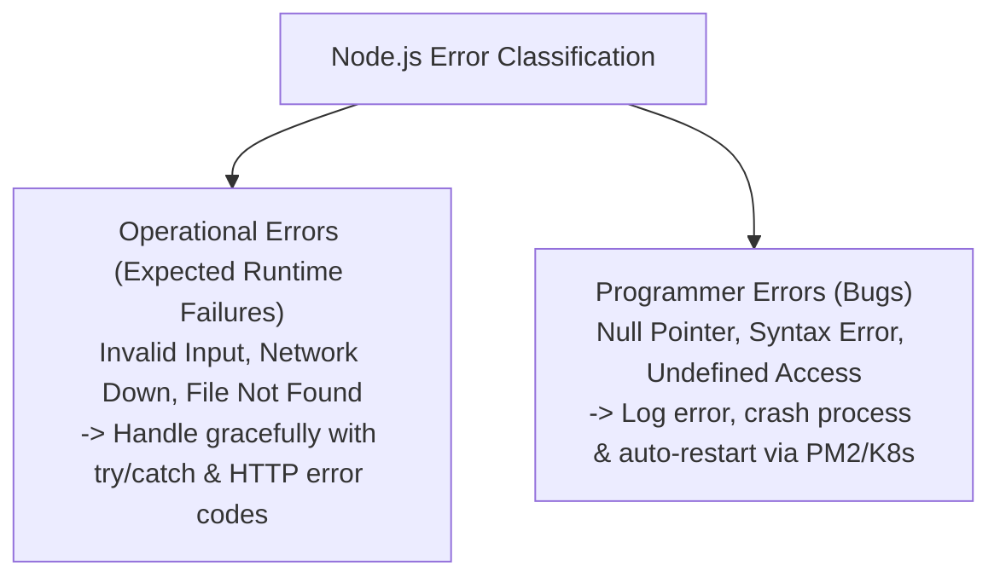

# File 26: Error Handling in Node.js (Operational vs Programmer Errors)

## Overview
Error handling distinguishes between **Operational Errors** (expected runtime failures like network timeout, 404, invalid user input) and **Programmer Errors** (bugs like `TypeError`, unhandled null property dereferences). Node.js applications must handle `uncaughtException` and `unhandledRejection` globally.

---

## 1. Error Categories & Global Handler Flow



---

## 2. Centralized Custom Error Handler Implementation

```javascript
class AppError extends Error {
    constructor(message, statusCode, isOperational = true) {
        super(message);
        this.statusCode = statusCode;
        this.isOperational = isOperational;
        Error.captureStackTrace(this, this.constructor);
    }
}

// Global Process Error Handlers
process.on("uncaughtException", err => {
    console.error("[CRITICAL UNCAUGHT EXCEPTION] Process shutting down:", err);
    process.exit(1); // Crash immediately on programmer error
});

process.on("unhandledRejection", (reason, promise) => {
    console.error("[UNHANDLED REJECTION] Promise rejected:", reason);
});

// Operational Error Throwing
function findUser(id) {
    if (!id) {
        throw new AppError("User ID is required", 400);
    }
    return { id, name: "Priya" };
}

try {
    findUser(null);
} catch (err) {
    if (err.isOperational) {
        console.log(`[OPERATIONAL ERROR ${err.statusCode}]: ${err.message}`);
    }
}
```

---

## Key Takeaways
1. Inherit from **`Error`** to create custom domain application errors (`AppError`).
2. Handle **Operational Errors** gracefully without crashing the web server.
3. For **Programmer Errors** caught by `uncaughtException`, log the stack trace and **exit process (1)** to allow PM2 or Kubernetes to start a clean instance.
