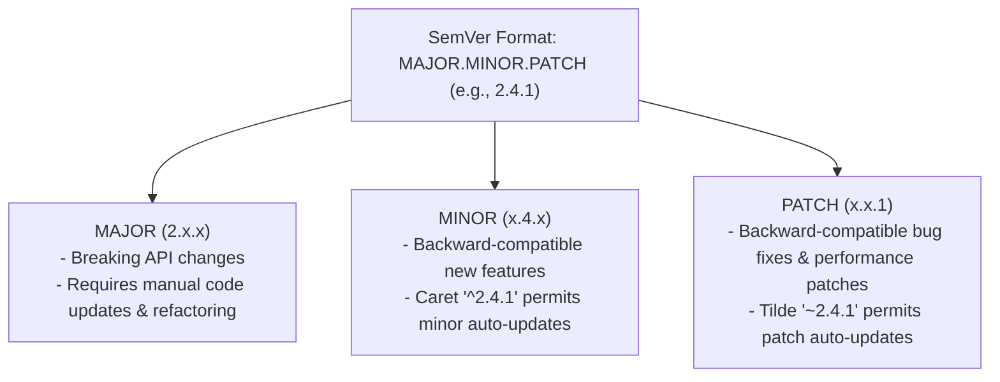
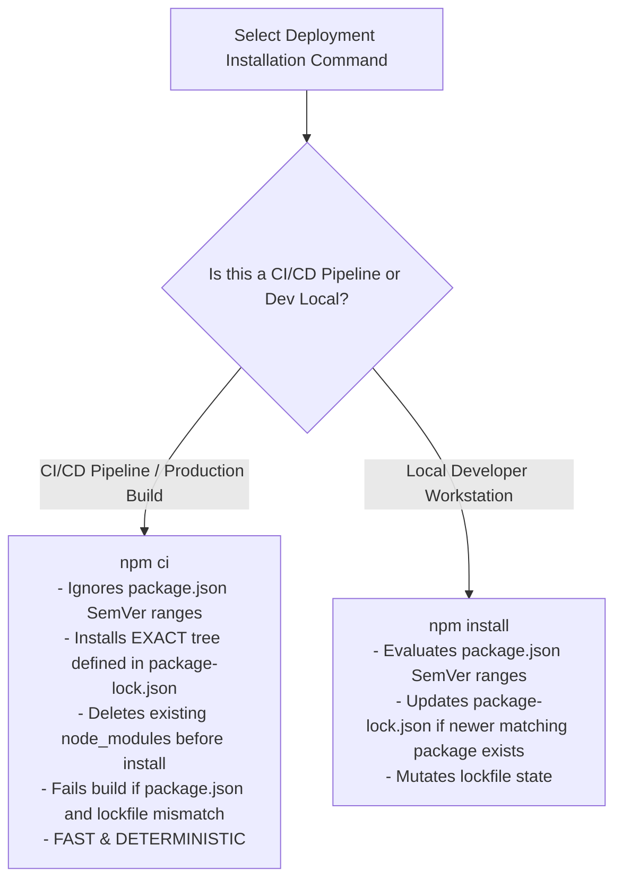

# Module 27: NPM Package Management, Semantic Versioning (SemVer), and Lockfiles

## Overview

**NPM (Node Package Manager)** is the package management system for JavaScript and Node.js. It manages third-party software dependencies, project metadata manifests (`package.json`), and deterministic lockfiles (`package-lock.json`).

Understanding **Semantic Versioning (SemVer)** rules, dependency resolution algorithms, and the difference between `npm install` and `npm ci` is critical for ensuring reproducible builds across development, staging, and production CI/CD pipelines.

---

## 1. Semantic Versioning (SemVer) Architecture

Semantic Versioning specifies version numbers in a 3-part numeric format: **`MAJOR.MINOR.PATCH`** (e.g. `2.4.1`).



### Version Prefix Specifiers Breakdown

| Symbol Specifier | Example String | Version Range Allowed | Production Recommendation |
| :--- | :--- | :--- | :--- |
| **Exact Version** | `"2.4.1"` | Exactly `2.4.1` only | **Recommended for critical security packages** |
| **Caret (`^`)** | `"^2.4.1"` | `>= 2.4.1 < 3.0.0` (Allows minor & patch updates) | Default NPM install setting |
| **Tilde (`~`)** | `"~2.4.1"` | `>= 2.4.1 < 2.5.0` (Allows patch updates only) | Conservative update policy |
| **Wildcard (`*`)** | `"*"` or `"latest"` | Any version available | **DANGEROUS** (Breaks builds unpredictably) |

---

## 2. Dependency Tree Resolution: `npm install` vs. `npm ci`



---

## 3. Dependency Types in `package.json`

| Dependency Category | Field Name | Installed When? | Primary Purpose |
| :--- | :--- | :--- | :--- |
| **Production Dependencies** | `"dependencies"` | Always (including `npm install --omit=dev`) | Code required at runtime by server (e.g. `express`, `pg`, `redis`). |
| **Development Dependencies** | `"devDependencies"` | Development local setup only | Tools needed strictly for building/testing (e.g. `typescript`, `jest`, `eslint`). |
| **Peer Dependencies** | `"peerDependencies"` | Parent application package | Plugins requiring a specific version of a host framework (e.g. React component requiring `react@^18`). |
| **Optional Dependencies** | `"optionalDependencies"` | Installed if platform supports native binary compilation | Optional native performance C++ bindings (e.g. `fsevents` on macOS). |

---

## 4. Complete `package.json` Production Manifest Example

```json
{
  "name": "enterprise-node-service",
  "version": "1.4.0",
  "description": "High-Performance Production Microservice",
  "main": "src/index.js",
  "type": "commonjs",
  "engines": {
    "node": ">=20.0.0",
    "npm": ">=10.0.0"
  },
  "scripts": {
    "start": "node src/index.js",
    "dev": "node --watch --env-file=.env src/index.js",
    "test": "node --test",
    "audit": "npm audit --audit-level=high"
  },
  "dependencies": {
    "dotenv": "^16.4.5",
    "express": "^4.19.2",
    "pg": "^8.11.5"
  },
  "devDependencies": {
    "eslint": "^9.2.0",
    "typescript": "^5.4.5"
  }
}
```

---

## Key Production Takeaways

1. **ALWAYS Commit `package-lock.json` to Git**: Without a committed `package-lock.json`, developers and deployment servers will install different transitive dependency versions, leading to "works on my machine" bugs.
2. **Use `npm ci` in Docker & CI/CD Pipelines**: Never run `npm install` on CI servers. Always use `npm ci` to guarantee 100% deterministic dependency trees and faster installation times.
3. **Specify Engine Restrictions in `package.json`**: Use the `"engines": { "node": ">=20.0.0" }` property to prevent deploying your application onto unsupported Node.js runtime versions.
4. **Run Regular Security Audits via `npm audit`**: Integrate `npm audit` checks into your CI pipeline to catch known vulnerabilities (CVEs) in third-party npm packages automatically.

