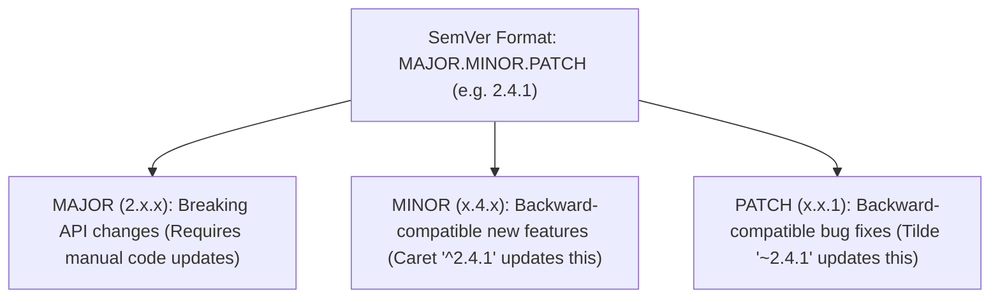

# File 27: NPM Package Management, Semantic Versioning, and Modules

## Overview
**NPM (Node Package Manager)** manages project dependencies, `package.json` manifests, and `package-lock.json` lockfiles. Dependency versions follow **Semantic Versioning (SemVer)** specs (`MAJOR.MINOR.PATCH`).

---

## 1. Semantic Versioning (SemVer) Rules



### Version Prefix Symbols

| Symbol Specifier | Example | Allowed Updates |
| :--- | :--- | :--- |
| **Exact Version** | `2.4.1` | Only exact version `2.4.1` |
| **Caret (`^`)** | `^2.4.1` | Minor & Patch updates (`>= 2.4.1 < 3.0.0`) |
| **Tilde (`~`)** | `~2.4.1` | Patch updates only (`>= 2.4.1 < 2.5.0`) |

---

## 2. Package Manifest Specification Example

```json
{
  "name": "tech-playbook-app",
  "version": "1.0.0",
  "description": "Production Node.js Core Playbook",
  "main": "src/index.js",
  "scripts": {
    "start": "node src/index.js",
    "dev": "node --watch src/index.js",
    "test": "node --test"
  },
  "dependencies": {
    "express": "^4.19.2"
  },
  "devDependencies": {
    "typescript": "^5.4.5"
  }
}
```

---

## Key Takeaways
1. Always commit **`package-lock.json`** to ensure reproducible dependency trees across environments.
2. Use **`npm ci`** in CI/CD build pipelines instead of `npm install` for deterministic installs.
3. Understand **SemVer**: `^` allows minor feature updates; `~` allows patch bug fixes.
