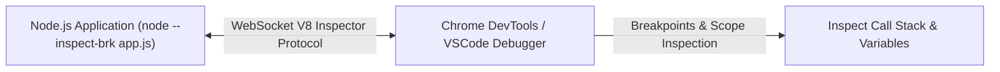

# File 28: Debugging and Performance Profiling in Node.js

## Overview
Debugging and performance tuning in Node.js uses **V8 Inspector (`node --inspect`)**, Chrome DevTools, Memory Leak Analysis (`heapdump`), CPU Profiling (`node --prof`), and performance measurement hooks (**`perf_hooks`**).

---

## 1. V8 Inspector Debugging Architecture



---

## 2. Performance Measurement API Implementation

```javascript
const { performance, PerformanceObserver } = require("perf_hooks");

// 1. Performance Observer for Automated Metric Collection
const obs = new PerformanceObserver((items) => {
    items.getEntries().forEach((entry) => {
        console.log(`[PERFORMANCE METRIC] ${entry.name}: ${entry.duration.toFixed(2)}ms`);
    });
});
obs.observe({ entryTypes: ["measure"] });

// 2. Measuring Expensive Computation
function measureHeavyTask() {
    performance.mark("task-start");

    // Heavy CPU task simulation
    let sum = 0;
    for (let i = 0; i < 1e7; i++) {
        sum += i;
    }

    performance.mark("task-end");
    performance.measure("Heavy Math Loop", "task-start", "task-end");
}

measureHeavyTask();
```

---

## Key Takeaways
1. Run **`node --inspect`** or **`node --inspect-brk`** to attach Chrome DevTools or VSCode debuggers.
2. Use **`perf_hooks`** (`performance.mark`, `performance.measure`) for high-precision microsecond timing benchmarks.
3. Detect memory leaks by analyzing V8 Heap Snapshots over time.
