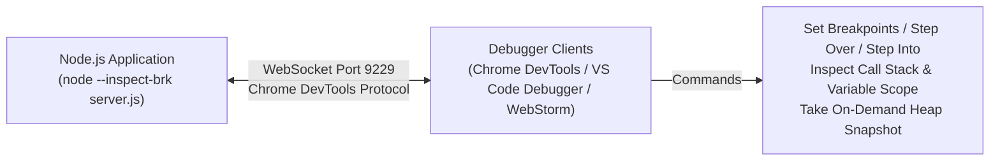
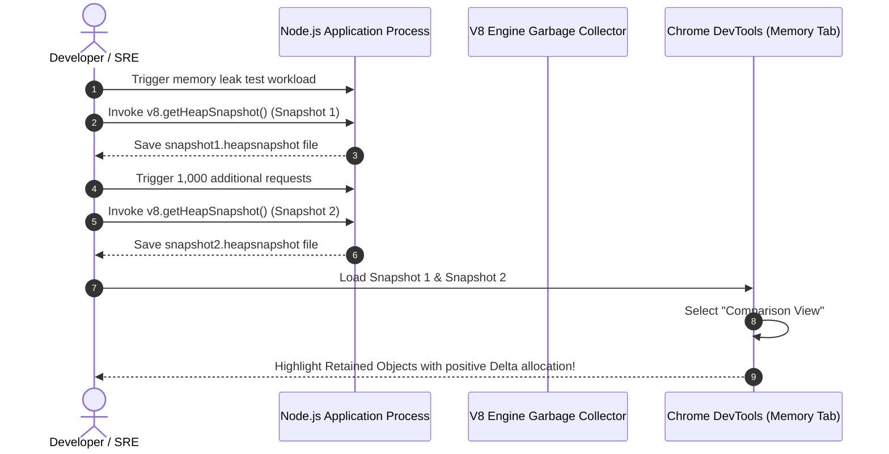

# Module 28: Debugging, Memory Heap Snapshots, and Performance Profiling

## Overview

Diagnosing performance bottlenecks, CPU event loop blocks, and memory leaks in production Node.js applications requires leveraging low-level V8 engine diagnostic tools.

Node.js exposes built-in debugging capabilities through the **V8 Inspector Protocol (`node --inspect`)**, **CPU Profiler (`node --prof`)**, **V8 Heap Snapshot Inspector (`v8.getHeapSnapshot()`)**, and microsecond-precision timing hooks (**`node:perf_hooks`**).

---

## 1. V8 Inspector Protocol Architecture

When starting Node.js with the `--inspect` or `--inspect-brk` flag, Node.js opens a WebSocket server listening on port `9229` implementing the **Chrome DevTools Protocol (CDP)**.



### Inspector CLI Flags Reference

| CLI Flag | Behavior Description | Production Use |
| :--- | :--- | :--- |
| **`node --inspect`** | Enables V8 Inspector WebSocket server on `127.0.0.1:9229`. Application executes immediately. | Local development debugging. |
| **`node --inspect-brk`** | Enables Inspector AND **pauses execution at line 1** until a debugger attaches. | Debugging startup initialization logic. |
| **`node --prof`** | Generates V8 execution tick log file (`isolate-0x...-v8.log`) for CPU profiling. | Generating flamegraphs for CPU bottlenecks. |

---

## 2. Memory Leak Analysis Workflow via V8 Heap Snapshots

A **Memory Leak** occurs when objects (closures, uncleaned event listeners, global caches) are no longer needed by application logic but remain reachable from the V8 Garbage Collection Root.



---

## 3. On-Demand Heap Snapshot Generator Code

Node.js provides the native **`node:v8`** module to trigger Heap Snapshots directly from JavaScript code without restarting the server:

```javascript
const v8 = require("node:v8");
const fs = require("node:fs");
const path = require("node:path");

function captureHeapSnapshot() {
  const snapshotStream = v8.getHeapSnapshot();
  const fileName = `heap-${Date.now()}.heapsnapshot`;
  const filePath = path.join(__dirname, fileName);
  
  const fileWriteStream = fs.createWriteStream(filePath);

  snapshotStream.pipe(fileWriteStream);

  fileWriteStream.on("finish", () => {
    console.log(`SUCCESS: Heap snapshot saved to: ${filePath}`);
    console.log("Load this file into Chrome DevTools -> Memory -> Load to inspect leaks.");
  });
}
```

---

## 4. High-Precision Performance Benchmarking via `perf_hooks`

The native **`node:perf_hooks`** module provides microsecond-resolution timing measurements (`performance.now()`) adhering to the W3C High Resolution Time specification.

```javascript
const { performance, PerformanceObserver } = require("node:perf_hooks");

// 1. Setup Automated Performance Metric Observer
const observer = new PerformanceObserver((list) => {
  const entries = list.getEntries();
  entries.forEach((entry) => {
    console.log(`[PERF METRIC] "${entry.name}" took ${entry.duration.toFixed(3)} ms`);
  });
});

// Observe measure entries
observer.observe({ entryTypes: ["measure"], buffered: true });

function benchmarkCryptoOperation() {
  const crypto = require("node:crypto");

  // Mark starting point
  performance.mark("crypto-start");

  // Heavy synchronous PBKDF2 calculation
  crypto.pbkdf2Sync("Password123!", "salt123", 100000, 64, "sha512");

  // Mark ending point
  performance.mark("crypto-end");

  // Calculate duration between marks
  performance.measure("PBKDF2 Hashing Duration", "crypto-start", "crypto-end");
}

benchmarkCryptoOperation();
```

---

## 5. CPU Profiling and Flamegraphs (`node --prof`)

To profile CPU consumption and identify hot execution paths:

```bash
# 1. Run Node app with V8 CPU profiler enabled
node --prof server.js

# 2. Generate load against server using autocannon or ab
autocannon -c 100 -d 10 http://localhost:3000/

# 3. Process the generated isolate log file into human-readable text
node --prof-process isolate-0x104008000-v8.log > processed_profile.txt
```

---

## Key Production Takeaways

1. **NEVER Expose `node --inspect` to Public IP Addresses**: `--inspect` grants unauthenticated full remote code execution to anyone who can connect to port `9229`. Always bind to `127.0.0.1` and use SSH tunneling for remote production debugging (`ssh -L 9229:localhost:9229 user@server`).
2. **Use `v8.getHeapSnapshot()` to Capture Production Leaks**: When an application process reaches 85% RAM usage, programmatically invoke `v8.getHeapSnapshot()` to save a snapshot file for offline memory analysis.
3. **Use `performance.mark()` and `performance.measure()`**: Avoid `Date.now()` or `console.time()` for high-precision microservice latency benchmarks; use `perf_hooks` for microsecond resolution.
4. **Inspect "Retainers" Tree in Chrome DevTools**: When analyzing memory heap snapshots in DevTools, look at the **Retainers** pane at the bottom to discover which global array, closure, or event listener is holding onto leaked memory objects.

