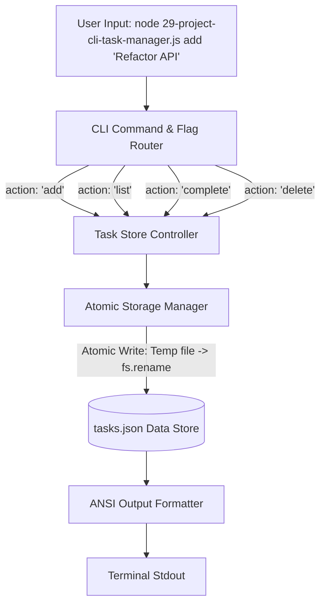
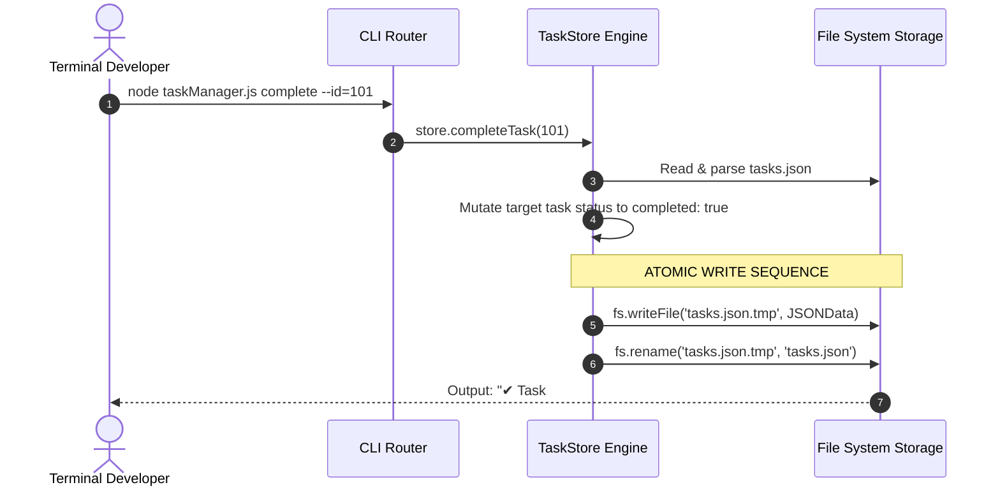

# Module 29: Capstone Project — Production CLI Task Manager Tool

## Overview

This capstone project demonstrates building a zero-dependency, production-grade **Command Line Interface (CLI) Task Manager Tool** using core Node.js modules (`node:fs/promises`, `node:path`, `node:process`, `node:util`).

It covers CLI command parsing (`process.argv`), atomic file persistence using temporary file writes and POSIX renames (`fs.rename`), structured JSON validation, and ANSI terminal color formatting.

---

## 1. System Architecture & CLI Execution Flow



---

## 2. Command Execution Lifecycle & Atomic Persistence

To prevent data corruption if the system crashes mid-write, the storage manager uses **Atomic Writes**: it writes data to a temporary file (`tasks.json.tmp`) first, and then executes an atomic file rename (`fs.rename`) to replace `tasks.json`.



---

## 3. CLI Command Specification

| Command Syntax | Sub-Arguments / Flags | Description | Example Call |
| :--- | :--- | :--- | :--- |
| **`add`** | `<task_title>` | Creates a new task with unique timestamp ID. | `node task.js add "Fix Auth Bug"` |
| **`list`** | `--status=all\|done\|pending` | Formats and outputs task list with status indicators. | `node task.js list` |
| **`complete`** | `<task_id>` | Marks target task as completed (`[X]`). | `node task.js complete 1700001` |
| **`delete`** | `<task_id>` | Removes target task from persistent store. | `node task.js delete 1700001` |
| **`clear`** | N/A | Deletes all completed tasks from store. | `node task.js clear` |

---

## 4. Production CLI Implementation Code

```javascript
const fs = require("node:fs/promises");
const path = require("node:path");

class TaskManagerStore {
  constructor(storageFilename = "tasks.json") {
    this.storagePath = path.resolve(__dirname, storageFilename);
  }

  // Load and parse JSON tasks from disk safely
  async _loadTasks() {
    try {
      const data = await fs.readFile(this.storagePath, "utf-8");
      return JSON.parse(data);
    } catch (err) {
      if (err.code === "ENOENT") return []; // Return empty list if file doesn't exist
      console.error("[ERROR] Storage file corrupted. Starting with empty state.");
      return [];
    }
  }

  // Atomic File Persistence: Writes temp file then renames to avoid corruption
  async _saveTasks(tasks) {
    const tempPath = `${this.storagePath}.tmp`;
    const payload = JSON.stringify(tasks, null, 2);

    try {
      await fs.writeFile(tempPath, payload, "utf-8");
      await fs.rename(tempPath, this.storagePath); // Atomic POSIX rename
    } catch (err) {
      console.error("[CRITICAL] Atomic storage write failed:", err.message);
      if (await fs.stat(tempPath).catch(() => null)) {
        await fs.unlink(tempPath).catch(() => {});
      }
    }
  }

  async addTask(title) {
    if (!title || title.trim() === "") {
      console.log("\x1b[31m%s\x1b[0m", "✖ ERROR: Task title cannot be empty!");
      return;
    }

    const tasks = await this._loadTasks();
    const newTask = {
      id: Date.now(),
      title: title.trim(),
      completed: false,
      createdAt: new Date().toISOString()
    };

    tasks.push(newTask);
    await this._saveTasks(tasks);
    console.log("\x1b[32m%s\x1b[0m", `✔ [ADDED] Task #${newTask.id}: "${newTask.title}"`);
  }

  async listTasks(filterStatus = "all") {
    const tasks = await this._loadTasks();
    console.log("\n==========================================");
    console.log("            CLI TASK MANAGER              ");
    console.log("==========================================");

    if (tasks.length === 0) {
      console.log("\x1b[33m%s\x1b[0m", "  No tasks found in store.");
      console.log("==========================================\n");
      return;
    }

    const filtered = tasks.filter((t) => {
      if (filterStatus === "done") return t.completed;
      if (filterStatus === "pending") return !t.completed;
      return true;
    });

    filtered.forEach((t) => {
      const statusBox = t.completed ? "\x1b[32m[X]\x1b[0m" : "\x1b[31m[ ]\x1b[0m";
      console.log(` ${statusBox} ID: ${t.id} | ${t.title}`);
    });
    console.log("==========================================\n");
  }

  async completeTask(id) {
    const numericId = Number(id);
    const tasks = await this._loadTasks();
    const task = tasks.find((t) => t.id === numericId);

    if (!task) {
      console.log("\x1b[31m%s\x1b[0m", `✖ ERROR: Task ID #${id} not found.`);
      return;
    }

    task.completed = true;
    await this._saveTasks(tasks);
    console.log("\x1b[32m%s\x1b[0m", `✔ [COMPLETED] Task #${id}: "${task.title}"`);
  }
}

// 5. CLI Execution Router
async function main() {
  const store = new TaskManagerStore("tasks_demo.json");
  const [, , command, ...args] = process.argv;
  const payloadArg = args.join(" ");

  switch (command) {
    case "add":
      await store.addTask(payloadArg);
      break;
    case "list":
      await store.listTasks(payloadArg || "all");
      break;
    case "complete":
      await store.completeTask(payloadArg);
      break;
    default:
      console.log(`
Usage Syntax:
  node 29-project-cli-task-manager.js add <title>       Add a new task
  node 29-project-cli-task-manager.js list [all|done]   List tasks
  node 29-project-cli-task-manager.js complete <id>    Mark task complete
      `);
  }
}

main();
```

---

## Key Production Takeaways

1. **Use Atomic Writes for JSON Storage**: Writing directly to the active storage file can leave truncated/corrupted JSON if the process crashes mid-write. Always write to a `.tmp` file first and perform an atomic `fs.rename()`.
2. **Handle Non-Existent Files Gracefully (`ENOENT`)**: Handle `ENOENT` code cleanly when reading data stores on first launch instead of crashing with unhandled file errors.
3. **Parse `process.argv` Cleanly**: Remember that `process.argv[0]` is the node binary path and `process.argv[1]` is the script file path. User arguments start at `process.argv[2]`.
4. **Use ANSI Terminal Escape Sequences for CLI Formatting**: Enhance CLI developer experience using standard ANSI codes (`\x1b[32m` for green, `\x1b[31m` for red, `\x1b[0m` for reset).

