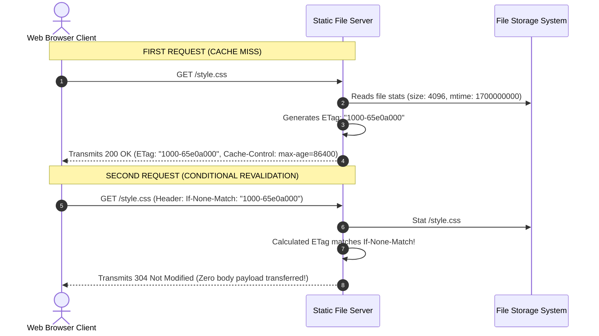

# Module 30: Capstone Project — Production High-Performance Static Web Server Architecture

## Overview

This capstone project implements a zero-dependency, production-ready **Static File Server** using native Node.js HTTP streams (`node:http`, `node:fs`, `node:path`, `node:zlib`, `node:crypto`).

Key features include **Path Traversal Security Guards**, **Dynamic MIME-Type Resolution**, **ETag / `304 Not Modified` Conditional Caching**, **HTTP Byte-Range Partial Content Streaming** (for MP4 video/audio scrub seeking), and **On-The-Fly Brotli/Gzip Compression Streams**.

Understanding **Static Request Processing Pipelines**, **Directory Traversal Attack Prevention (CWE-22)**, **ETag Revalidation Flows**, and **HTTP 206 Range Streaming** is essential.

---

## 1. Request Processing Architecture Pipeline

```mermaid
flowchart TD
    ClientReq[Client HTTP GET /assets/app.js] --> PathGuard{Safe Path Check:<br/>resolvedPath.startsWith(PUBLIC_DIR)}
    
    PathGuard -- "No: Traversal Attempt!" --> 403[Return 403 Forbidden]
    PathGuard -- "Yes" --> FileStat{fs.stat: File Exists?}

    FileStat -- "No" --> 404[Return 404 Not Found]
    FileStat -- "Yes" --> ETagCheck{If-None-Match Header Matches ETag?}

    ETagCheck -- "Yes: Unchanged" --> 304[Return 304 Not Modified<br/>Zero Body Bytes Transferred]
    ETagCheck -- "No: File Changed" --> RangeCheck{Request Contains 'Range' Header?}

    RangeCheck -- "Yes: Byte Range" --> 206[Send 206 Partial Content Stream]
    RangeCheck -- "No: Full File" --> EncodingCheck{Accept-Encoding: br or gzip?}

    EncodingCheck -- "Yes" --> ZipStream[Stream via zlib.createBrotliCompress / createGzip]
    EncodingCheck -- "No" --> RawStream[Stream raw file directly to HTTP res]

    ZipStream --> 200[200 OK Response]
    RawStream --> 200

    style PathGuard fill:#fef3c7,stroke:#b45309
    style 403 fill:#fee2e2,stroke:#dc2626
    style 304 fill:#dcfce7,stroke:#15803d
```

---

## 2. Conditional Caching Sequence (`ETag` & `304 Not Modified`)

Using **ETags** derived from file modification timestamps (`mtime`) and file sizes, clients revalidate static assets without re-downloading unchanged binary payloads over the network:



---

## 3. Server Feature Architectural Matrix

| Static Server Capability | Core Node.js Modules Used | Technical Impact & Security Purpose |
| :--- | :--- | :--- |
| **Path Traversal Guard** | `node:path` (`path.resolve`, `startsWith`) | Prevents attackers from fetching `/etc/passwd` via `GET /../../etc/passwd`. |
| **Dynamic MIME Types** | `node:path` (`path.extname`) | Maps file extensions (`.html`, `.css`, `.js`, `.png`) to proper `Content-Type` headers. |
| **ETag Caching** | `node:crypto` / `fsp.stat` (`mtime`, `size`) | Returns `304 Not Modified` to eliminate redundant network bandwidth usage. |
| **Range Requests** | HTTP Request `Range` Header Parsing | Serves `206 Partial Content` streams, enabling video/audio scrub seeking. |
| **Stream Compression** | `node:zlib` (`createBrotliCompress`, `createGzip`) | Reduces text asset transmission sizes by 75%+ over the wire. |

---

## 4. Production Code Showcase: High-Performance Static Web Server

```javascript
const http = require("node:http");
const fs = require("node:fs");
const fsp = require("node:fs/promises");
const path = require("node:path");
const zlib = require("node:zlib");
const { pipeline } = require("node:stream/promises");

const PORT = process.env.PORT || 8080;
const PUBLIC_DIR = path.resolve(__dirname, "public");

// Ensure public directory and index.html file exist for demonstration
if (!fs.existsSync(PUBLIC_DIR)) {
  fs.mkdirSync(PUBLIC_DIR, { recursive: true });
  fs.writeFileSync(path.join(PUBLIC_DIR, "index.html"), "<h1>Production Static Web Server Active!</h1>");
}

const MIME_TYPES = {
  ".html": "text/html; charset=utf-8",
  ".css": "text/css; charset=utf-8",
  ".js": "application/javascript; charset=utf-8",
  ".json": "application/json; charset=utf-8",
  ".png": "image/png",
  ".jpg": "image/jpeg",
  ".svg": "image/svg+xml",
  ".mp4": "video/mp4"
};

const server = http.createServer(async (req, res) => {
  if (req.method !== "GET" && req.method !== "HEAD") {
    res.writeHead(405, { "Content-Type": "text/plain" });
    return res.end("405 Method Not Allowed");
  }

  // 1. Path Traversal Security Validation
  let safePath = path.normalize(req.url).replace(/^(\.\.[\/\\])+/, "");
  if (safePath === "/") safePath = "/index.html";

  const targetFilePath = path.resolve(PUBLIC_DIR, `.${safePath}`);

  // CRITICAL SECURITY GUARD: Verify target file resides strictly INSIDE PUBLIC_DIR
  if (!targetFilePath.startsWith(PUBLIC_DIR)) {
    res.writeHead(403, { "Content-Type": "text/plain" });
    return res.end("403 Forbidden: Path Traversal Denied");
  }

  try {
    const stats = await fsp.stat(targetFilePath);

    if (stats.isDirectory()) {
      res.writeHead(403, { "Content-Type": "text/plain" });
      return res.end("403 Directory Listing Forbidden");
    }

    const ext = path.extname(targetFilePath).toLowerCase();
    const contentType = MIME_TYPES[ext] || "application/octet-stream";

    // 2. Generate ETag Header (Derived from size and mtime)
    const etag = `W/"${stats.size.toString(16)}-${stats.mtimeMs.toString(16)}"`;
    
    // Check Conditional If-None-Match Header
    if (req.headers["if-none-match"] === etag) {
      res.writeHead(304, { "ETag": etag, "Cache-Control": "public, max-age=86400" });
      return res.end();
    }

    // Common Headers
    res.setHeader("Content-Type", contentType);
    res.setHeader("ETag", etag);
    res.setHeader("Cache-Control", "public, max-age=86400");
    res.setHeader("Accept-Ranges", "bytes");

    // 3. Handle HTTP Byte-Range Requests (Media Streaming 206 Partial Content)
    const rangeHeader = req.headers.range;
    if (rangeHeader && rangeHeader.startsWith("bytes=")) {
      const parts = rangeHeader.replace(/bytes=/, "").split("-");
      const start = parseInt(parts[0], 10);
      const end = parts[1] ? parseInt(parts[1], 10) : stats.size - 1;
      const chunkSize = end - start + 1;

      res.writeHead(206, {
        "Content-Range": `bytes ${start}-${end}/${stats.size}`,
        "Content-Length": chunkSize
      });

      const rangeStream = fs.createReadStream(targetFilePath, { start, end });
      return await pipeline(rangeStream, res);
    }

    // 4. Content Negotiation Compression (Brotli / Gzip for text assets)
    const acceptEncoding = req.headers["accept-encoding"] || "";
    const fileStream = fs.createReadStream(targetFilePath);

    const isCompressibleText = contentType.startsWith("text/") || contentType.includes("javascript") || contentType.includes("json");

    if (isCompressibleText && acceptEncoding.includes("br")) {
      res.setHeader("Content-Encoding", "br");
      res.writeHead(200);
      await pipeline(fileStream, zlib.createBrotliCompress(), res);
    } else if (isCompressibleText && acceptEncoding.includes("gzip")) {
      res.setHeader("Content-Encoding", "gzip");
      res.writeHead(200);
      await pipeline(fileStream, zlib.createGzip(), res);
    } else {
      res.setHeader("Content-Length", stats.size);
      res.writeHead(200);
      await pipeline(fileStream, res);
    }

  } catch (err) {
    if (err.code === "ENOENT") {
      res.writeHead(404, { "Content-Type": "text/plain" });
      res.end("404 Not Found");
    } else {
      res.writeHead(500, { "Content-Type": "text/plain" });
      res.end("500 Internal Server Error");
    }
  }
});

server.listen(PORT, () => {
  console.log(`=== STATIC FILE SERVER ACTIVE: http://localhost:${PORT} ===`);
});
```

---

## Key Production Takeaways

1. **Always Enforce `targetFilePath.startsWith(PUBLIC_DIR)`**: Never trust `path.normalize()` alone. Always resolve the absolute path and verify it starts with your public root directory to prevent directory traversal attacks (CWE-22).
2. **Support `304 Not Modified` via ETags**: Returning `304 Not Modified` saves massive bandwidth and server CPU work by letting client browsers use cached asset copies.
3. **Handle `Accept-Ranges` for Video/Audio Assets**: Implementing byte range requests allows media players to stream video without loading entire 500 MB files into client memory.
4. **Use `stream.pipeline` for Robust Cleanup**: Never use `.pipe()` without manual error listeners. Always use `stream.pipeline` to clean up file streams cleanly on client aborts.


